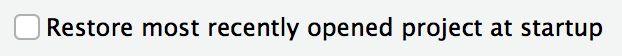

<link rel="stylesheet" href="//fonts.googleapis.com/css?family=Lato" />

<div id="header">

</div>

```{r markdown setup, include=FALSE}

knitr::opts_chunk$set(fig.path = "intro-to-r/www/images/")
knitr::opts_chunk$set(message = FALSE)
knitr::opts_chunk$set(echo = TRUE)
knitr::opts_chunk$set(warning = FALSE)

options(scipen = 999)
```

## Introduction

------

R is one of two premier programming languages for data science and one of the [fastest growing programming languages.](https://stackoverflow.blog/2017/10/10/impressive-growth-r/) Created by researchers for researchers (with some help from software engineers), R offers rich, intuitive tools that make it perfect for visualization, public policy analysis, econometrics, geospatial analysis, and statistics. 

R doesn't come in a box. R was never wrapped in cellophane and it definitely isn't purchased at a store. R's pricelessness and open-source development are two of its greatest strengths, but it can often leave new users without the anchor of the box and booklet often provided with proprietary software. 

This guide is meant to be an on-ramp for soon-to-be R Users and a fill-in-the-gap guide for existing R Users. It starts with the most basic question, "what is R?" and progresses to advanced topics like organizing analyses. Along the way it even demonstrates how to read XKCD comics in R. 

R boasts a strong community in the world and inside the Urban Institute. Please don't hesitate to contact Aaron Williams (awilliams@urban.org) or Kyle Ueyama (kueyama@urban.org) with thoughts or questions about R.  

## What is R?

------

{width=15%}

[Source](https://www.r-project.org/logo/)

R is a free, open-source software for statistical computing. It is known for intuitive, crisp graphics and an extensive, growing library of statistical and analytic methods. Above all, R boasts an enthusiastic community of developers, instructors, and users.  

The copyright and documentation for R is held by a not-for-profit organization called [The R Foundation](https://www.r-project.org/foundation/). 

{width=15%}

[Source, Fair use](https://en.wikipedia.org/w/index.php?curid=48590482) 

RStudio is a free, open-source integrated development environment (IDE) that runs on top of R. In practice, R users almost exclusively open RStudio and rarely directly open R. 

RStudio is developed by a for-profit company called [RStudio](https://www.rstudio.com/). RStudio, the company, employs some of the R community's most prolific, open-source developers and creates many open-source tools and trainings.  

While R code can be written in any text editor, the RStudio IDE is a powerful tool with a console, syntax-highlighting, and debugging tools. [This cheatsheet](https://github.com/rstudio/cheatsheets/raw/master/rstudio-ide.pdf) outlines the power of RStudio. 


## Installation and Updates

------

### When should you update?

All Urban computers should come pre-installed with R and Rstudio. However your R version may be out of date and require updating. We recommend having at least R version 3.6.0 or higher. You can check what version of R you have installed by opening Rstudio and submitting the following line of code to the console: `R.Version()$version.string`.  

If you're working on a personal computer, you may not have R or Rstudio installed. So follow this guide to install both on your computer. 

### Updating/Installing R

1) Visit https://cran.r-project.org/bin/windows/base/. The latest R version will be the downloadable link at the top. As of 1/1/2020, that R version is 3.6.2. Click on the link at the top and download the `R-x.x.x-win.exe` file. 

2) Open the R-x.x.x-win.exe` file. Click next, accept all the defaults, and install R. After R has been installed, click the Finish button. You should not need admin privileges for this.

3) Check that your version of R has been updated in Rstudio. If Rstudio is already open, first close it. Then open Rstudio and retype in `R.Version()$version.string`. You should see an updated version number printed out on the console. 

4) Test that R packages are loading as expected. Packages you already had installed should continue to work with newer versions of R. But in some cases, you may need to re-install the packages to work properly with new versions of R. 

### Updating/Installing Rstudio

1) Open Rstudio and go to Help > Check for Updates to see if RStudio is up-to-date

2) If it is out-of-date, download the [appropriate update](https://rstudio.com/products/rstudio/download/#download).

3) Before you run the installer, contact IT at helpdesk@urban.org for administrative approval as the program requires admin access.

4) Run the installer and accept all defaults. 

Moving forward, RStudio will automatically and regularly update on Windows computers at the Urban Institute. 

## Learning R

------

### What to Learn

There is often more than one way to accomplish a goal in R because of the language's flexibility. At first, this flexibility can be overwhelming. That's why it is useful to pick and master one set of tools in R before branching out and learning everything R. 

Fortunately, [Hadley Wickham's tidyverse](https://www.tidyverse.org/) offers a comprehensive set of tools for data analysis that are good for both beginners and experts. The tidyverse is self-described as "an opinionated collection of R packages designed for data science." The tidyverse consists of almost two dozen clear and concise tools for every part of an analysis workflow. At first, focus on the function `read_csv()` for loading data, the package `dplyr` for manipulating data, and the package `ggplot2` for plotting. 

Here's a quick example that reads a .csv, filters the data, and creates a publishable column plot in just fifteen lines of code:

```{r quick example}
# load packages and source the Urban Institute ggplot2 theme
library(tidyverse) # contains read_csv, library(dplyr), and library(ggplot2)
library(urbnthemes)

set_urbn_defaults(style = "print")

# read bankdata.csv
bank <- read_csv("intro-to-r/data/bankdata.csv") 

bank_subset <- bank %>%
	# filter to observations of unmarried mothers less than age 30
	filter(married == "NO" & age < 30) %>%	
	# drop all variables except children and income
	select(children, income)								

# plot!
bank_subset %>%
	ggplot(mapping = aes(x = children, y = income)) +
	geom_bar(stat = "summary", fun.y = "mean") +
	scale_y_continuous(expand = c(0, 0), labels = scales::dollar) +
	labs(title = "Mean income",
			 subtitle = "Unmarried mothers less than age 30",
			 caption = "Urban Institute analysis of bank data",
			 x = "Number of children",
			 y = "Income")
```

### Resources for Learning

*R for Data Science* by Hadley Wickham and Garrett Grolemund is the best print resource for learning R and the tidyverse. The book is available [online](http://r4ds.had.co.nz/index.html) for free and *begins* with visualization which is motivating and practical. *R for Data Science* contains dozens of worthwhile exercises but no solutions guide. Please check your solutions against the [Urban Institute r4ds solutions guide on GitHub](https://github.com/UI-Research/r4ds-exercises.git) and please contribute if the exercise isn't already in the guide! 

RStudio publishes a number of cheat sheets that cover the tidyverse. The main cheat sheets can be accessed in RStudio at Help > Cheat Sheets. Additional cheat sheets are accessible here on the [RStudio website](https://www.rstudio.com/resources/cheatsheets/). 

David Robinson, a data scientist from Data Camp, has a new [video course](https://www.datacamp.com/instructors/drobinson) about the tidyverse. Few people know as much about R and communicate as effectively as David Robinson. 

*Advanced R* by Hadley Wickham is a good resource for new R users that have experience with other programming languages and computer science. It is available [online](http://adv-r.had.co.nz/) for free. 

### Library

It's easy to feel overwhelmed by the frenetic development of the extended R universe. Books are an invaluable resource for slowing down and focusing on fully-formed ideas. 

Aaron Williams (awilliams@urban.org) has a number of books that can be checked out:

* [The Art of R Programming](https://www.nostarch.com/artofr.htm)
* [ggplot2](http://www.springer.com/us/book/9780387981413)
* [Efficient R Programming](http://shop.oreilly.com/product/0636920047995.do) ([Online!](https://csgillespie.github.io/efficientR/))
* [Text Mining with R](http://shop.oreilly.com/product/0636920067153.do) ([Online!](https://www.tidytextmining.com/))
* [Reasoning with Data](https://www.guilford.com/books/Reasoning-with-Data/Jeffrey-Stanton/9781462530267/reviews)
* [Practical Statistics for Data Scientists](http://shop.oreilly.com/product/0636920048992.do)

### Built-in Data Sets

R has many built-in data sets that are useful for practice and even more data sets are accessible through R packages. 

Submitting `data()` shows a list of all available data sets. `cars` and `iris` are two classic sets that are used in many examples. 

`library(tidyverse)` loads many more "tidy" data sets including `diamonds` and `starwars`. 

```{r tidyverse}
library(tidyverse)
starwars %>%
	count(species) %>%
	arrange(desc(n)) %>%
	head()
```

`library(dslabs)` by [Rafael Irizarry](https://simplystatistics.org/2018/01/22/the-dslabs-package-provides-datasets-for-teaching-data-science/) includes varied data sets that are intentionally imperfect that are useful for practice. Students of econometrics will enjoy `library(wooldridge)`. It loads 105 data sets from _Introductory Econometrics: A Modern Approach_ by Jeffrey Wooldridge. Now you can practice estimating your hedonic pricing models in R!

```{r psid}
library(wooldridge)
library(tidyverse)
library(urbnthemes)

set_urbn_defaults(style = "print")

as_tibble(hprice1) %>%
	ggplot(aes(x = sqrft, y = price)) +
	geom_point() +
	scale_y_continuous(expand = c(0, 0), lim = c(0, 800)) +
	labs(title = '"hprice1" data from Wooldridge') 
```

### Getting Help

Even the best R programmers spend hours each week searching the Internet for answers. Here are some of the best ways to find answers: 

Submit `?` and any function name without parentheses (ex. `?mean`) to see the function documentation in RStudio. 

When Googling, set the search range to the last year to avoid out-of-date solutions and to focus on up-to-date practices. 

[Stack Overflow](https://stackoverflow.com/) contains numerous solutions. Add `[r]` to any search to limit results to R. If a problem is particularly perplexing, it is simple to submit questions. Exercise caution when submitting questions because the Stack Overflow community has strict norms about questions and loose norms about respecting novices. 

[RStudio Community](https://community.rstudio.com/) is a new forum for R Users. It has a smaller back catalog than Stack Overflow but users are friendlier than on Stack Overflow. 

Finally, Aaron Williams (awilliams@urban.org) from IBP and Kyle Ueyama (kueyama@urban.org) from IT are available to solve problems, offer guidance, and share R enthusiasm. 

### CRAN Task Views

R has sub-communities, frameworks, and tools focused on different subject-matter and and methodological areas. [CRAN Task Views](https://cran.r-project.org/web/views/) is invaluable for understanding these communities and finding the best frameworks and tools for different disciplines in R. 

CRAN Task Views has 35 pages focused on subcategories of R ranging from [econometrics](https://cran.r-project.org/web/views/Econometrics.html) to natural language processing. Each page is maintained by a subject-matter expert and contains methods, packages, books, and mailing lists that are useful for researchers. 

The econometrics page alone contains detailed information on basic linear regression, microeconometrics, instrumental variables, panel data models, further regression models, time series data and models, data sets, CRAN packages, articles, books, and more. 

## R Code

------

It's time to start writing R code. Remember, most R users never open R and exclusively use RStudio. Go ahead and open R once to admire its dated text editor. Then, close R and never directly open it again. Now, open RStudio. 

### Submitting Code

RStudio has four main panels: code editor (top left by default), R console (bottom left by default), environment and history (top right by default), and files, plots, packages, help, and viewer pane (bottom right by default). 

There are two main ways to submit code:

1) Type code to the right of  in the R console and hit enter. **Note:** R won't create a long-term record of this code.
2) Click  in the top left to create a new R script in the code editor panel. Type code in the script. Highlight desired code and either click run the in top right of the code editor panel or type Ctrl/command-enter to run code. Scripts can be saved, so they are the best way to write code that will be used again. 

For practice, submit `state.name` in the R console to create a vector with all fifty state names (sorry statehood advocates, no Washington, D.C.). Next, create a script, paste `state.name`, highlight the text, and click run at the top right of the code editor. You should get the same output both times. 

```{r state names}
state.name
```

### Syntax

The are five fundamental pieces of syntax in R.  

* `<-` is the assignment operator. An object created on the right side of an assignment operator is assigned to a name on the left side of an assignment operator. Assignment operators are important for saving the consequences of operations and functions. Operations without assignment operators will typically be printed to the console but not saved. 
* `#` begins a comment. Comments are useful for explaining decisions in scripts. As Haldey Wickham notes in the [Tidyverse styleguide](http://style.tidyverse.org/), ’In code, use comments to explain the “why” not the “what” or “how”.
* `c()` combines similar vectors into larger vectors. For example, `c(1, 2, 3)` is a numeric vector of length three made up of three numeric vectors of length one. 
* `?` in front of any function name without parentheses returns function documentation. For example, `?mean`.
* `%>%` from `library(magrittr)` and `library(tidyverse)` is the "pipe operator". It passes the output from one function to another function. This is useful because strings of operations can be "piped" together instead of each individual operation needing to be assigned to an object.

### Vectors

Vectors are the fundamental piece of data in R. They are one-dimensional 


Most vectors are one-dimensional collections of logicals, integers, doubles, characters, factors, dates, or date-times. Vectors can't mix types 


R has six commonl


Scalars don't exist in R.  

```{r}
1:10 > 5
```

todo(aaron): link to Hadley Wickham talk


### Data frames

Data frames are combinations of equally lengthed vectors. 


Data analysis in R is built around the data fra


each observation forms a row
each variables forms a column
each observational forms a table


### Missing values

R stores missing values as `NA`. A single `NA` in a calculation can cause the entire result to return as `NA`. 

```{r}
sum(c(2, 2, NA))
```

The contagiousness of `NA` is good, it makes users explicitly acknowledge dropping missing values with `na.rm = TRUE`.

```{r}
sum(c(2, 2, NA), na.rm = TRUE)
```

`== NA` does not test for missing values. Instead, use `is.na()`. 


* is.na() and math with booleans
* complete.cases


### Functions

Functions in R are collections of code that when called cause certain actions. R contains hundreds of functions and thousands of more functions can be accessed through packages. 

Most functions take arguments. For example, the function `mean()` has arguments `x`, `trim`, `na.rm`, and `...`. The first argument in most functions, in this case `x`, is an input object. Arguments can be passed to functions by name or position. `mean(c(1, 2, 3))` is equivalent to `mean(x = c(1, 2, 3))`. 

Notice how the other three arguments were skipped. Most arguments in functions have default values. The best way to see default values is to submit the function name with a question mark, like `?mean`. In this case, `trim = 0`, `na.rm = FALSE`, and no further arguments were passed through with `...`.

In the previous example, the `c()` function was nested inside of the `mean()` function. It is also possible to assign a vector of 1, 2, and 3 to a name and pass the name to the mean function. 

```{r mean, eval = FALSE}
apples <- c(1, 2, 3)

mean(apples)
```

R is a [functional programming language](http://adv-r.had.co.nz/Functional-programming.html). In addition to having many pre-made functions like `mean()`, R has powerful tools for creating and manipulating custom functions. This is useful because:

* It avoids tedious and error-prone copying-and-pasting and makes iterating processes simple;
* Is a powerful way to organize sets of operations;
* Is a standardized way to save code for later and to share operations with others.

This last bullet is key to the package system in R. 

### Packages

Opening RStudio automatically loads "base R", a fundamental collection of code and functions that handles simple operations like math and system management. R can be extended with collections of code and functions developed by the R community called packages. This sounds wild, but most packages are created and maintained by some of the best statisticians and developers in the world. 

Most packages can be installed with `install.packages("dplyr")`, where the string between the quotation marks is the name of the package. Packages installed with `install.packages()` come from CRAN and must pass certain checks for performance and documentation. Popular packages on CRAN, like dplyr, have as much, if not more support, standards, and quality than code in proprietary software packages like Stata or SAS. 

It is possible, but less common, to install packages from places like GitHub. This is less secure and the functionality of the packages is more likely to change over time. `install.packages()` need only be run once per version of package per machine and should rarely be included in .R scripts. 

Packages are loaded once per R session with the function `library()`. It is a good idea to include `library(package-name)` at the top of scripts for each package used in the script. This way it is obvious at the top of the script which packages are installed and loaded. 

**Note:** `install.packages()` uses quoted package names and `library()` uses unquoted package names. 

For practice, submit the following three lines of code to install `RXKCD`, load `library(RXKCD)`, and get a random [XKCD comic](https://www.xkcd.com/). 

```{r xkcd, eval=FALSE}
install.packages("RXKCD")
library(RXKCD)
getXKCD("random")
```

```{r xkcd run, echo=FALSE}
library(RXKCD)
# assignment to hide text output
comic <- getXKCD(539)
```

Packages are frequently updated, especially around the time R versions change. The easiest way to update packages is Tools > Check for Package Updated in RStudio. 

Occasionally, two loaded packages will have functions with identical names. Any conflicts with be announced when loading packages. See how `filter()` and `lag()` from `library(tidyverse)` and `library(stats)` conflict:


In this case, the tidyverse functions are usually favored. If there is ever a conflict or any doubt about which function is used, use the package name and `::` to directly call the function. For example, `dplyr::select(apples)`. `::` can also be used to call a function without loading the entire package. 

### CRAN

The [Comprehensive R Archive Network](https://cran.r-project.org/index.html) (CRAN) contains almost 12,000 packages contributed over the last two decades by a range of developers. New packages are added to CRAN almost every day. 

CRAN enables R to have all of the benefits of open-source development and the security and predictability of proprietary statistical packages like SAS and Stata. CRAN weds the benefits of broad-based, real-time package development with certain [standards](https://cran.r-project.org/index.html) for functionality and documentation. Methods and tools make it to R before SAS or Stata, if they ever make it to SAS or Stata, but have standards that generally exceed Python or other open-source languages. (See: [Malicious Libraries Found on Python Package Index (PyPI)](https://www.blog.pythonlibrary.org/2017/09/15/malicious-libraries-found-on-python-package-index-pypi/))

Because of CRAN's long history and R's place in the statistics community, CRAN contains many methods that can't be accessed, much less duplicated, using proprietary software. In addition to being useful now, this also ensures that R isn't a temporary fad and will have staying power because of the challenge of replicating or besting CRAN. 

R's extensible design is important, but most tasks can be accomplished with a handful of packages:

* `ggplot2` data visualization
* `dplyr` data management
* `tidyr` data tidying
* `readr` data import 
* `purrr` functional programming
* `tibble` data frames
* `hms` times
* `stringr` character strings
* `lubridate` dates/times  
* `forcats` factors
* `DBI` databases 
* `haven` SPSS, SAS, and Stata files
* `readxl`.xls and .xlsx
* `modelr` simple modeling within a pipeline
* `broom` turning models into tidy data
* `tidyverse` loads all of the packages listed up to this point; see Hadley Wichkham's "[tidyverse](https://blog.rstudio.org/2016/09/15/tidyverse-1-0-0/)"

## Organizing Analyses

------

This section outlines how to organize an analysis to get the most out of R. Newer users may want to skip this section and work through [R for Data Science](http://r4ds.had.co.nz/) until they understand `library(readr)`, `library(dplyr)`, and `library(ggplot2)`.

### Projects

Organizing scripts, files, and data is one of the most important steps to creating a clear and reproducible analysis. 

R Projects, proper noun, are the best way to organize an analysis. They have several advantages:

* They make it possible to concurrently run multiple RStudio sessions.
* They allow for project-specific RStudio settings. 
* They integrate well with Git version control. 
* They are the "node" of relative file paths. (more on this in a second)

Before setting up an R Project, go to Tools > Global Options and uncheck "Restore most recently opened project at startup".

{width=50%}

Every new analysis in R should start with an R Project. First, create a directory that holds all data, scripts, and files for the analysis. Storing files and data in a sub-directories is encouraged. For example, data can be stored in a folder called data/.

Next, click "New Project..." in the top right corner. 

{width=50%}

When prompted, turn your recently created "Existing Directory" into a project. 

{width=50%}

Upon completion, the name of the R Project should now be displayed in the top right corner of RStudio where it previously displayed "Project: (None)". Once opened, .RProj files do not need to be saved. Double-clicking .Rproj files in the directory is now the best way to open RStudio. This will allow for the concurrent use of multiple R sessions and ensure the portability of file paths. Once an RStudio project is open, scripts can be opened by double-clicking individual files in the computer directory or clicking files in the "Files" tab in the top right of RStudio. 

R Projects make code highly portable because of the way they handle file paths. Here are a few rules:

#### Filepaths

Never use `\` in file paths in R. `\` is a regular expression and will complicate an analysis. Fortunately, RStudio understands `/` in file paths regardless of operating system. 

Never use `setwd()` in R. It is unnecessary, it makes code unreproducible across machines, and it is rude to collaborators. R Projects create a better framework for file paths. Simply treat the directory where the R Project lives as the working directory and directories inside of that directory as sub-directories. 

For example, say there's a `.Rproj` called `starwars-analysis.Rproj` in a directory called `starwars-analysis`. If there is a .csv in that folder called `jedi.csv`, the file can be loaded with `read_csv("jedi.csv")` instead of `read_csv("H:/ibp/analyses/starwars-analysis/diamonds.csv")`. If that file is in a sub-directory of `starwars-analysis` called `data`, it can be loaded with `read_csv("data/jedi.csv")`. The same concepts hold for writing data and graphics. 

This simplifies code and makes it portable because all relative filepaths will be identical on all computers. To share an analysis, simply send the entire directory to a collaborator or share it with GitHub.

Here's an example directory:

<center>
{width=50%}
</center>

It isn't always possible to avoid absolute file paths because of the many different ways the Urban Institute stores data. Avoid absolute paths when possible and be deliberate about where analyses live in relation to where data live. 

Finally, it's good practice to include a README in the same directory as the .Rproj. The README should outline the purpose and the directories and can include information about how to contribute, licenses, dependencies, and acknowledgements. This [GitHub page](https://gist.github.com/PurpleBooth/109311bb0361f32d87a2) is a good README template. 

Check out [R for Data Science](http://r4ds.had.co.nz/workflow-projects.html) by Hadley Wickham and Garrett Grolemund for a more thorough explanation of this workflow. Jenny Bryan also has a good [blogpost](https://www.tidyverse.org/articles/2017/12/workflow-vs-script/) about avoiding `setwd()`.

### Naming Conventions

Naming functions, objects, variables, files, and scripts is one of the toughest and least-taught dimensions of computer programming. Better names can add clarity to code, save time and effort, and minimize errors caused by accidentally overwriting existing functions or other objects. 

> There are only two hard things in Computer Science: cache invalidation and naming things. ~ [Phil Karlton](http://www.meerkat.com/2017/12/naming-things-hard/)

#### Functions and Other Objects

R is case-sensitive. 

Objects in R can be named anything - [even unicode characters](https://www.r-bloggers.com/rules-for-naming-objects-in-r/). But just because something *can* be named anything doesn't mean it should. 

Most functions and objects in R are lowerCamelCase, period.separated, or underscore_separated. As an individual or team, it's important to pick a style and stick with it, but as [this article](https://journal.r-project.org/archive/2012-2/RJournal_2012-2_Baaaath.pdf) from 2012 shows, there isn't much consistency across the R community. Hadley Wickham's tidyverse uses underscores, so expect to see some consolidation into this style. 

In general, it's good practice to name functions with verbs and other objects with nouns. 

Variable and object names that start with numbers, have spaces, or use peculiar syntax require back-ticks. 

> select(urban, \`R Users Group\`)

> urban$\`R Users Group\`)

Finally, it's possible to overwrite existing functions and other objects in R with the assignment operator. Don't give vectors or data frames the same names as exisiting functions and don't overwrite existing functions with custom functions. 

#### Files

Naming conventions for scripts and files is probably the most overlooked dimension in programming and analysis. The first three bullets from this section come from this [rich slide deck](http://www2.stat.duke.edu/~rcs46/lectures_2015/01-markdown-git/slides/naming-slides/naming-slides.pdf) by Jenny Bryan. This may seem pedantic, but picking a file naming convention now can save a bunch of time and headaches in the future. 

**1) Machine readable**

Create file names that are easily machine readable. Use all lower case letters and skip punctuation other than delimiters. Use underscores as characters for splitting the file name. For example, `stringr::str_split_fixed("2018-01-10_r-introduction_machine-readable-example_01.csv", "[_\\.]", 5)` splits the file name on underscores and periods and returns date, project, file name, file number, and file type. This information can then be stored and sorted in a data frame. 

**2) Human readable**

Create file names that are human readable. The example from above is informative without any machine interpretation. 

**3) Plays well with default ordering**

It is often useful to include date or sequence numbers in script and file names. For example, include 2018-10-01 for data collected on January 10th, 2018 or include 3 for the third script a sequence of five `.R` programs. Starting file names with the date or sequence numbers means files will show up in a logical order by default. Be sure to use ISO 8601 standard for dates (YYYY-MM-DD).

**4) Don't Use File Names for Version Control**

Version control with file names is unwieldy and usually results in names that are barely human readable and definitely not machine readable. 

> "2018-01-10_r-introduction_machine-readable-example_01_v2_for-aaron_after-review_before-submission.R"

Iterations usually don't iterate sensibly. For example, what was "v1", "v2" abandoned for "for-aaron", "after-review", "before-submission". Furthermore, version control with file names is poor for concurrent work and merging. 

The next section will outline the optimal tool for version control. 

### Version Control

The workflow outlined above integrates perfectly with version control like Git and distributed version control repository hosting services like GitHub. 

Version control is a system for recording changes to files over time. Version control is built around repositories. In this case, the folder containing the `.Rproj` is the perfect directory to use as a repository. A handful of simple commands are used to track and commit changes to text files (.R, .Rmd, etc.) and data. This record is valuable for testing alternatives, communicating with others and your future self, and documenting progress on projects.  

GitHub is a distributed repository system built on top of Git. GitHub has a number of valuable tools for collaboration and project management. In particular, it makes concurrent collaboration on code simpler with branches and has a slick system for issues. Here are the [branches](https://github.com/UrbanInstitute/urban_R_theme/branches) and [issues](https://github.com/UrbanInstitute/urban_R_theme/issues) for the Urban Institute R Graphics Guide. It also has free web hosting for websites like the website you are reading right now. [GitHub has a quick guide that is a good place to start learning Git](https://try.github.io/levels/1/challenges/1). 

The Urban Institute has a number of legacy models and code bases that span years and have been touched by scores of brilliant researchers. The future value of a record of all code changes and development is borderline unthinkable. 

### Coding Style

> "Good coding style is like using correct punctuation. You can manage without it, but it sure makes things easier to read." 
> ~Hadley Wickham (2014)

good coding style is like using correct punctuation you can manage without it but it sure makes thing easier to read 

The details of a coding style are less important than consistently sticking to that style. Be flexible when working with collaborators so the style doesn't change inside an analysis. 

Here are three good sources for inspiration:

* [Tidyverse Style Guide](http://style.tidyverse.org/)
* [Google's R Style Guide](https://google.github.io/styleguide/Rguide.xml)
* [Hadley Wickham's R Style Guide](http://adv-r.had.co.nz/Style.html)

## Putting it All Together

------

R can augment or replace a traditional proprietary statistical packages like SAS or Stata with a few extra bells and whistles, but hopefully this guide and other resources show a fuller vision for developing reproducible, accurate, and collaborative analyses.[^1] 

This research pipeline, to use the phrase by Roger Peng, Jeff Leek, and Brian Caffo, combines the best of traditional economic and social policy research, computer science/software development, and statistics.[^2] Here are the rules:

#### 1) No steps in an analysis are done by hand and all steps are recorded with executable scripts.

It is common to use executable scripts to estimate a regression equation or to tabulate weighted summary statistics. But for some reason, other steps like file management, data munging, and visualization are often done "by hand". Good science demands that every step of an analysis is recorded - and if possible - with executable scripts. 

Fortunately, it is possible to script most steps in R from downloading data from the Internet and accessing APIs to visualizations and drafting manuscripts. This may be challenging at first, but it will save time and result in better research in the long run. 

#### 2) All code is entirely reproducible and portable. 

Executable scripts are for communicating with other researchers and our future selves. Scripts lose value if they aren't portable and can't be reproduced in the future or by others. Recording every step with execuatble scripts is a start, but scripts aren't valuable if they require expensive proprietary software,or if researchers have to significantly alter scripts to run an analysis. 

Open source software, like R, promotes accessibility, portability, and reproducibility. Also, be sure to avoid `setwd()` and use relative filepaths.

#### 3) Local and collaborative version control is used and all repositories include all code and a README. 

Use local version control like Git and a distributed version control repository hosting service like GitHub to track changes and share analyses. The version control should include all scripts and meta information about the analysis in a README.

#### 4) Raw data and tidy analytic data are stored in a collaborative location with a code book. 

Many raw data are already stored in collaborative locations like BLS.gov and don't need to be duplicated. Tidy analytic data, like the data used to estimate a regression equation, should be stored in a collaborative location. This is good practice, but is less essential if executable scripts are flawless and reproducible. Researcher-entered data and data from less-stable sources should be stored in raw and analytic forms. 

Small data sets can be stored on GitHub without issue. Larger data sets should be stored in collaborative locations accessible by scripting languages. This is only possible for public data and best-practices for private data are less established. 

Save codebooks for data sets as text files or PDFs in repositories. Creating codebooks for user-entered data or variables created in executable scripts is often worth the time. 

#### 5) Code review and issue tracking are used to improve accuracy and computational efficiency. 

Getting stronger programmers and/or methodologists to review code is valuable for limiting programming and analytic mistakes, improving computational efficiency, and learning. 

[GitHub issues](https://guides.github.com/features/issues/) is a powerful tool for managing, discussing, and collaborating on code. 

#### 6) Projects rely heavily on literate statistical programming and standard means of distribution for execution, validation, and publishing.

Literate statistical programming is the combination of natural language explanations for humans and executable code in one document. The idea was created by Donald Knuth and is embodied by R Markdown. 

R Markdown combines text chunks, code chunks, and output chunks in one script that can be "knitted" using `library(knitr)` to created PDFs, books, .htmls, and websites like the website where this guide lives. 

This workflow combines the analytic and narrative process in a tool that is flexible, scalable, reproducible, and less error-prone. R Markdown documents can be used for executing programs, validating models and analyses, and publishing. These documents can be submitted to many academic journals and shared easily with [GitHub pages](https://pages.github.com/). 

#### 7) Software versions and dependencies are recorded and all software is cited in publications. 

`sessionInfo()` reports the R version, locale, packages used, and other important information about an R session. `citation()` creates a text and BibTex entry of the citation for R. `citation(<package-name>)` creates a text and BibTex entry for R packages. `library(packrat)` (outlined [here](https://rstudio.github.io/packrat/)) is a tool for saving R dependencies.

## Bibliography and References

------

Hadley Wickham (2017). tidyverse: Easily
  Install and Load the 'Tidyverse'. R
  package version 1.2.1.
  https://CRAN.R-project.org/package=tidyverse
  
Hadley Wickham and Garrett Grolemund (2017). 
	R For Data Science
	http://r4ds.had.co.nz/
  
Hadley Wickham (2014).
	Advanced R
	http://adv-r.had.co.nz/Style.html
 
Hilary S. Parker (2017.
	Opinionated Analysis Development
	https://www.rstudio.com/resources/videos/opinionated-analysis-development/ 
  
Jenny Bryan (2017).   
  Project-oriented workflow
  https://www.tidyverse.org/articles/2017/12/workflow-vs-script/
  
Jenny Bryan (2015).
	naming things.
	http://www2.stat.duke.edu/~rcs46/lectures_2015/01-markdown-git/slides/naming-slides/naming-slides.pdf
  
JJ Allaire, Yihui Xie, Jonathan McPherson,
  Javier Luraschi, Kevin Ushey, Aron Atkins,
  Hadley Wickham, Joe Cheng and Winston
  Chang (2017). rmarkdown: Dynamic Documents
  for R. R package version 1.8.
  https://CRAN.R-project.org/package=rmarkdown
  
Justin M. Shea (2017). wooldridge: 105
  Data Sets from "Introductory Econometrics:
  A Modern Approach" by Jeffrey M.
  Wooldridge. R package version 1.2.0.
  https://CRAN.R-project.org/package=wooldridge  
  
Roger Peng
	Reproducible Research Part 2
  https://www.coursera.org/learn/reproducible-research/lecture/abevs/reproducible-research-concepts-and-ideas-part-2
  
Yihui Xie (2017). knitr: A General-Purpose
  Package for Dynamic Report Generation in
  R. R package version 1.18.
 
```{r session info}
sessionInfo()
```
 
[^1]: The language "reproducible, accurate, and collaborative analyses" comes from [Hilary S. Parker's talk](https://www.rstudio.com/resources/videos/opinionated-analysis-development/) at rstudio::conf 2017 about opinionated analysis development. 

[^2]: The basis for [this section](https://www.coursera.org/learn/reproducible-research/lecture/abevs/reproducible-research-concepts-and-ideas-part-2) comes from this Coursera talk by Roger Peng.

