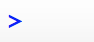
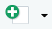

<link rel="stylesheet" href="//fonts.googleapis.com/css?family=Lato" />

<div id="header">

</div>

```{r markdown setup, include=FALSE}
knitr::opts_chunk$set(message = FALSE)
knitr::opts_chunk$set(echo = TRUE)
knitr::opts_chunk$set(warning = FALSE)

options(scipen = 999)
```

## introduction

R is one of two premier programming languages for data science and will likely be the fasting growing language in social and economic policy research over the next decade. 

R doesn't come in a box. R was never wrapped in cellophane and it definitely isn't purchased at a store. R's pricelessness and open source development are two of its greatest strengths, but it can often leave new users without the anchor of the box and booklet often provided with proprietary software. 

This guide is meant to be an on-ramp for soon-to-be R Users and a fill-in-the-gap guide for exisiting R Users. It starts with the most basic question, "what is R" and progresses to advanced topics like organizing analyses. Along the way it even demonstrates how to read XKCD comics in R. 

R boasts a strong community in the world and inside the Urban Institute. Please don't hesitate to contact Aaron Williams (awilliams@urban.org) or Kyle Ueyama (kueyama@urban.org) with thoughts or questions about R.  

## Setting Up R

### R

<center>
{width=15%}

[Source](https://www.r-project.org/logo/)
</center>

R is a free, open source software for statistical computing. It is known for intuitive, crisp graphics and an extensive, growing library of statistical and analytical methods. Above all, R boasts an enthusiastic community of developers, instructors, and users.  

The copyright and documentation for R is held by a not-for-profit organization called [The R Foundation](https://www.r-project.org/foundation/). 

### RStudio

<center>
{width=15%}

[Source, Fair use](https://en.wikipedia.org/w/index.php?curid=48590482) 
</center>

RStudio is a free, open source integrated development environment (IDE) that runs on top of R. In practice, R users almost exclusively open RStudio and rarely directly open R. 

RStudio is developed by a for-profit company called [RStudio](https://www.rstudio.com/). RStudio, the company, employs some of the R community's most-prolific open source developers and creates many open source tools and trainings.  

While R is a simple text editor, the RStudio IDE is a powerful tool with a console, syntax-highlighting, and debugging tools. [This cheatsheet](https://github.com/rstudio/cheatsheets/raw/master/rstudio-ide.pdf) outlines the power of RStudio. 

### Installation and Updates

Contact IT at helpdesk@urban.org to install R and RStudio on your machine. 

The R Project for Statistical Computing frequently releases R updates. The best way to update R on a Windows machine is with `library(installr)` (see below to learn more about packages). Load the package and then submit the function `updateR()` to start the updating process. On Mac or Linux, visit [this link](https://cran.r-project.org/mirrors.html), choose a mirror, and download the newest version of R. 

RStudio also releases occasional updates. Go to Help > Check for Updates to see if RStudio is up-to-date. If it is out-of-date, download the appropriate [update](https://www.rstudio.com/products/rstudio/download/) here and then contact IT at helpdesk@urban.org for administartive approval. 

## Learning R

### What to learn

There is often more than one way to accomplish a goal in R because of the language's flexibility. At first, this flexibility can be overwhelming. That's why it is useful to pick and master one set of tools before branching out and learning everything else. 

Fortunately, it is more clear than ever that the best place to start in R is with [Hadley Wickham's tidyverse](https://www.tidyverse.org/). The tidyverse is self described as "an opinionated collection of R packages designed for data science." The tidyverse consists of almost two dozen clear and concise tools for every part of an analysis workflow. At first, focus on the function `read_csv()` for loading data, the package `dplyr` for manipulating data, and the package `ggplot2` for plotting. 

Here's a quick example:

```{r, eval=FALSE}
library(tidyverse)
source('https://raw.githubusercontent.com/UrbanInstitute/urban_R_theme/master/urban_theme_mac.R')

read_csv()


houses <- tibble(state = state.name,
			 houses = rep(2, 50)) %>%
	mutate(houses = ifelse(state == "Nebraska", 1, 2))

write_csv(houses, "")

```

todo(aaron): add an example with the three tools

### Resources for learning

*R for Data Science* by Hadley Wickham and Garrett Grolemund is the best print resource for learning R and the tidyverse. The book is available [online](http://r4ds.had.co.nz/index.html) for free and *begins* with visualization which is motivating and practical. 

RStudio publishes a number of cheat sheets that cover the tidyverse. The main cheat sheets can be accessed in RStudio at Help > Cheat Sheets. Additional cheat sheets are accessible here on the [RStudio website](https://www.rstudio.com/resources/cheatsheets/). 

David Robinson, a data scientist from Stack Overflow, has a new [video course](https://www.datacamp.com/instructors/drobinson) about the tidyverse. Few people know as much about R and communicate as effecitvely as David Robinson. 

### Library

It's easy to feel ovewhelmed by the frenetic development of the extended R universe. Books are an invaluable resource for slowing down and focusing on fully-formed ideas. 

Aaron Williams (awilliams@urban.org) has a number of books that can be checked out:

* [The Art of R Programming](https://www.nostarch.com/artofr.htm)
* [ggplot2](http://www.springer.com/us/book/9780387981413)
* [Efficient R Programming](http://shop.oreilly.com/product/0636920047995.do) [Online!](https://csgillespie.github.io/efficientR/)
* [Text Mining with R](http://shop.oreilly.com/product/0636920067153.do) [Online!](https://www.tidytextmining.com/)
* [Reasoning with Data](https://www.guilford.com/books/Reasoning-with-Data/Jeffrey-Stanton/9781462530267/reviews)
* [Practical Statistics for Data Scientists](http://shop.oreilly.com/product/0636920048992.do)

### Built-in data sets

R has many built-in data sets that are useful for practice and even more data sets can are accessible through R packages. 

Submitting `data()` shows a list of all available data sets. `cars` and `iris` are two classic sets that are used in many examples. 

`library(tidyverse)` loads many more "tidy" data sets. `diamonds` and `starwars` are two entertaining data sets for practice. 

```{r tidyverse}
library(tidyverse)
starwars %>%
	count(species) %>%
	arrange(desc(n)) %>%
	head()
```

Students of econometrics will enjoy `library(wooldridge)`. It loads 105 data sets from _Introductory Econometrics: A Modern Approach_ by Jeffrey Wooldridge. Now you can practice your hedonic price models in R!

```{r psid}
library(wooldridge)
library(tidyverse)
source('https://raw.githubusercontent.com/UrbanInstitute/urban_R_theme/master/urban_theme_mac.R')

as_tibble(hprice1) %>%
	ggplot(aes(x = sqrft, y = price)) +
	geom_point() +
	scale_y_continuous(expand = c(0, 0), lim = c(0, 800)) +
	labs(title = '"hprice1" data from Wooldridge') 
```

### Getting Help

Even the best R programmers spend hours each week searching the Internet for answers. Here are some of the best ways to find answers: 

Submit `?` and any function name without parentheses (ex. `?mean`) to see the function documentation in RStudio. 

When Googling, set the search range to the last year using tools to avoid out-of-date solutions and to focus on up-to-date practices. 

[Stack Overflow](https://stackoverflow.com/) contains numerous solutions. Add `[r]` to any search to limit results to R. If a problem is particularly perplexing, it is simple to submit questions. Exercise caution when submitting questions because the Stack Overflow community has strict norms about questions but loose norms about respecting novices. 

[RStudio Community](https://community.rstudio.com/) is a new forum for R Users. It has a smaller back catalog than Stack Overflow but users are friendlier than on Stack Overflow. 

Finally, Aaron Williams (awilliams@urban.org) from IBP and Kyle Ueyama (kueyama@urban.org) from IT are available to solve problems, offer guidance, and share R enthusiasm. 

### CRAN Task Views

R has sub-communities, frameworks, and tools focused on different subject-matter and and methodological areas. [CRAN Task Views](https://cran.r-project.org/web/views/) is invaluable for understanding these communities and finding the best frameworks and tools for different disciplines in R. 

CRAN Task Views has 35 pages focused on subcategories of R ranging from [econometrics](https://cran.r-project.org/web/views/Econometrics.html) to natural language processing. Each page is maintained by a subject-matter expert and contains methods, packages, books, and mailing lists that are useful for researchers. 

The econometrics page alone contains detailed information on basic linear regression, microeconometrics, instrumental variables, panel data models, further regression models, time series data and models, data sets, CRAN packages, articles, books, and more. 

## R Code

### Submitting Code

RStudio has four main panels: code editor (top left), R console (bottom left), environment and history (top right), and files, plots, packages, help, and viewer pane (bottom right). 

There are two main ways to submit code:

1) Type code to the right of  in the R console and hit enter. **Note:** R won't create a longterm record of this code.
2) Click  in the top left to create a new R script in the code editor panel. Type code in the script. Highlight desired code and either click run the in top right of the code editor panel or type ctrl/command-enter to run code. Scripts can be saved, so they are the best way to write code that will be used again. 

### Meta-code

The are five fundamental pieces of code in R.  

* `<-` is the assignment operator. An object created on the right side of an assignment operators is assigned to a name on the left of an assignment operator. Assignment operators are important for saving the consequences of operations. Operations without assignment operators will typically be printed to the console but not saved. 
* `#` begins a comment
* `c()` combines similar vectors into larger vectors. For example, `c(1, 2, 3)` is a numeric vector of length three made up of three numeric vectors of length one. Scalars don't exist in R.  
* `?` in front of any function name without parentheses returns function documentation. For example, `?mean`. 
* `%>%` from `library(magrittr)` and `library(tidyverse)` is the "pipe operator". It passes the output from one function to another function. This is useful because strings of operations can be "piped" together instead of each individual operation needing to be assigned to an object.

### Functions

Functions in R are collections of code that when called cause certain actions. R contains hundreds of functions and thousands of more functions can be accessed through packages. 

Most functions take arguments. For example, the function `mean()` has arguments `x`, `trim`, `na.rm`, and `...`. The first argument in most functions, in this case `x`, is an input object. Arguments can be passed to functions by name or position. `mean(c(1, 2, 3))` is equivalent to `mean(x = c(1, 2, 3))`. 

Notice how the other three arguments were skipped. Most arguments in functions have default values. The best way to see default values is to submit the function name with a question mark, like `?mean`. In this case, `trim = 0`, `na.rm = FALSE`, and no further arguments were passed through with `...`.

In the previous example, the `c()` function was nested inside of the `mean()` function. It is also possible to assign a vector of 1, 2, and 3 to a name and pass the name to the mean function. 

```{r mean, eval = FALSE}
`apples <- c(1, 2, 3)`

`mean(apples)
```

R is mostly written in R. This is different than SAS and Stata which are written in C. It is possible to look at the source code for most R functions and understand what's happening. It's also possible to manipulate that source code. 

Still, R and its predecessor S, have a strong tradition of running compiled C and Fortran code. Many modern R packages have functions that call compiled C code in order to speed up processing.  

R is a [functional programming language](http://adv-r.had.co.nz/Functional-programming.html). In addition to having many pre-made functions like `mean()`, R has powerful tools for creating and manipulating custom functions. This is useful because:

* It avoids tedious and eror-prone copying-and-pasting and makes iterating processes simple;
* Is a powerful way to organize sets of operations;
* Is a standardized way to save code for later and share operations with others.

This last bullet is key to package system in R. 

### Packages

Opening RStudio automatically loads "base R", a fundamental collection of code that handles simple operations like math and system management. R can be extended with collections of code developed by the R community called packages. This sounds wild, but most packages are created and maintained by some of the best statisticians and developers in the world. 
Most packages can be installed with `install.packages("dplyr")`, where the string between the quotation marks is the name of the package. Packages installed with `install.packages()` come from CRAN and must pass certain checks for performance and documentation. Popular packages on CRAN, like dplyr, have as much, if not more support, standards, and quality than code in proprietary software packages like Stata or SAS. It is possible, but less common, to install packages from places like GitHub but this is less secure and the functionality of the packages is more likely to change over time. `install.packages()` need only be run once per version of package per machine and should rarely be included in scripts. 

Packages are loaded once per R session with the function `library()`. It is a good idea to include `library(package-name)` at the top of scripts for each package used in the script. This way it is obvious at the top of the script which packages are installed and loaded. 

For practice, submit the following three lines of code to install `RXKCD`, load `library(RXKCD)`, and get a random [XKCD comic](https://www.xkcd.com/). 

```{r xkcd, eval=FALSE}
install.packages("RXKCD")
library(RXKCD)
getXKCD("random")
```

```{r xkcd run, echo=FALSE}
library(RXKCD)
# assignment to hide text output
boom <- getXKCD("random")
```

Packages are frequently updated, especially around the time R versions change. The easiest way to update packages is Tools > Check for Package Updated in RStudio. 

**Note:** `install.packages()` uses quoted package names and `library()` uses unquoted package names. 

Occasionally, two loaded packages will have functions with identical names. Any conflicts with be announced when loading packages. If there is ever a conflict or any doubt about which function is used, use the package name and `::` to directly call the function. For example, `dplyr::select(apples)`. `::` can also be used to call a function without loading the entire package. 

### CRAN

The [Comprehensive R Archive Network](https://cran.r-project.org/index.html) (CRAN) contains almost 12,000 packages contributed over the last two decades by a range of developers. New packages are added to CRAN almost every day. 

CRAN enables R to have all of the benefits of broad-based open source development and the security and predictability of proprietary statistical packages like SAS and Stata. CRAN weds the benefits of broad-based, real-time package development with certain [standards](https://cran.r-project.org/index.html) for functionality and documentation. Methods and tools make it to R before SAS or Stata, if they ever make it to SAS or Stata, but have standards that generally exceed Python or other open source languages. (See: [Malicious Libraries Found on Python Package Index (PyPI)](https://www.blog.pythonlibrary.org/2017/09/15/malicious-libraries-found-on-python-package-index-pypi/))

Because of CRAN's long history and R's place in the statistics community, CRAN contains many methods that can't be accessed, much less duplicated, using proprietary software. In addition to being useful now, this also ensures that R isn't a temporary fad and will have staying power because of the challenge of replicating or besting CRAN. 

R's extensible design is important, but most tasks can be accomplished with a handful of packages:

* `ggplot2` data visualization
* `dplyr` data management
* `tidyr` data tidying
* `readr` data import 
* `purrr` functional programming
* `tibble` data frames
* `hms` times
* `stringr` character strings
* `lubridate` dates/times  
* `forcats` factors
* `DBI` databases 
* `haven` SPSS, SAS, and Stata files
* `readxl`.xls and .xlsx
* `modelr` simple modeling within a pipeline
* `broom` turning models into tidy data
* `tidyverse` loads all of the packages listed up to this point; see Hadley Wichkham's "[tidyverse](https://blog.rstudio.org/2016/09/15/tidyverse-1-0-0/)"

## Organizing Analyses

### Projects

Organizing scripts, files, and data is one of the most important steps to creating a clear and reproducible analysis. 

R Projects, proper noun, are the best way to organize an analysis. They have several advantages:

* They make it possible to concurrently run multiple RStudio sessions.
* They allow for project-specific RStudio settings. 
* They integrate well with Git version control. 
* They are the "node" of relative filepaths. (more on this in a second)

Before setting up an R Project, go to Tools > Global Options and uncheck "Restore most recently opened project at startup".

<center>
{width=50%}
</center>

Every new analysis in R should start with an R Project. First, create a directory that holds all data, scripts, and files for the analysis. Storing files and data in a subdirectories is encouraged. For example, data can be stored in a folder called data/.

Next, click "New Project..." in the top right corner. 


When prompted, turn your recently created "Existing Directory" into a project. 


Upon completion, the name of the R Project should now be displayed in the top right corner of RStudio where it used to display "Project: (None)". Once opened, .RProj files do not need to be saved. Simply double click the .RProj file when opening the analysis in the future. 

R Projects make code highly portable because of the way they handle filepaths. Here are a few rules:

#### Filepaths

Never use `\` in filepaths in R. `\` is a regular expression and will complicate an analysis. Fortunately, RStudio understands `/` in filepaths regardless of operating system. 

Never use `setwd()` in R. It is unnecessary, it makes code unreproducible across machines, and it is rude to collaborators. R Projects create a better framework for filepaths. Simply treat the directory where the R Project lives as the working directory and directories inside of that directory as subdirectories. 

For example, say there's a `.Rproj` called `introduction-to-r.Rproj` in a directory called `introduction-to-r`. If there is a .csv in that folder called `diamonds.csv`, the file can be loaded with `read_csv("diamonds.csv")` instead of `read_csv("H:/ibp/analyses/introduction-to-r/diamonds.csv")`. If that file is in a subdirectory of `introduction-to-r` called `data`, it can be loaded with `read_csv("data/diamonds.csv")`. The same concepts hold for writing data and graphics. 

This simplifies code and makes it portable. To share an analysis, simply send the entire directory to a collaborator or share it with GitHub.  

Here's an example directory:

<center>
{width=50%}
</center>

It isn't always possible to avoid absolute filepaths because of many different ways the Urban Institute stores data. Avoid absolute paths when possible and be deliberate about where analyses live in relation to when the data live. 

Check out [R for Data Science](http://r4ds.had.co.nz/workflow-projects.html) by Hadley Wickham and Garett Grolemund for a more thorough explanation of this workflow. Jenny Bryan also has a good [blogpost](https://www.tidyverse.org/articles/2017/12/workflow-vs-script/) about avoiding `setwd()`.

#### Naming Conventions

A little effort today can save a ton of work tomorrow. Be sure to follow [Jenny Bryan's three principles for file names](http://www2.stat.duke.edu/~rcs46/lectures_2015/01-markdown-git/slides/naming-slides/naming-slides.pdf):

1) Machine Readable
2) Human Readable
3) Plays Well with Default Ordering

### Version Control

The workflow outlined above integrates perfectly with version control like Git and distributed version control repository hosting services like GitHub. 

Version control is a system for recording changes to files over time. Version control is built around repositories. In this case, the folder containing the .Rproj is the perfect directory to use as a repository. A handful of simple commands are used to track and commit changes to text files (.R, .Rmd, etc.) and data. This record is valuable for testing alternatives, communicating with others and your future self, and documenting progress on projects.  

GitHub is a distributed repository system built on top of Git. GitHub has a number of valuable tools for collaboration and project management. In particular, it makes concurrent collaboration on code simpler with branches and has a slick system for issues. Here are the [branches](https://github.com/UrbanInstitute/urban_R_theme/branches) and [issues](https://github.com/UrbanInstitute/urban_R_theme/issues) for the Urban Institute R Graphics Guide. It also has free web hosting for websites like the website you are reading right now. 

The Urban Institute has a number of legacy models and code bases that span years and have been touched by scores of brilliant researchers. The future value of a record of all code changes and development is borderline unthinkable. 

### Coding Style

> "Good coding style is like using correct punctuation. You can manage without it, but it sure makes things easier to read." 
> ~Hadley Wickham

The details of a coding style are less important than consistently sticking to that style. Be flexible when working with collaborators so the style doesn't change inside an analysis. 

Here are two good sources for inspiration:

* [Google's R Style Guide](https://google.github.io/styleguide/Rguide.xml)
* [Hadley Wickham's R Style Guide](http://adv-r.had.co.nz/Style.html)

## Putting it All Together

R can augment or replace a traditional proprietary statistical packages like SAS or Stata with a few extra bells and whistles, but hopefully this guide and other resources show a fuller vision for developing reproducible, accurate, and collaborative analyses. 

This research pipeline, to use the phrase by Roger Peng, Jeff Leek, and Brian Caffo, combines the best of traditional economic and social policy research, computer science/software development, and statistics. 

PIPELINE

Reproducible, accurate, and collaborative analyses are achieved through a few principles:

* All steps in an analysis should be recorded.
* No steps in an analysis should be done "by hand".
* Version control should be used. 
* Software environments should be tracked. 
* Repositories should be stored in a collaborative location. 

These principles are reflected by a versioned repository on GitHub or on a confidential drive with:

* A clear README
* All analytic data, 
* use literate statistical programming like RMarkdown

* analytic data
* analytic code
* documentation of code and data
* standard means of distribution

But hopefully this guide makes starts to share a vision of a new workflow for economic and social policy analysis. 
This workflow combines the 

better practices for developing reprouducible, accurate, and collaborative economic and social policy research
