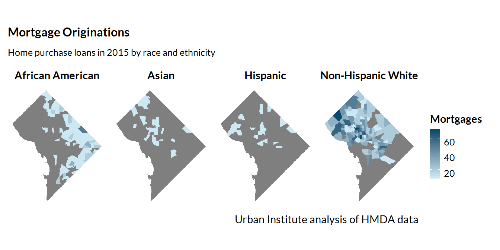

<link rel="stylesheet" href="//fonts.googleapis.com/css?family=Lato" />

::: {#header}

:::

```{r markdown-setup, include=FALSE}
knitr::opts_chunk$set(fig.path = "mapping/www/images/")
knitr::opts_chunk$set(message = FALSE)
knitr::opts_chunk$set(echo = TRUE)
knitr::opts_chunk$set(warning = FALSE)

options(scipen = 999)
```

```{r setup, include=FALSE}
library(tidyverse)
library(knitr)
library(kableExtra)
library(here)
library(sf)
library(vembedr)
```

# Text to put somewhere

We hope this guide is a useful resource that helps you accomplish your
existing research ideas or helps you come up with entirely new ideas.
Please don't hesitate to contact Aaron Williams
([awilliams\@urban.org](mailto:awilliams@urban.org){.email}) or Ajjit
Narayanan ([anarayanan\@urban.org](mailto:anarayanan@urban.org){.email})
if you have any questions about this guide or need any assistance with
R. And make sure to join our slack channel at \#r-users-group!

Rob Pitingolo
([rpitingolo\@urban.org](mailto:rpitingolo@urban.org){.email}) and the
Urban Institute Mapping Users Group are also a fantastic resource to
learn more about maps.

# Introduction

------------------------------------------------------------------------

This guide will teach you the concepts and R libraries you will need for
mapping and geospatial analysis in R. **This is a long guide, so if you
need something specific, we encourage you to scroll to the appropriate
section using the Table of Contents on the left.** If you just want to
see code examples of maps you can copy and paste, go to the Map Gallery
(coming soon!).

## Should this be a map?

The [Urban Institute Data Visualization Style
Guide](http://urbaninstitute.github.io/graphics-styleguide/)  offers some
blunt but useful suggestions for maps:

> Just because you've got geographic data, doesn't mean that you have to
> make a map. Many times, there are more efficient storyforms that will
> get your point across more clearly. If your data shows a very clear
> geographic trend or if the absolute location of a place or event
> matters, maps might be the best approach, but sometimes the reflexive
> impulse to map the data can make you forget that showing the data in
> another form might answer other---and sometimes more
> important---questions.

So we would encourage you to think critically beofore making a map

## Why map with R?

R can have a steeper learning curve than point-and-click tools - like
QGIS or ArcGIS - for geospatial analysis and mapping. But creating maps
in R has many advantages including:

1)  **Reproducibility**: By creating maps with R code, you can easily
    share the outputs and the code that generated the output with
    collaborators, allowing them to replicate your work and catch errors
    easily.

2)  **Iteration**: With point and click software like ArcGIS, making 50
    maps would be 50 times the work/time. But using R, we can easily
    make make many iterations of the same map with a few changes to the
    code.

3)  **Easy Updates**: Writing code provides a roadmap for others (and
    future you!) to quickly update parts of the map as needed. Say for
    example a collabarator wanted to change the legend colors of 50
    state maps. With R, this is possible in just a few seconds!

4)  **An Expansive ecosystem**: There are several R packages that make
    it very easy to get spatial data, create static and interactive
    maps, and perform spatial analyses. This feature rich package
    ecosystem which all play nice together is frankly unmatched by other
    programming languages and even point and click tools like QGIS and
    ArcGIS. Some of these R packages include:

    -   \`sf\`: For managing and analyzing spatial dataframes
    -   \`tigris\`: For downloading in Census geographies
    -   \`ggplot2\`: For making publication ready static maps
    -   \`urbnmapr\`: For automatically adding Urban styling to static
        maps
    -   \`mapview\`: For making expxploratory interactive maps

5)  **Cost**: Most point-and-click tools for geospatial analysis are
    proprietary and expensive. R is free opensource software. The
    software and most of its packages can be used for free by anyone for
    almost any use case.

## Helpful Learning Resources

-   The Urban Institute [mapping training
    series](https://ui-research.github.io/urbn101-mapping/) (with video
    lectures and notes)
-   Chapters
    [5](https://walker-data.com/census-r/census-geographic-data-and-applications-in-r.html),
    [6](https://walker-data.com/census-r/mapping-census-data-with-r.html),
    and
    [7](https://walker-data.com/census-r/spatial-analysis-with-us-census-data.html)
    from Kyle Walker's Analyzing US Census Data
    [book](https://walker-data.com/census-r/index.html).
-   Andew Heiss' fantastic mapping [guide](https://datavizm20.classes.andrewheiss.com/example/12-example/)
-   All of the vignettes for the [`sf`
    package](https://cran.r-project.org/web/packages/sf/sf.pdf)
-   [Geocomputation with
    R](https://geocompr.robinlovelace.net/index.html): A book by Robin
    Lovelace and others
-   UChicago's R Spatial Workshops:
    <https://spatialanalysis.github.io/tutorials/>

# Basic Concepts

------------------------------------------------------------------------

## library(sf)

The `sf` library is a key tool for reading in, managing, and working
with spatial data in R. `sf` stands for simple features (not San
Francisco you Bay Area folks) and denotes a way to describe the spatial
attributes of real life objects. The R object you will be working with
most frequently for mapping is an `sf` dataframe. An `sf` dataframe
is essentially a regular R dataframe, with a couple of extra features
for use in mapping. These extra features exclusive to `sf` dataframes
include:

-   sticky `geometry` columns
-   attached coordinate reference systems
-   some other spatial metadata

The most important of the above list is the sticky `geometry` column,
which is a magical column that contains all of the geographic
information for each row of data. Say for example you had a `sf`
dataframe of all DC census tracts. Then the `geometry` column would
contain all of the geographic points used to define DC census tract
polygons. The stickiness of this column means that no matter what data
munging/filtering you do, you will not be able to drop or delete the
`geometry` column. Below is a graphic to help you understand this:

`r knitr::include_graphics(here::here("mapping", "www", "images", "sf_sticky_geometry.png"), dpi = 600)`

credits: @allisonhorst

And below is an example of reading in an `sf` dataframe and printing it
to the R console.

```{r print_sf, warning = F, message = F}
# Read in spatial data about DC parks from DC Open Data Portal
dc_parks  = st_read("https://opendata.arcgis.com/api/v3/datasets/287eaa2ecbff4d699762bbc6795ffdca_9/downloads/data?format=geojson&spatialRefId=4326",
										quiet = T)

# Select just a few columns for readability
dc_parks = dc_parks %>%
	select(NAME, geometry)

# Print to the console
dc_parks
```

Note that there is some spatial metadata such as the `Geometry Type`,
`Bounding Box`, and `CRS` which shows up as a header before the actual
contents of the dataframe.

Since `sf` dataframes operate similarly to regular dataframes, we can
use all our familiar `tidyverse` functions for data wrangling, including
`select`, `filter`, `rename`, `mutate`, `group_by` and `summarize`. The
`sf` package also has many functions that provide easy ways to replicate
common tasks done in other GIS software like spatial joins, clipping,
and buffering. Almost all of the mapping and geospatial analysis methods
described in this guide rely on you having an `sf` dataframe. So let's
talk about how to get one!

## Importing spatial data

The first step to mapping in R is reading in your spatial data as an
`sf` dataframe. There are many R packages that make this easy, depending
on the kind of spatial data you want to read in.

### For states and counties

We highly recommend using the `library(urbnmapr)` package, which was
created by folks here at Urban to easily create state and county level
maps. The `get_urbn_map()` function in the package allows you to read in
spatial data on states and counties, with options to include
territories. Importantly, it will also display AL and HI as insets on
the map in accordance with the Urban Institute Data Visualization Style
Guide. For information on how to install `urbnmapr`, see the [GitHub
repository](https://github.com/UrbanInstitute/urbnmapr).

Below is an example of how you would use `urbnmapr` to get an `sf`
dataframe of all the states or counties in the US.

```{r urbnmapr-1, eval=FALSE}
library(urbnmapr)

# Get state data
states <- get_urbn_map("states", sf = TRUE)

# Can also get county data
counties <- get_urbn_map("counties", sf = TRUE)
```

### For other Census geographies

We recommend using the `library(tigris)` package, which allows you to
easily download TIGER and other cartographic boundaries from the US
Census Bureau. In order to automatically load in the boundaries as `sf`
objects, run `r options(tigris_class = "sf")` once per R session.

`library(tigris)` has all the standard census geographies, including
census tracts, counties, CBSAs, ZCTAs, congressional districts, tribal
areas, and more. It also includes other elements such as water, roads,
and military bases. A couple of notes on `library(tigris)`:

-   By default, `libraray(tigris)` will download large very large and
    detailed TIGER line boundary files. For thematic mapping, the
    smaller cartographic boundary files are a better choice, as they are
    clipped to the shoreline, generalized, and therefore usually smaller
    in size without losing too much accuracy. To load cartographic
    boundaries, use the `cb = TRUE` argument. If you are doing detailed
    geospatial analysis and need the most detailed shapefiles, then you
    should use the detailed TIGER line boundary files and set
    `cb = FALSE`.

-   `library(tigris)` functions also allow you to load boundaries for
    previous years, though they will default to the most recent year.

Below is an example of how you would use `library(tigris)` to get a `sf`
dataframe of all Census tracts in Maryland for 2015.

```{r tigris-1, eval=FALSE}
library(tigris)

# Only need to set once per script
options(tigris_class = "sf")

md_zctas <- tracts(state = "MD",
									cb = TRUE,
									year = 2015)

```

Unlike `library(urbnmapr)`, different functions are used to get
geographic data for different geographic levels. For instance, the
`blocks()` function will load census block group data, and the `tracts()`
function will load tract data. Other functions include `block_groups()`,
`zctas()` , and `core_based_statistical_areas()`. For the
full list of supported geographies and functions, see the [package
vignette](https://cran.r-project.org/web/packages/tigris/tigris.pdf).

For folks interested in pulling in Census demographic information
along with Census geographies, we recommend checking out the sister
package to `library(tigris)`: `library(tidycensus)`. That package allows
you to download in Census variables and Census geographic data
simultaneously.

### For boundaries outside the US

We recommend using the `library(rnaturalearth)` package, which is
similar to `library(tigris)` but allows you to download and use
boundaries beyond the US. Instead of setting class to `sf` one time per
session as we did with `library(tigris)`, you must set the
`returnclass = "sf"` argument each time you use a function from the
package. Below is an example of downloading in an `sf` dataframe of all
the countries in the world.

```{r natural-earth, eval = FALSE}

library(rnaturalearth)

world <- ne_countries(returnclass = "sf")

ggplot() +
	geom_sf(data = world, mapping = aes())

```

### Your own files

#### Shapefiles/GeoJSONS

Shapefiles and GeoJSONs are 2 common spatial file formats you will found
out in the wild. `library(sf)` has a function called `st_read` which
allows you to easily read in these files as `sf` dataframes. The only
required argument is `dsn` or data source name. This is the filepath of the 
`.shp` file or the `.geojson` file on your local computer. For geojsons, 
`dsn` can also be a URL.

Below is an example of reading in a shapefile of fire stations in DC
which is stored in `mapping/data/shapefiles/`.

```{r list f-ei}
library(sf)

# Print out all files in the directory
list.files("mapping/data/shapefiles")
```

Note that shapefiles are actually stored as 6+ different files inside a
folder. You need to provide the fileapth to the file ending in `.shp`.

```{r st-read-shpfile}
dc_firestations <- st_read(dsn = "mapping/data/shapefiles/Fire_Stations.shp",
													 quiet = T)

```

And now `dc_firestations` is an `sf` dataframe you can use in all your
mapping needs! `st_read` supports reading in a wide variety of
other spatial file formats, including geodatabases, KML files, and over
200 others. For an incomplete list, please see the this `sf`
[vignette](https://r-spatial.github.io/sf/articles/sf2.html).

#### CSVs or dataframes with lat/lons

If you have a CSV with geographic information stored in columns, you will need
to read in the CSV as a regular R dataframe and then convert to an `sf` dataframe.
`library(sf)` contains the `st_as_sf()` function for converting regular
R dataframes into an `sf` dataframe. The two arguments you must specify for this
function are:

-   `coords`: A length 2 vector with the names of the columns
    corresponding to longitude and latitude (in that order!). For
    example, `c("lon", "lat")`.
-   `crs`: The CRS (coordinate references system) for your
    longitude/latitude coordinates. Remember you need to specify both the \
    authority and the SRID code, for exmaple ("EPSG:4326"). For more information
    on finding and setttnig CRS codes, please see this section.
    (TODO: INSERT CRS LINK)

Below is an example of reading in data from a CSV and
converting it to an `sf` dataframe.

```{r make-sf, message = F, warning = F}
library(sf)

# Read in dataset of state capitals which is stored as a csv
state_capitals <- read_csv("mapping/data/state-capitals.csv")

state_capitals <- state_capitals %>% 
	# Specify names of the lon/lat columns in the CSV to use to make geometry col
	st_as_sf(coords = c("longitude", "latitude"),
					 crs = 4326)

```

One common mistake is that before converting to an `sf` dataframe, you
must drop any rows that have `NA` values for latitude or longitude. If
your data contains `NA` values, then the `st_as_sf()` function will
throw an error. 

## Appending spatial info to your data

Oftentimes, the data you are working with will just have state or county
identifiers - like FIPS codes or state abbreviations - but will not
contain any geographic information. In this case, you must do the extra
work of downloading in the geographic data as an `sf` dataframe and then
joining your non-spatial data to the spatial data. Generally this
involves 3 steps:

1)  Reading in your own data as a data frame
2)  Reading in the geographic data as an `sf` dataframe
3)  Using `left_join` to merge the geographic data with your own non
    spatial data and create a new expanded `sf` dataframe

Let's say we had a dataframe on CHIP enrollment by state with state
abbreviations.

```{r readin-chip-data, warning=F, message=F}

# read the state CHIP data
chip_by_state <- read_csv("mapping/data/chip-enrollment.csv") %>% 
	# clean column names so there are no random spaces/uppercase letters
	janitor::clean_names()

# print to the console
chip_by_state %>% head()

```

In order to convert this to an `sf` dataframe, we need to read in the
spatial boundaries for each state and append the magical `geometry`
column to turn it into an `sf` dataframe. Here is how we do that with
`get_urbn_map()` and `left_join()` .

```{r append-spatial-info, warning = F, message = F}
library(urbnmapr)

# read in state geographic data from urbnmapr
states <- get_urbn_map(map = "states", sf = TRUE)

# left join state geographies to chip data
chip_with_geographies = states %>% 
	left_join( 
		chip_by_state, 
		# Specify join column, which are slightly differently named in states and chip 
		# respectively
		by = c("state_abbv" = "state_abbreviation"))

chip_with_geographies %>% 
	select(state_fips, state_abbv, chip_enrollment)

```

A common pitfall when doing `left_join()`s is that some records may be
missing from either the left hand side dataframe (in this case `states`)
or the right hand side dataframe (in this case `chip`). This can happen
if a few states are missing in your data, or if your data has misspelled
states that weren't matched.

We highly recommend using `libraray(tidylog)` and the
`tidylog::left_join()` function - instead of the regular `left_join`
function - to print additional information on the number of rows that
are unmatched, or rows only in the left hand side/right hand side
dataframes. This will help you identify errors and mismatches between
datasets early on in your data ingestion process. For example say we
also wanted to merge in a dataset of state population totals onto our
`chip_with_geographies` dataframe. If we use `tidylog::left_join()`

```{r append-state-pops, message = TRUE, include = TRUE}

# Read in data on state populations from 2010
state_pops <- 
	read_csv("https://raw.githubusercontent.com/jakevdp/data-USstates/master/state-population.csv",
					 # Set this to disable printing column info to console
					 col_types = cols()) %>% 
	filter(ages == "total", year == "2010") %>% 
	select(state_abbv   = `state/region`, population)

chip_with_geographies <- chip_with_geographies  %>% 
	# Specify left_join from tidylog to print summary messages
 	tidylog::left_join(state_pops, by = "state_abbv")
 

```

After some digging, we see that the two unmatched rows in the `state_pops`
dataframe correspond to PR and the USA total, which we choose to safely
disregard.

## Coordinate Reference Systems

### The short version

Just watch this video:
`r vembedr::embed_url("https://www.youtube.com/watch?v=vVX-PrBRtTY")`

The Urban Institute Style Guide requires the use of the Atlas Equal Earth
Projection (`"ESRI:102003"`) for US maps. For state and local maps, use
[this](https://github.com/veltman/d3-stateplane) handy guide to find an 
appropriate State Plane projection. 

### The long version

Coordinate reference systems (CRS) specify the 3d shape of the earth
and optionally how we project that 3d shape onto a 2d surface. They are an important part of working with spatial
data as you need to ensure that all the data you are working with are in
the same CRS in order for spatial operations and maps to be accurate.

CRS can be specified either by name (ie Maryland State Plane) or
**S**patial **R**eference System **ID**entifier (SRID). THe SRID is a
numeric identifier that uniquely identifies a coordinate reference
system. Generally when referring to an SRID, you need to refer to an
authority (ie the data source) and a unique ID. An example is
`EPSG:26985` which refers to the Maryland State plane projection from the
EPSG, or `ESRI:102003` which refers to the Atlas Equal Area projection
from ESRI. Most CRS codes will be from the EPSG, and some from ESRI and
others. A good resource for finding/validating CRS codes is
[epsg.io](epsg.io).

Sidenote - EPSG stands for the now defunct European Petroleum Survey
Group. And while oil companies have generally been terrible for the
earth, the one nice thing they did for the earth was to set up common
standards for coordinate reference systems.

You might be thinking well isn't the earth just a sphere? Why do we need
all this complicated stuff? And the answer is well the earth is [kind
of](https://oceanservice.noaa.gov/facts/earth-round.html) a sphere, but
it's really more of a misshapen ellipsoid which is pudgier at the
equator than at the poles. To visualize how coordinate reference systems work, imagine that the
earth is a (lumpy) orange. Now peel the skin off an orange and try to
flatten it. There are many ways to do it, but all will create
[distortions](https://twitter.com/neilrkaye/status/1050740679008296967)
of some kind. The CRS will give us the formula we've used to specify the
shape of the orange (usually a sphere or ellipsoid of some kind) and
optionally, specify how we flattened the orange into 2d.

Broadly, there are two kinds of Coordinate Reference Systems:

1)  [**Geographic coordinate
    systems**](https://www.ibm.com/support/knowledgecenter/en/SSGU8G_12.1.0/com.ibm.spatial.doc/ids_spat_407.html)

    -   (sometimes called unprojected coordinate systems)
    -   Specifies a 3d shape for the earth
    -   Uses a spheroid/ellipsoid to approximate shape of the earth
    -   Usually use decimal degree units (ie latitude/longitude) to
        identify locations on earth
        `r knitr::include_graphics(here::here("mapping", "www", "images", "gcs_esri.png"), dpi = 150)`


2)  [**Projected coordinate systems**](https://mgimond.github.io/Spatial/chp09-0.html#projected-coordinate-systems)

    -   Specifies a 3d shape for the earth + a 2d mapping

        -   Is a geographic coordinate system + a *projection*
        
            `r knitr::include_graphics("https://imgs.xkcd.com/comics/projecting.png")`
        -   **projection**: mathematical formula used to convert a 3d
            coordinate system to a 2d flat coordinate system
        -   Many different kinds of projections, including Equal Area,
            Equidistant, Conformal, etc
        -   All projections distort the true shape of the earth in some
            way, either in terms of shape, area, or angle. Required
            [xkcd comic](https://xkcd.com/977/)
        -   Usually use linear units (ie feet, meters) and therefore
            useful for distance based spatial operations (ie creating
            buffers)

### Finding the CRS

If you are lucky, your data will have embedded CRS data that will be
automatically detected when the file is read in. This is usually the
case for GeoJSONS (`.geojson`) and shapefiles (`.shp`). When you use
`st_read()` on these files, you should see the CRS displayed in the
metadata:

```{r import-shpfile-crs example, echo = F}
	knitr::include_graphics(here("mapping", "www", "images", "sf_crs_pic.png"))
```


You can also the `st_crs()` function to find the CRS associated with your `sf` dataframe. Note that the information returned is very long, but the key information is located at the end in `ID[authority, SRID]`. For example:
```{r st_crs}
st_crs(dc_firestations)
```


Sometimes however, the CRS will be blank or `NA` as the
dataset did not specify the CRS. In that case you MUST find and set the
CRS for your data before proceeding with analysis. Below are some good
rules of thumb for finding out what the CRS for your data is:

-   For geojsons, the CRS should always be `EPSG:4326` (or WGS 84). The
    official geojson specification states that this is the only valid
    crs for geojsons, but in the wild, this may not be true 100% of the
    time.
-   For shapefiles, there should be a file that ends in `.proj` in the
    same directory as the `.shp` file. This file contains the projection
    information for that file.
-   For CSV's with latitude/longitude columns, the CRS is usually
    `EPSG:4326` (or WGS 84).
-   Look at the metadata and any accompanying documentation to see if
    the coordinate reference system for the data is specified

If none of the above rules of thumb apply to you, check out
[Whattheproj](https://stevage.github.io/WhatTheProj/), or the
`crsuggest` R [package]() for help identifying the CRS in your data. Once you've 
identified the appropriate CRS, you can set the CRS for your data with `st_crs()`:

```{r set_crs, eval = F}
# If you are certain that your data contains coordinates in the ESRI Atlas Equal Earth projections
some_sf_dataframe = st_crs("ESRI:102003")
```


### Transforming the CRS

Often you will need to change the CRS for your `sf` dataframe. You can do this with `st_transform`:

```{r}
# Tranforming CRS from WGS 84 to Urban required Equal Earth Projection
dc_firestations = dc_firestations %>% st_transform("ESRI:102003")
```

if you are working with multiple `sf` dataframes which have different CRS, 
you will need to transform the CRS to all be the same. Luckily, `st_transform`
allows you to just use the CRS of another `sf` dataframe when transforming, so 
an easy way to do this would be

```{r}
# transform CRS of df to be the same as CRS of dc_firestations
chip_with_geographies = chip_with_geographies %>% 
	st_transform(crs = st_crs(dc_firestations))

```

# Mapping

In order to start mapping, you need an `sf` dataframe. If you don't have
one, see the `Basic Concepts` section above.

## The basics

### library(ggplot2)

Most mapping in R fits the same theoretical framework as plotting in R
using `library(ggplot2)`. To learn more about ggplot2, visit the Data Viz [page](https://urbaninstitute.github.io/r-at-urban/graphics-guide.html#Grammar_of_Graphics_and_Conventions)
or read the official ggplot [book](html)

The key function for mapping is the special `geom_sf()` geom which works with 
`sf` dataframes. This function magically detects whether you have point or 
polygon spatial data and displays the results on a map. 

### A simple map

To make a simple map, all you need to do is add a `geom_sf()` to a
`ggplot` and set the `data` argument equal to an `sf` dataframe. Say for
example you wanted to make a map of all 50 states using data from
`library(urbnmapr)`:

```{r first-map}

library(urbnmapr)

states <- get_urbn_map("states", sf = TRUE)

ggplot() +
	geom_sf(data = states, mapping = aes())

```

Note that we set no `aes` mappings as we currently do not want to apply
any mappings (like coloring in the states by a variable or allowing the
transparency to vary by a variable). We will cover how to set such
aesthetic mappings later.

## Styling

### `library(urbnthemes)`

`library(urbnthemes)`  automatically styles maps in
accordance with the [Urban Institute Data Visualization Style
Guide](http://urbaninstitute.github.io/graphics-styleguide/). By using
`library(urbnthemes)`, you can create publication ready maps you can
immediately drop in to Urban research briefs or blog posts.

To install `urbnthemes`, visit the package's [GitHub
repository](https://github.com/UrbanInstitute/urbnthemes) and follow the instructions.

You can use the automated theming functions in two ways: set the map
defaults once per script, or add `theme_urbn_map()` to the end of each
of your created maps. These functions will get rid of unnecessary axes,
labels, and gridlines that are useful for charts, but not needed for
maps.

```{r urbnthemes}

library(urbnthemes)

# You can either run this once per script to automatically style all maps with
# the Urban theme
set_urbn_defaults(style = "map")

# Or you can add `+ theme_urbn_map()` to the end of every plot you make
ggplot() +
	geom_sf(states, mapping = aes()) +
	theme_urbn_map()

```

### Layering

Just like in other GIS software, you can layer multiple geometries on
top of each other using the `+` operator from `library(ggplot2)`. The
shapes will appear from bottom to top (ie the last mapped object will
show up on top). It is important that all layers are in the same CRS
(coordinate reference system).

```{r layers}

state_capitals = state_capitals %>% 
	# This will change CRS to ESRI:102003 and shift the AK and HI state capitals
	# point locations to the appropriate locations on the inset maps.
	tigris::shift_geometry()

ggplot() +
	geom_sf(data = states,
					mapping = aes()) +
	geom_sf(data = state_capitals, 
					mapping = aes(),
					# urbnthemes library has urbn color palettes built in.
					color = palette_urbn_main['cyan'], 
					size = 2.0) +
	theme_urbn_map()

```

### Fill and Outline Colors

The same commands used to change colors, opacity, lines, size, etc. in
charts can be used for maps too. For instance, to change the
colors of the map above, just use the `fill =` and `color =`
parameters in `geom_sf()`. `fill` will change the fill color of
polygons; `color` will change the color of polygon outlines, lines, and
points.

`library(urbnthemes)` contains inbuilt. helper variables (like
`palette_urbn_main`) for accessing color palettes from the Urban Data
Viz Style guide. If for example you want states to be Urban's magenta color:

```{r urbnthemes- pink}

ggplot() +
	geom_sf(states, mapping = aes(),
					# Adjust polygon fill color
					fill = palette_urbn_main['magenta'],
					# Adjust polygon outline color
					color = "white") +
	theme_urbn_map()

```

### Adding text

You can also add text, like state abbreviations, directly to your map using 
`geom_sf_text` and the helper function `get_urbn_labels()`. 

```{r geom_sf_text}
ggplot() +
	geom_sf(states, mapping = aes(),
					color = "white") +
	theme_urbn_map() +
	# Generates dataframe of state abbv and appropriate location to plot them
	geom_sf_text(data = get_urbn_labels(map = "states", 
																			sf = TRUE), 
                aes(label = state_abbv), 
            size = 3)

```
There's also `geom_sf_label()` if you want labels with a border. 
```{r geom_sf_label}

ggplot() +
	geom_sf(states, mapping = aes(),
					color = "white") +
	theme_urbn_map() +
	geom_sf_label(data = get_urbn_labels(map = "states", 
																			sf = TRUE), 
                aes(label = state_abbv), 
            size = 3)

```

### Urban Institute style

-   U.S. dot maps and U.S. choropleths use the Albers Equal-Area Conic
    Projection. Tile-based maps like tile grid maps and geofaceting use
    the Mercator projection.
-   Maps that show the magnitude of a variable use the blue sequential
    ramp and maps that display positives and negatives use the diverging
    color ramp.
-   In general, the borders between geographies are white.

## Choropleth Maps

Choropleth maps display geographic areas with shades, colors, or
patterns in proportion to a variable or variables. Choropleth maps can
represent massive geographies like the entire world and small
geographies like Census Tracts. To make a choropleth map where you shade
in regions in proportion to a variable, you can set an aesthetic mapping
inside the `aes` argument of `geom_sf`.

When we set an aesthetic mapping, we are telling R that we want some
aspect of the plot to change in accordance with a variable in our
dataset. And because we want the fill color to vary, we use the `fill`
aesthetic.

### Continuous color scale

Let's say we wanted to make a chloropleth map of states colored in by
CHIP enrollment as a percentage of total population (ie the
`chip_enrollment` variable divided by the `population` variable in the
`chip_with_geographies` dataframe). Below is the code we would use

```{r, choropleth-1}

# Calculate the chip enrollment percentage and append as a column
chip_with_geographies <- chip_with_geographies %>% 
	mutate(chip_pct = chip_enrollment/population)

# make chloropleth map
ggplot() + 
	geom_sf(data = chip_with_geographies, 
					# we set the fill aesthetic to be a column in the data
					aes(fill = chip_pct),
					# set white boundaries
					color = "white") + 
	theme_urbn_map() +
	# dipslay legend labels as percentages. Note we use use scale_fill_continuous bc
	# we want a continuous legend
	scale_fill_continuous(labels = scales::percent)

```

### Discrete color scale

You can also have discrete color bins (ie 0-1%, 1-2%, etc) for the
legend. Be careful when doing this as changing the number or size of
bins can drastically change how the map looks.

```{r}

# make chloropleth map with discrete buckets

# Discretize continuous chip_pct variable
x = chip_with_geographies %>% 
	# Add two rows where chip_pct = 0 and 1 in order to have cut_interval
	# generate bins that include 0 and 1 as they aren't in the data explicitly
	add_row(chip_pct = 0) %>% 
	add_row(chip_pct = 1) %>% 
	mutate(chip_pct = cut_interval(chip_pct, n =3))
				 	
				 
ggplot() + 
	geom_sf(data = x, 
					# we set the fill aesthetic to be a column for chloropleth maps
					aes(fill = chip_pct)) + 
	theme_urbn_map()

```

When mapping, you need to be very careful when setting color breaks for
legends as slightly different breaks can generate very different looking
maps

## Interactive Maps

Interactive maps can be a great tool to explore and understand your
data. And luckily there are a lot of new R packages that make it really
easy to create them.

### `library(mapview)`

`library(mapview)` is probably the most user friendly of the interactive
mapping R libraries. All you have to do to create an interactive map is:

```{r show-mapview}
library(mapview)

mapview(chip_with_geographies)
```

A couple of things to note about this interactive map:

    - When you click on an object, you get a popup table of all it's attributes
    - When you hover over an object, you get a popup with an object id
    - The default basemap used is from Carto 

Each of the above behaviors can be changed if desired. As you'll see in
the below section, the syntax for `library(mapview)` is significantly
different from `libraray(ggplot2)` so be careful!

#### Coloring in points/polygons

In order to create a chloropleth map where we color in the
points/polygons by a variable, we need to feed in a column name *in
quotes* to the`zcol` argument inside the `mapview()` function:

```{r mapview_zcol}
# Create interactive state map colored in by chip enrollment,
mapview(chip_with_geographies, zcol = "chip_enrollment")
```

If you want more granular control over the color palette for the legend
can also feed in a vector of color hex codes to `col.regions` along with
a column name to `zcol`. This will create a continuous color range along
the provided colors. Be careful though as the color interpolation is not
perfect.

```{r}
library(RColorBrewer)
mapview(chip_with_geographies, 
				col.regions = c(palette_urbn_green[6], 
												"white", 
												palette_urbn_cyan[6]),
				zcol = "chip_enrollment") 
```

If you want to color in all points/polygons as the same color, just feed
in a single color hex code to the `col.regions` argument:

```{r}
mapview(chip_with_geographies, col.regions = palette_urbn_green[5]) 
```

#### Adding layers

You can add multiple `sf` objects on the same map by using the `+`
operator. This is very useful when comparing 2 or more spatial datasets.

```{r}
mapview(chip_with_geographies, col.regions = palette_urbn_green[5]) +
	mapview(state_capitals, col.regions = palette_urbn_cyan[5])
```

You can even create slider maps by using the `|` operator!

```{r}
mapview(chip_with_geographies, col.regions = palette_urbn_green[5]) |
	mapview(state_capitals, col.regions = palette_urbn_cyan[5])
```

### More details

To learn more about more advanced options with `mapview` maps, check out
their
[documentation](https://r-spatial.github.io/mapview/articles/articles/mapview_02-advanced.html)
page and the [reference
manual](https://cran.r-project.org/web/packages/mapview/mapview.pdf).

There are also other interactive map making packages in R like `leaflet`
(which `mapview` is a more user friendly wrapper of), `tmap`, and
`mapdeck`. To learn about these other packages, [this book
chapter](https://geocompr.robinlovelace.net/adv-map.html#interactive-maps)
is a good starting point.

## Dot Maps

## Tile Grid Maps

## Geofacetting

## Cartograms

# Spatial Operations

### Calculating Distance

### Spatial Joins

### Cropping

### Aggregating

### Drive/Transit times

# Geocoding

Geocoding is the process of turning text (usually addresses) into
geographic coordinates (usually latitudes/longitudes) for use in
mapping. For Urban researchers, we highly recommend using the [Urban
geocoder](https://tech-tools.urban.org/geocoding/) as it is fast,
accurate, designed to work with sensitive/confidential data and most
importantly free to use for Urban researchers! To learn about how we set
up and chose the geocoder for the Urban Institute, you can read our
[Data\@Urban
blog](https://medium.com/@urban_institute/choosing-a-geocoder-for-the-urban-institute-86192f656c5f).

### Cleaning Addresses

The single most important factor in getting accurate geocoded data is
having clean, well structured address data. This can prove difficult as
address data out in the wild is often messy and unstandardized. While
the rules for cleaning addresses are very data specific, below are some
examples of clean addresses you should aim for in your data cleaning
process:

```{r cleaned-addr, cache=TRUE,eval=TRUE,results=TRUE}
library(gt)
cleaned_address_table  = tribble(
	~"f_address", ~"Type of address",
	"123 Troy Drive, Pillowtown, CO, 92432", "residnetial address",
	"789 Abed Avenue, Apt 666, Blankesburg, CO, 92489", "residential apartment address",
	"Shirley Boulevard and Britta Drive, Blanketsburg, CO, 92489", "street intersection",
	"Pillowtown, CO", "city",
	"92489, CO", "Zip Code",
	
	)

gt(cleaned_address_table) %>% 
    # tab_header(title = md("Clean Address Examples")) %>% 
    opt_row_striping(row_striping = TRUE) %>% 
	  tab_style(
    style = list(
	      cell_text(weight = "bold")
	      ),
	    locations = cells_column_labels(
	    	columns = vars(f_address, `Type of address`)
	    )) %>% 
    opt_align_table_header(align = c("left")) %>% 
    tab_options(
      container.width = "100%",
      container.height = "400px",
      # column_labels.background.color  = palette_urbn_cyan[1],
      table.border.top.width = 0,
      table.border.bottom.width = 0,
      column_labels.border.bottom.width= 0,
      

    )

```

All that being said, our geocoder is pretty tolerant of different
address formats, typos/spelling errors and missing state, zip codes,
etc. So don't spend too much time cleaning every address in the data.
Also note that while our geocoder is able to geocode cities and zip
codes, it will return the lat/lon of the center of the city/zip code,
which may not be what you want.

## Instructions

To use the [Urban geocoder](https://tech-tools.urban.org/geocoding/),
you will need to:

1)  Generate a CSV with a column named `f_address` which contains the
    addresses in single line format (ie
    `123 Abed Avenue, Blanketsburg, CO, 94328`). This means that if you
    have the addresses split across multiple columns (ie `Address`,
    `City`, `State`, `Zip` columns), you will need to concatenate them
    into one column. Also see our Address cleaning section above.

2)  Go to the Urban geocoder and answer the initial questions. This will
    tell you whether your data is non-confidential or confidential data,
    and allow you to upload your CSV for geocoding.

3)  Wait for an email telling you your results are ready. If your data
    is non-confidential, this email will contain a link to your geocoded
    results. This link expires in 24 hours, so make sure to download
    your data before then. If you data is confidential, the email will
    contain a link to the location on the Y Drive where your
    confidential geocoded data is stored. You can specify this output
    folder when submitting the CSV in step 1.

## Geocoder outputs

<p>

The geocoded file will be your original data, plus a few more columns
(including latitude and longitude). each of the new columns that have
been appended to your original data. [It's very important that you take
a look at the Addr_type
column]{style="background-color: #FFFF00;  font-weight: bold"} in the
CSV before doing further analysis to check the accuracy of the geocoding
process.

</p>

+-------------+-------------------------------------------------------+
| Column      | Description                                           |
+:============+:======================================================+
| Ma tch_addr | The actual address that the inputted address was      |
|             | matched to. This is the address that the geocoder     |
|             | used to get Latitudes / Longitudes. If there are      |
|             | potentially many typos or non standard address        |
|             | formats in your data file, you will want to take a    |
|             | close look at this column to confirm that the matched |
|             | address correctly handled typos and badly formatted   |
|             | addresses.                                            |
+-------------+-------------------------------------------------------+
| L ongitude  | The WGS 84 datum Longitude (EPSG code 4326)           |
+-------------+-------------------------------------------------------+
| Latitude    | The WGS 84 datum Latitude (EPSG code 4326)            |
+-------------+-------------------------------------------------------+
| A ddr_type  | The match level for a geocode request. This should be |
|             | used as an indicator of the precision of geocode      |
|             | results. Generally, Subaddress, PointAddress,         |
|             | StreetAddress, and StreetInt represent accurate       |
|             | matches. The list below contains all possible values  |
|             | for this field. **Green values represent High         |
|             | accuracy matches, yellow represents Medium accuracy   |
|             | matches and red represents Low accuracy/inaccurate    |
|             | matches**. If you have many yellow and red values in  |
|             | your data, you should manually check the results      |
|             | before proceeding with analysis. All possible         |
|             | values:\                                              |
|             | \                                                     |
|             | **Subaddress:** A subset of a PointAddress that       |
|             | represents a house or building subaddress location,   |
|             | such as an apartment unit, floor, or individual       |
|             | building within a complex. The UnitName, UnitType,    |
|             | LevelName, LevelType, BldgName, and BldgType field    |
|             | values help to distinguish subaddresses which may be  |
|             | associated with the same PointAddress. Reference data |
|             | consists of point features with associated house      |
|             | number, street name, and subaddress elements, along   |
|             | with administrative divisions and optional postal     |
|             | code; for example, 3836 Emerald Ave, Suite C, La      |
|             | Verne, CA, 91750.\                                    |
|             | \                                                     |
|             | **PointAddress:** A street address based on points    |
|             | that represent house and building locations.          |
|             | Typically, this is the most spatially accurate match  |
|             | level. Reference data contains address points with    |
|             | associated house numbers and street names, along with |
|             | administrative divisions and optional postal code.    |
|             | The X / Y (`Longitude`/`Latitude`) and `geometry`     |
|             | output values for a PointAddress match represent the  |
|             | street entry location for the address; this is the    |
|             | location used for routing operations. The `DisplayX`  |
|             | and `DisplayY` values represent the rooftop, or       |
|             | actual, location of the address. Example: 380 New     |
|             | York St, Redlands, CA, 92373.\                        |
|             | \                                                     |
|             | **StreetAddress** --- A street address that differs   |
|             | from PointAddress because the house number is         |
|             | interpolated from a range of numbers. Reference data  |
|             | contains street center lines with house number        |
|             | ranges, along with administrative divisions and       |
|             | optional postal code information, for example, 647    |
|             | Haight St, San Francisco, CA, 94117.\                 |
|             | \                                                     |
|             | **StreetInt:** A street address consisting of a       |
|             | street intersection along with city and optional      |
|             | state and postal code information. This is derived    |
|             | from StreetAddress reference data, for example,       |
|             | Redlands Blvd & New York St, Redlands, CA, 92373.\    |
|             | \                                                     |
|             | **StreetName:** Similar to a street address but       |
|             | without the house number. Reference data contains     |
|             | street centerlines with associated street names (no   |
|             | numbered address ranges), along with administrative   |
|             | divisions and optional postal code, for example, W    |
|             | Olive Ave, Redlands, CA, 92373.\                      |
|             | \                                                     |
|             | **StreetAddressExt:** An interpolated street address  |
|             | match that is returned when parameter                 |
|             | matchOutOfRange=true and the input house number       |
|             | exceeds the house number range for the matched street |
|             | segment.\                                             |
|             | \                                                     |
|             | **DistanceMarker:** A street address that represents  |
|             | the linear distance along a street, typically in      |
|             | kilometers or miles, from a designated origin         |
|             | location. Example: Carr 682 KM 4, Barceloneta,        |
|             | 00617.\                                               |
|             | \                                                     |
|             | **PostalExt:** A postal code with an additional       |
|             | extension, such as the United States Postal Service   |
|             | ZIP+4. Reference data is postal code points with      |
|             | extensions, for example, 90210-3841.\                 |
|             | \                                                     |
|             | **POI:** ---Points of interest. Reference data        |
|             | consists of administrative division place-names,      |
|             | businesses, landmarks, and geographic features, for   |
|             | example, Golden Gate Bridge.\                         |
|             | \                                                     |
|             | **Locality:** A place-name representing a populated   |
|             | place. The Type output field provides more detailed   |
|             | information about the type of populated place.        |
|             | Possible Type values for Locality matches include     |
|             | Block, Sector, Neighborhood, District, City,          |
|             | MetroArea, County, State or Province, Territory,      |
|             | Country, and Zone. Example: Bogotá, COL,\             |
|             | \                                                     |
|             | **PostalLoc:** A combination of postal code and city  |
|             | name. Reference data is typically a union of postal   |
|             | boundaries and administrative (locality) boundaries,  |
|             | for example, 7132 Frauenkirchen.\                     |
|             | \                                                     |
|             | **Postal:** Postal code. Reference data is postal     |
|             | code points, for example, 90210 USA.                  |
+-------------+-------------------------------------------------------+
| Score       | A number from 1--100 indicating the degree to which   |
|             | the input tokens in a geocoding request match the     |
|             | address components in a candidate record. A score of  |
|             | 100 represents a perfect match, while lower scores    |
|             | represent decreasing match accuracy.                  |
+-------------+-------------------------------------------------------+
| Status      | Indicates whether a batch geocode request results in  |
|             | a match, tie, or unmatched. Possible values include\  |
|             | \                                                     |
|             | M - Match. The returned address matches the input     |
|             | address and is the highest scoring candidate.\        |
|             | \                                                     |
|             | T - Tied. The returned address matches the input      |
|             | address but has the same score as one or more         |
|             | additional candidates.\                               |
|             | \                                                     |
|             | U - Unmatched. No addresses match the inputtd         |
|             | address.                                              |
+-------------+-------------------------------------------------------+
| geometry    | The WKT (Well-known text) representation of the       |
|             | latitudes and longitudes. This column may be useful   |
|             | if you're reading the CSV into R, Python, or ArcGIS   |
+-------------+-------------------------------------------------------+
| Region      | The state that `Match_addr` is located in             |
+-------------+-------------------------------------------------------+
| Re gionAbbr | Abbreviated State Name. For example, CA for           |
|             | California                                            |
+-------------+-------------------------------------------------------+
| S ubregion  | The county that the input address is located in       |
+-------------+-------------------------------------------------------+
| M etroArea  | The name of the Metropolitan area that `Match_addr`   |
|             | is located in. This field may be blank if the input   |
|             | address is not located within a metro area.           |
+-------------+-------------------------------------------------------+
| City        | The city that `Match_addr` is located in              |
+-------------+-------------------------------------------------------+
| Nbrhd       | The Neighborhood that `Match_addr` is located in.     |
|             | Note these are ESRI defined neighborhoods which may   |
|             | or may not align with other sources neighborhood      |
|             | definitions                                           |
+-------------+-------------------------------------------------------+

While interactive maps are a great tool to explore and understand your
data, we do not recommend using them in Urban research briefs or blog
posts. They are unfortunately pretty difficult to style in compliance
with the Data Viz Style Guide and there are potential legal concerns
with some of the basemaps not allowing free use for research purposes.

There are also legal concerns with using some of the common basemaps
used in these interactive maps. Many are not open source and their terms
of use prohbit them from being used for research purposes.

There are many packages in R that allow you to quickly create
interactive maps. The two mai

<!-- [urbnmapr](https://github.com/UrbanInstitute/urbnmapr) is an R package created by the Urban Institute. \`It includes state and county outlines for the entire United States with Hawaii and Alaska next to the Continental U.S. The packages includes a data frame for states called`states`and a data frame for counties called`counties\`. -->

<!-- Variables mapped as colors or shades need to be joined using `left_join()` to geographic data loaded by `library(urbnmapr)`. In this example, the variable `"state_name"` is joined to `"State"`. If ever in doubt, use `anti_join()` to test which cases don't join. After joining, use `geom_polygon()`. Be sure to include `coord_map("albers", lat0 = 39, lat1 = 45)` to create an Albers Equal Area projection. -->

<!-- ```{r} -->

<!-- # load necessary packages -->

<!-- library(tidyverse) -->

<!-- library(forcats) -->

<!-- library(gridExtra) -->

<!-- library(urbnmapr) -->

<!-- library(urbnthemes) -->

<!-- set_urbn_defaults(style = "map") -->

<!-- # read the state CHIP data -->

<!-- chip <- read_csv("mapping/data/chip-enrollment.csv") -->

<!-- # set the state names to lower case and create the five groups based on the order -->

<!-- # of state CHIP enrollment     -->

<!-- chip <- chip %>% -->

<!--   arrange(`CHIP Enrollment`) %>% -->

<!--   mutate(Enrollment = c(rep("Group 1", times = 11),  -->

<!--                             rep("Group 2", times = 10), -->

<!--                             rep("Group 3", times = 10),  -->

<!--                             rep("Group 4", times = 10),  -->

<!--                             rep("Group 5", times = 10))) -->

<!-- # join chip data and state shapes -->

<!-- chip <- left_join(chip, states, by = c("State" = "state_name"))  -->

<!-- # test join -->

<!-- mismatches <- anti_join(chip, states, by = c("State" = "state_name"))  -->

<!-- # create a vector with 5 hexadecimal colors for the 5 groups -->

<!-- urban_colors <- c("#cfe8f3", "#a2d4ec", "#46abdb", "#12719e", "#062635") -->

<!-- # plot the data with colors based on state CHIP enrollment and white borders  -->

<!-- # between the states -->

<!-- ggplot(data = chip, mapping = aes(long, lat, group = group, fill = Enrollment)) + -->

<!--   geom_polygon(color = "#ffffff", size = 0.25) + -->

<!--   scale_fill_manual(values = urban_colors) +   -->

<!--   coord_map(projection = "albers", lat0 = 39, lat1 = 45) + -->

<!--   labs(title = "State CHIP Enrollment")  + -->

<!--   theme(plot.margin = margin(t = 0, r = 0, b = 0, l = 0)) -->

<!-- ``` -->

<!-- `library(urbnmapr)` makes it is easy to filter to a subset of geographies. Here, `filter(state_name %in% c("Washington", "Oregon", "Idaho"))` is used to filter to three states before `ggplot()` is called. -->

<!-- ```{r state-map-northwest} -->

<!-- # load the necessary packages -->

<!-- library(tidyverse) -->

<!-- library(urbnmapr) -->

<!-- # read the shapefiles for the three states -->

<!-- state <- states %>% -->

<!--    filter(state_name %in% c("Washington", "Oregon", "Idaho")) -->

<!-- # map! -->

<!-- ggplot(data = state, mapping = aes(x = long, y = lat, group = group)) +  -->

<!--    geom_polygon(color = "#ffffff", fill = "gray", size = 0.25) + -->

<!--    coord_map(projection = "albers", lat0 = 39, lat1 = 45) +  -->

<!--    labs(title = "Northwest United States") -->

<!-- ``` -->

<!-- `library(urbnmapr)` can be used to map counties. Here, `counties` is used to map all counties in the Continental United States. -->

<!-- ```{r us-county-map} -->

<!-- # load the necessary packages -->

<!-- library(tidyverse) -->

<!-- library(urbnmapr) -->

<!-- # map! -->

<!-- ggplot(data = counties, mapping = aes(x = long, y = lat, group = group)) +  -->

<!--    coord_map(projection = "albers", lat0 = 39, lat1 = 45) +  -->

<!--    geom_polygon(color = "#ffffff", fill = "gray", size = 0.1) -->

<!-- ``` -->

<!-- Geographies can be added on top of each other as layers. In this case, states is called once with no fill and a thick border to outline states and then counties is called with fill and a thin border to outline counties. -->

<!-- ```{r northwest-county-map} -->

<!-- # load the necessary packages -->

<!-- library(tidyverse) -->

<!-- library(urbnmapr) -->

<!-- # read the shapefiles for counties -->

<!-- county <- counties %>% -->

<!--    filter(state_name %in% c("Washington", "Oregon", "Idaho")) -->

<!-- # read the shapefiles for states -->

<!-- state <- states %>% -->

<!--    filter(state_name %in% c("Washington", "Oregon", "Idaho")) -->

<!-- # map -->

<!-- ggplot(data = county, mapping = aes(x = long, y = lat, group = group)) +  -->

<!--    geom_polygon(color = "#ffffff", fill = "gray", size = 0.2) +     -->

<!--    geom_polygon(data = state, -->

<!--      mapping = aes(x = long, y = lat, group = group),  -->

<!--      color = "#ffffff",  -->

<!--      fill = NA,  -->

<!--      size = 0.4) +  -->

<!--    coord_map(projection = "albers", lat0 = 39, lat1 = 45) +     -->

<!--    labs(title = "Counties in the Northwest United States") -->

<!-- ``` -->

<!-- ### Mapping individual states -->

<!-- The groups of states above use the same Albers Equal-Area Conic Projection as the maps of the entire United States. For single state maps, the Urban Institute uses [state plane coordinate systems](https://en.wikipedia.org/wiki/State_Plane_Coordinate_System). This requires loading the data from `library(tidycensus)` and using special features. tidycensus has quality documentation. This [GitHub](https://github.com/walkerke/tidycensus) page and this [vignette](https://walkerke.github.io/tidycensus/articles/spatial-data.html) are good places to start. -->

<!-- ```{r virginia} -->

<!-- library(tidycensus) -->

<!-- library(tidyverse) -->

<!-- library(urbnthemes) -->

<!-- get_acs(geography = "state", variables = "B19013_001",  -->

<!--                shift_geo = TRUE, geometry = TRUE) %>% -->

<!--    filter(NAME == "Virginia") %>% -->

<!--    ggplot() +  -->

<!--    geom_sf(color = "#ffffff", fill = "gray", size = 0.2) +  -->

<!--    coord_sf(crs = 32047) + -->

<!--    theme_void() + -->

<!--    theme(panel.grid = element_line(colour = "transparent")) -->

<!-- ``` -->

<!-- ### library(leaflet) -->

<!-- [Leaflet](http://leafletjs.com/) is a JavaScript library for building interactive maps. The syntax is different than ggplot2, but `library(leaflet)` makes easy building interactive maps in R. -->

<!-- [This post](https://juliasilge.com/blog/using-tidycensus/) by Julia Silge is an excellent introduction to `library(leaflet)` and `library(tidycensus)`. -->

<!-- Certain geographies require a [Census API key](https://api.census.gov/data/key_signup.html). Add the API key with `tidycensus::census_api_key()`. The argument `install = TRUE` will permanently install the key on a computer. -->

<!-- ```{r leaflet, results="hide"} -->

<!-- # load necessary packages -->

<!-- library(tidyverse) -->

<!-- library(sf) -->

<!-- library(stringr) -->

<!-- library(rgdal) -->

<!-- library(leaflet) -->

<!-- library(stringr) -->

<!-- library(viridis) -->

<!-- library(tidycensus) -->

<!-- # certain geographies require a Census API key -->

<!-- # census_api_key("") -->

<!-- # read mortgage data and drop unnecessary variables -->

<!-- hmda <- read_csv("mapping/data/hmdamap2015_10_purch.csv",  -->

<!--   col_types = cols( -->

<!--     tract = col_character(), -->

<!--     year1 = col_integer(), -->

<!--     tract_T = col_character(), -->

<!--     aa = col_integer(), -->

<!--     his = col_integer(), -->

<!--     nhw = col_integer(), -->

<!--     asian = col_integer(), -->

<!--     total = col_integer())) %>%  -->

<!--    select(-year1, -tract_T) -->

<!-- # The Census tract IDs in the hmda data do not perfectly match the Census tract -->

<!-- # IDS in the shapefiles. Add zeros to the front of the  10-digit census tracts  -->

<!-- # so the IDs match before using left_join() -->

<!-- hmda <- hmda %>% -->

<!--    mutate(tract = ifelse(!str_length(hmda$tract) == 11, str_c("0", tract), tract)) -->

<!-- # Pull data from the ACS using library(tidycensus). Rename GEOID to tract so the -->

<!-- # tract ID has the same variable name as on the mortgage data.  -->

<!-- ct_value <- get_acs(geography = "tract",  -->

<!--                                         variables = "B25077_001",  -->

<!--                                         state = "CT", -->

<!--                                         geometry = TRUE) %>% -->

<!--    rename(tract = GEOID) -->

<!-- # join housing data to the shapefiles -->

<!-- ct_value <- left_join(x = ct_value, y = hmda, by = "tract") -->

<!-- # check for mismatches using anti_join. Hopefully nrow(mismatches) == 0 -->

<!-- mismatches <- anti_join(x = ct_value, y = hmda, by = "tract") -->

<!-- # create a color palette based on the total number of mortgages variable -->

<!-- pal <- colorNumeric(palette = c("#cfe8f3", "#062635"),  -->

<!--                                        domain = ct_value$total) -->

<!-- ``` -->

<!-- ```{r build-leaflet} -->

<!-- # create the map -->

<!-- connecticut <- ct_value %>% -->

<!--    st_transform(crs = "+init=epsg:4326") %>% -->

<!--    leaflet(width = "100%") %>% -->

<!--    addProviderTiles(provider = "CartoDB.Positron") %>% -->

<!--    addPolygons(popup = ~ str_extract(NAME, "^([^,]*)"), -->

<!--                            stroke = FALSE, -->

<!--                            smoothFactor = 0, -->

<!--                            fillOpacity = 1, -->

<!--                            color = ~ pal(total)) %>% -->

<!--    addLegend(position = "bottomright",  -->

<!--                        pal = pal,  -->

<!--                        values = ~ total, -->

<!--                        title = "Mortgage Purchases", -->

<!--                        opacity = 1) -->

<!-- library(htmltools) -->

<!-- browsable( -->

<!--   tagList(list( -->

<!--     tags$head( -->

<!--       # you'll need to be very specific -->

<!--       tags$style("* {font-family:Lato !important;}") -->

<!--       # could also use url -->

<!--       #tags$link(href="https://maxcdn.bootstrapcdn.com/font-awesome/4.5.0/css/font-awesome.min.css",rel="stylesheet") -->

<!--     ), -->

<!--     connecticut -->

<!--   )) -->

<!-- ) -->

<!-- # https://stackoverflow.com/questions/35720698/is-it-possible-to-include-custom-css-in-htmlwidgets-for-r-and-or-leafletr -->

<!-- ``` -->

<!-- ### Census tract shapefiles -->

<!-- It is often desirable to map geographies that aren't easily available in an R package. Like any GIS, R can work with shapefiles, which are a vector data storage format created by Esri to store location, shape, and attributes of geographic features. Shapefiles are available for most geographies. -->

<!-- `readOGR()` from `library(rgdal)` is the most used function for reading shapefiles. One challenge of working with shapefiles is the hierarchical data structure. Click on the shapefile in the R Studio environment to explore the tree and see how the data are organized. Another challenge is merges. In the following example, mortgage data need to be merged with the appropriate Census tracts. -->

<!-- ```{r census-tract-choropleth, fig.height = 3.5, eval = FALSE} -->

<!-- # load necessary packages -->

<!-- library(tidyverse) -->

<!-- library(sp) -->

<!-- library(stringr) -->

<!-- library(rgdal) -->

<!-- library(broom) -->

<!-- # read in mortgage data -->

<!-- hmda <- read_csv("mapping/data/hmdamap2015_10_purch.csv",  -->

<!--                                 col_types = cols( -->

<!--                                    tract = col_character(), -->

<!--                                    year1 = col_integer(), -->

<!--                                    tract_T = col_character(), -->

<!--                                    aa = col_integer(), -->

<!--                                    his = col_integer(), -->

<!--                                    nhw = col_integer(), -->

<!--                                    asian = col_integer(), -->

<!--                                    total = col_integer())) %>%  -->

<!--    select(-year1, -tract_T) -->

<!-- # The Census tract IDs in the hmda data do not perfectly match the Census tract -->

<!-- # IDS in the shapefiles. Add zeros to the front of the  10-digit census tracts  -->

<!-- # so the IDs match before using left_join() -->

<!-- hmda <- hmda %>% -->

<!--    mutate(tract = ifelse(!str_length(hmda$tract) == 11, str_c("0", tract), tract)) -->

<!-- # read in shapefile for Washington D.C. -->

<!-- tracts_dc <- readOGR(dsn = "mapping/shapefiles/tl_2015_11_tract", verbose = FALSE) -->

<!-- # create an extra data frame with the tract number and the position from 1 to n -->

<!-- tract_id <- tibble(tract = as.character(tracts_dc@data$GEOID),  -->

<!--                                     position = 1:length(tracts_dc@data$GEOID)) -->

<!-- # convert shapefile to tibble. Add a vector for position that will be used to  -->

<!-- # merge the Census tract  -->

<!-- tracts_dc <- tidy(tracts_dc) %>% -->

<!--    rename(position = id) %>% -->

<!--    mutate(position = as.numeric(position)) %>% -->

<!--    mutate(position = position + 1) -->

<!-- # merge on tract number -->

<!-- tracts_dc <- left_join(x = tracts_dc, y = tract_id, by = "position") -->

<!-- # check for mismatches using anti_join. Hopefully nrow(mismatches) == 0 -->

<!-- mismatches1 <- anti_join(x = tracts_dc, y = tract_id, by = "position") -->

<!-- # With the new tract number, merge on the mortgage data -->

<!-- tracts_dc <- left_join(x = tracts_dc, y = hmda, by = "tract") -->

<!-- # check for mismatches using anti_join. Hopefully nrow(mismatches) == 0 -->

<!-- mismatches2 <- anti_join(x = tracts_dc, y = hmda, by = "tract") -->

<!-- # munge the data and transform it into a long data frame -->

<!-- tracts_dc_long <- tracts_dc %>% -->

<!--    gather(key = "race", value = "Mortgages",  -->

<!--                 -long, -lat, -order, -hole, -piece,  -->

<!--                 -group, -position, -tract, -total) %>% -->

<!--    mutate(race = factor(race,  -->

<!--                                             levels = c("aa", "asian", "his", "nhw"),  -->

<!--                                             labels = c("African American", "Asian", "Hispanic", "Non-Hispanic White"))) %>% -->

<!--    mutate(Mortgages = ifelse(Mortgages == 0, NA, Mortgages)) %>% -->

<!--    mutate(Mortgages = Mortgages * 10) -->

<!-- # plot! -->

<!-- tracts_dc_long %>% -->

<!--    ggplot(mapping = aes(x = long, y = lat, group = group, fill = Mortgages)) + -->

<!--    geom_polygon(size = 0.3) + -->

<!--    coord_map() + -->

<!--    facet_wrap(facets = ~race, nrow = 1) + -->

<!--    scale_fill_continuous(low = "#CEE8F3",  -->

<!--                                                high = "#094C6B", -->

<!--                                                breaks = c(0, 20, 40, 60, 80)) + -->

<!--    labs(x = NULL, -->

<!--             y = NULL) + -->

<!--    labs(title = "Mortgage Originations", -->

<!--             subtitle = "Home purchase loans in 2015 by race and ethnicity", -->

<!--             caption = "Urban Institute analysis of HMDA data") + -->

<!--    theme(axis.text = element_blank(), -->

<!--                axis.line = element_blank(), -->

<!--                axis.ticks = element_blank(),  -->

<!--                panel.grid.major = element_blank(), -->

<!--                legend.position = "right", -->

<!--                legend.direction = "vertical", -->

<!--                legend.title = element_text(face = "bold", size = 11), -->

<!--                strip.text = element_text(size = 11), -->

<!--                plot.caption = element_text(size = 11), -->

<!--                strip.background = element_rect(fill = "#ffffff")) -->

<!-- ``` -->

<!-- ```{r} -->

<!--  -->

<!-- ``` -->

<!-- ## Tile Grid Maps -->

<!-- ------------------------------------------------------------------------ -->

<!-- Choropleths tend to overemphasize low-population density areas because size represents area instead of the statistic of interest. This is especially true for maps of the United States because many western states are large and have low-density populations. Tile grid maps, which give equal size to each state, mitigates this problem. -->

<!-- This example fills `geom_tile()` from `library(ggplot2)` with five discrete colors based on state CHIP enrollment and then uses `facet_geo()` from `library(geofacet)` to create a tile grid map. -->

<!-- ```{r chip} -->

<!-- # load the necessary packages -->

<!-- library(tidyverse) -->

<!-- library(forcats) -->

<!-- library(geofacet) -->

<!-- # read CHIP enrollment data -->

<!-- chip <- read_csv("mapping/data/chip-enrollment.csv", -->

<!--    col_types = cols( -->

<!--   State = col_character(), -->

<!--   `CHIP Enrollment` = col_integer(), -->

<!--   state_abbreviation = col_character())) -->

<!-- # Add xdimension = 1 and ydimension = 1 for dimensions of geom_tile. x and y  can be any arbitrary numbers greater than zero as long as xdimesion == ydimension.  Arrange the observations by state enrollment and add groups for the colors of the tiles  -->

<!-- chip <- chip %>% -->

<!--   mutate(xdimension = 1,  -->

<!--          ydimension = 1) %>% -->

<!--   arrange(desc(`CHIP Enrollment`)) %>% -->

<!--   mutate(enrollment_group = c(rep("Group 1", times = 11),  -->

<!--                               rep("Group 2", times = 10),  -->

<!--                               rep("Group 3", times = 10),  -->

<!--                               rep("Group 4", times = 10),  -->

<!--                               rep("Group 5", times = 10))) -->

<!-- # create a vector with 5 hexadecimal colors for the 5 groups -->

<!-- urban_colors <- c("#062635", "#12719e", "#46abdb", "#a2d4ec", "#cfe8f3") -->

<!-- # create a custom geofacet grid -->

<!-- urban_grid <- tibble( -->

<!--   row = c(1, 1, 2, 2, 2, 3, 3, 3, 3, 3, 3, 3, 3, 3, 4, 4, 4, 4, 4, 4, 4, 4, 4,  -->

<!--           4, 4, 5, 5, 5, 5, 5, 5, 5, 5, 5, 5, 6, 6, 6, 6, 6, 6, 6, 6, 7, 7, 7,  -->

<!--           7, 7, 8, 8, 8), -->

<!--   col = c(1, 11, 6, 10, 11, 1, 2, 3, 4, 5, 6, 7, 9, 10, 1, 2, 3, 4, 5, 6, 7, 8, 9, 10, 11, 1, 2, 3, 4, 5, 6, 7, 8, 9, 10, 2, 3, 4, 5, 6, 7, 8, 9, 4, 5, 6, 7, 8, 1, 4, 9), -->

<!--   code = c("AK", "ME", "WI", "VT", "NH", "WA", "ID", "MT", "ND", "MN", "IL", "MI", "NY", "MA", "OR", "NV", "WY", "SD", "IA", "IN", "OH", "PA", "NJ", "CT", "RI", "CA", "UT", "CO", "NE", "MO", "KY", "WV", "VA", "MD", "DE", "AZ", "NM", "KS", "AR", "TN", "NC", "SC", "DC", "OK", "LA", "MS", "AL", "GA", "HI", "TX", "FL"), -->

<!--   name = c("Alaska", "Maine", "Wisconsin", "Vermont", "New Hampshire", "Washington", "Idaho", "Montana", "North Dakota", "Minnesota", "Illinois", "Michigan", "New York", "Massachusetts", "Oregon", "Nevada", "Wyoming", "South Dakota", "Iowa", "Indiana", "Ohio", "Pennsylvania", "New Jersey", "Connecticut", "Rhode Island", "California", "Utah", "Colorado", "Nebraska", "Missouri", "Kentucky", "West Virginia", "Virginia", "Maryland", "Delaware", "Arizona", "New Mexico", "Kansas", "Arkansas", "Tennessee", " North Carolina", "South Carolina", " District of Columbia", "Oklahoma", "Louisiana", "Mississippi", "Alabama", "Georgia", "Hawaii", "Texas", "Florida") -->

<!-- ) -->

<!-- # create tile grid map -->

<!-- chip %>% -->

<!--   ggplot(aes(x = xdimension, y = ydimension, fill = enrollment_group)) + -->

<!--     geom_tile() + -->

<!--     scale_fill_manual(values = urban_colors) +   -->

<!--     geom_text(aes(label = state_abbreviation), color = "white") + -->

<!--     facet_geo(facets = ~state_abbreviation, grid = urban_grid) + -->

<!--     labs(title = "State CHIP Enrollment",  -->

<!--             x = NULL, -->

<!--          y = NULL) + -->

<!--        coord_equal() + -->

<!--     theme(axis.text = element_blank(), -->

<!--           axis.ticks = element_blank(), -->

<!--           axis.line = element_blank(), -->

<!--                strip.text = element_blank(), -->

<!--                plot.background = element_rect(color = "white"),     -->

<!--                panel.background = element_blank(),      -->

<!--           panel.grid = element_blank(), -->

<!--           panel.spacing = unit(0L, "pt"), -->

<!--                panel.grid.major = element_blank(), -->

<!--           panel.grid.minor = element_blank()) -->

<!-- ``` -->

<!-- ## Geofaceting -->

<!-- ------------------------------------------------------------------------ -->

<!-- `library(geofacet)` adds geofaceting functionality to `library(ggplot2)`. Geofaceting arranges sub-geography-specific plots into a grid that resembles a larger geography. -->

<!-- Interactive geofacets of the United States have been used by the Urban Institute in the features section. For example, ["A Matter of Time"](http://apps.urban.org/features/long-prison-terms/trends.html) included geofaceted line charts showing trends in incarceration by state. Static geofacets of the United States were included in ["Barriers to Accessing Homeownership Down Payment, Credit, and Affordability"](https://www.urban.org/sites/default/files/publication/94801/barriers-to-homeownership-down-payments-credit-access-and-affordability_2.pdf) by the Housing Finance Policy Center. -->

<!-- `library(geofacet)` comes with two default United States grids, but the Urban Institute uses a custom layout for United States geofacets. The code for that layout is included in each of the following examples. Creating custom grids is simple and is outlined in the [vignette](https://hafen.github.io/geofacet/) for `library(geofacet)`. This [grid designer](https://hafen.github.io/grid-designer/) is useful for testing custom layouts. Custom geofacet grids can be made for any sized geography and any set of geographies. -->

<!-- Lots of custom formatting in `theme()` is necessary because geofaceted plots are different than the plots for which the theme was optimized. Copying-and-pasting the code in `theme()` is a good start. -->

<!-- ### geom_tile() -->

<!-- The first example is a variation on the tile grid map. Here, state labels are moved to the strip and values are added in each square as a text geom. -->

<!-- ```{r modified-tile-grid-map, fig.height=6} -->

<!-- # load the necessary packages -->

<!-- library(tidyverse) -->

<!-- library(geofacet) -->

<!-- library(fivethirtyeight) -->

<!-- # create a tibble with state name abbreviations -->

<!-- state_abbreviations <- tibble(state = c(state.name, "District of Columbia"), -->

<!--                               abbreviation = c(state.abb, "DC")) -->

<!-- # read the bad_drivers data from library(fivethirtyeight) and add maximum -->

<!-- # x- and y- dimensions for each geom_tile. The dimension could be any positive  -->

<!-- # integers as long as x == y -->

<!-- usa_drivers <- bad_drivers %>%  -->

<!--   mutate(xdimension = 1,  -->

<!--             ydimension = 1) -->

<!-- # merge state abbreviations on to bad_drivers based on state -->

<!-- usa_drivers <- left_join(x = usa_drivers, y = state_abbreviations, by = "state") -->

<!-- # test merge criteria for mismatches. hopefully nrow(mismatches) == 0 -->

<!-- mismatches <- left_join(x = usa_drivers, y = state_abbreviations, by = "state") -->

<!-- # create a custom geofacet grid -->

<!-- urban_grid <- tibble( -->

<!--   row = c(1, 1, 2, 2, 2, 3, 3, 3, 3, 3, 3, 3, 3, 3, 4, 4, 4, 4, 4, 4, 4, 4, 4,  -->

<!--           4, 4, 5, 5, 5, 5, 5, 5, 5, 5, 5, 5, 6, 6, 6, 6, 6, 6, 6, 6, 7, 7, 7,  -->

<!--           7, 7, 8, 8, 8), -->

<!--   col = c(1, 11, 6, 10, 11, 1, 2, 3, 4, 5, 6, 7, 9, 10, 1, 2, 3, 4, 5, 6, 7, 8, 9, 10, 11, 1, 2, 3, 4, 5, 6, 7, 8, 9, 10, 2, 3, 4, 5, 6, 7, 8, 9, 4, 5, 6, 7, 8, 1, 4, 9), -->

<!--   code = c("AK", "ME", "WI", "VT", "NH", "WA", "ID", "MT", "ND", "MN", "IL", "MI", "NY", "MA", "OR", "NV", "WY", "SD", "IA", "IN", "OH", "PA", "NJ", "CT", "RI", "CA", "UT", "CO", "NE", "MO", "KY", "WV", "VA", "MD", "DE", "AZ", "NM", "KS", "AR", "TN", "NC", "SC", "DC", "OK", "LA", "MS", "AL", "GA", "HI", "TX", "FL"), -->

<!--   name = c("Alaska", "Maine", "Wisconsin", "Vermont", "New Hampshire", "Washington", "Idaho", "Montana", "North Dakota", "Minnesota", "Illinois", "Michigan", "New York", "Massachusetts", "Oregon", "Nevada", "Wyoming", "South Dakota", "Iowa", "Indiana", "Ohio", "Pennsylvania", "New Jersey", "Connecticut", "Rhode Island", "California", "Utah", "Colorado", "Nebraska", "Missouri", "Kentucky", "West Virginia", "Virginia", "Maryland", "Delaware", "Arizona", "New Mexico", "Kansas", "Arkansas", "Tennessee", " North Carolina", "South Carolina", " District of Columbia", "Oklahoma", "Louisiana", "Mississippi", "Alabama", "Georgia", "Hawaii", "Texas", "Florida") -->

<!-- ) -->

<!-- # create tile grid map -->

<!-- usa_drivers %>% -->

<!--   ggplot(aes(x = xdimension, y = ydimension, fill = perc_alcohol)) + -->

<!--   geom_tile() + -->

<!--   geom_text(aes(label = paste0(as.character(perc_alcohol), "%")),  -->

<!--                    color = "white",  -->

<!--                    family = "Lato") + -->

<!--    scale_fill_gradientn() + -->

<!--   facet_geo(facets = ~abbreviation, grid = urban_grid) + -->

<!--   labs(title = "Don't Drink and Drive", -->

<!--         subtitle = "% of Drivers in Deadly Wrecks Who Were Alcohol-Impaired",  -->

<!--         caption = "National Highway Traffic Administration\n Data from library(fivethirtyeight)", -->

<!--        x = NULL, -->

<!--        y = NULL) + -->

<!--   theme(plot.background = element_rect(colour = "white"), -->

<!--         panel.grid = element_blank(), -->

<!--         panel.grid.major = element_blank(), -->

<!--         axis.text = element_blank(), -->

<!--         axis.ticks = element_blank(), -->

<!--         axis.line = element_blank(), -->

<!--         panel.spacing = unit(0L, "pt"), -->

<!--         legend.position = "none", -->

<!--         strip.text.x = element_text(size = 9L)) -->

<!-- ``` -->

<!-- ### geom_bar() -->

<!-- Unlike the tile grid map, geofaceting isn't limited to just text and color in the facets. This geofaceted map uses bar plots. Be careful, it can quickly clutter. -->

<!-- ```{r geo-facet-bar, fig.height=6} -->

<!-- # load necessary packages -->

<!-- library(tidyverse) -->

<!-- library(fivethirtyeight) -->

<!-- library(geofacet) -->

<!-- # create data frame with state driving data -->

<!-- usa_drivers <- bad_drivers %>% -->

<!--    mutate(perc_distracted = 100 - perc_not_distracted) %>% -->

<!--    select(state, perc_speeding, perc_alcohol, perc_distracted) %>% -->

<!--    gather(key = issue, value = value, - state) %>% -->

<!--    mutate(issue = ifelse(issue == "perc_speeding", "Speeding", issue), -->

<!--                 issue = ifelse(issue == "perc_alcohol", "Alcohol-Impaired", issue), -->

<!--                 issue = ifelse(issue == "perc_distracted", "Distracted", issue)) -->

<!-- # create a tibble with state name abbreviations -->

<!-- state_abbreviations <- tibble(state = c(state.name, "District of Columbia"), -->

<!--                                                            abbreviation = c(state.abb, "DC")) -->

<!-- # merge state abbreviations on to bad_drivers based on state -->

<!-- usa_drivers <- left_join(x = usa_drivers, y = state_abbreviations, by = "state") -->

<!-- # test merge criteria for mismatches. hopefully nrow(mismatches) == 0 -->

<!-- mismatches <- anti_join(x = usa_drivers, y = state_abbreviations, by = "state") -->

<!-- # create a custom geofacet grid -->

<!-- urban_grid <- tibble( -->

<!--   row = c(1, 1, 2, 2, 2, 3, 3, 3, 3, 3, 3, 3, 3, 3, 4, 4, 4, 4, 4, 4, 4, 4, 4,  -->

<!--           4, 4, 5, 5, 5, 5, 5, 5, 5, 5, 5, 5, 6, 6, 6, 6, 6, 6, 6, 6, 7, 7, 7,  -->

<!--           7, 7, 8, 8, 8), -->

<!--   col = c(1, 11, 6, 10, 11, 1, 2, 3, 4, 5, 6, 7, 9, 10, 1, 2, 3, 4, 5, 6, 7, 8, 9, 10, 11, 1, 2, 3, 4, 5, 6, 7, 8, 9, 10, 2, 3, 4, 5, 6, 7, 8, 9, 4, 5, 6, 7, 8, 1, 4, 9), -->

<!--   code = c("AK", "ME", "WI", "VT", "NH", "WA", "ID", "MT", "ND", "MN", "IL", "MI", "NY", "MA", "OR", "NV", "WY", "SD", "IA", "IN", "OH", "PA", "NJ", "CT", "RI", "CA", "UT", "CO", "NE", "MO", "KY", "WV", "VA", "MD", "DE", "AZ", "NM", "KS", "AR", "TN", "NC", "SC", "DC", "OK", "LA", "MS", "AL", "GA", "HI", "TX", "FL"), -->

<!--   name = c("Alaska", "Maine", "Wisconsin", "Vermont", "New Hampshire", "Washington", "Idaho", "Montana", "North Dakota", "Minnesota", "Illinois", "Michigan", "New York", "Massachusetts", "Oregon", "Nevada", "Wyoming", "South Dakota", "Iowa", "Indiana", "Ohio", "Pennsylvania", "New Jersey", "Connecticut", "Rhode Island", "California", "Utah", "Colorado", "Nebraska", "Missouri", "Kentucky", "West Virginia", "Virginia", "Maryland", "Delaware", "Arizona", "New Mexico", "Kansas", "Arkansas", "Tennessee", " North Carolina", "South Carolina", " District of Columbia", "Oklahoma", "Louisiana", "Mississippi", "Alabama", "Georgia", "Hawaii", "Texas", "Florida") -->

<!-- ) -->

<!-- # plot! -->

<!-- ggplot(data = usa_drivers, aes(x = issue, y = value, fill = issue)) + -->

<!--   geom_col() + -->

<!--    coord_flip() + -->

<!--    scale_y_continuous(expand = expand_scale(mult = c(0, 0.2)), -->

<!--                                         breaks = c(0, 50, 100), -->

<!--                                         labels = c("0", ".5", "1")) + -->

<!--   facet_geo(facets = ~abbreviation, grid = urban_grid) + -->

<!--    labs(title = "Driving is dangerous",  -->

<!--             subtitle = "Proportion of drivers in fatal collisions who were...", -->

<!--             x = NULL, -->

<!--             y = NULL, -->

<!--             caption = "National Highway Traffic Administration \n Data from library(fivethirtyeight)") + -->

<!--    theme(plot.background = element_rect(colour = "white"), -->

<!--                panel.grid = element_blank(), -->

<!--                panel.grid.major = element_blank(), -->

<!--                axis.text.x = element_text(margin = margin(t = 2)), -->

<!--                axis.text.y = element_blank(), -->

<!--            axis.text = element_text(size = 8L), -->

<!--            axis.line = element_blank(), -->

<!--                panel.border = element_rect(colour = "black",  -->

<!--                                                                        fill = NA,  -->

<!--                                                                        size = 0.3), -->

<!--         strip.background = element_rect(fill = "grey85",  -->

<!--                                                                        colour = "black",  -->

<!--                                                                        size = 0.3), -->

<!--                axis.ticks.length = unit(1L, "pt"), -->

<!--                strip.text.x = element_text(margin = margin(t = 1, b = 1), size = 11)) -->

<!-- ``` -->

<!-- ### geom_line() -->

<!-- ```{r geo-facet-line, fig.height=6} -->

<!-- # load necessary packages -->

<!-- library(tidyverse) -->

<!-- library(geofacet) -->

<!-- library(fivethirtyeight) -->

<!-- library(purrr) -->

<!-- # add random noise to create simulated longitudinal data -->

<!-- usa_drivers <- bad_drivers %>% -->

<!--    mutate(`2010` = (100 - perc_not_distracted) / 100)  -->

<!-- usa_drivers$`2011` <- usa_drivers$`2010` * rnorm(51, mean = 1.05, sd = 0.05) -->

<!-- usa_drivers$`2012` <- usa_drivers$`2011` * rnorm(51, mean = 1.05, sd = 0.05) -->

<!-- usa_drivers$`2013` <- usa_drivers$`2012` * rnorm(51, mean = 1.05, sd = 0.05) -->

<!-- usa_drivers$`2014` <- usa_drivers$`2013` * rnorm(51, mean = 1.05, sd = 0.05) -->

<!-- usa_drivers$`2015` <- usa_drivers$`2014` * rnorm(51, mean = 1.05, sd = 0.05) -->

<!-- # gather data from wide-format to long-format -->

<!-- usa_drivers <- usa_drivers %>% -->

<!--    gather(`2010`:`2015`, key = "Year", value = "Share Distracted") -->

<!-- # create a tibble with state abbreviations -->

<!-- state_abbreviations <- tibble(state = c(state.name, "District of Columbia"), -->

<!--                                                            abbreviation = c(state.abb, "DC")) -->

<!-- # merge state abbreviations on to bad_drivers based on state -->

<!-- usa_drivers <- left_join(x = usa_drivers, y = state_abbreviations, by = "state") -->

<!-- # test merge criteria for mismatches. hopefully nrow(mismatches) == 0 -->

<!-- mismatches <- anti_join(x = usa_drivers, y = state_abbreviations, by = "state") -->

<!-- # create a custom geofacet grid -->

<!-- urban_grid <- tibble( -->

<!--   row = c(1, 1, 2, 2, 2, 3, 3, 3, 3, 3, 3, 3, 3, 3, 4, 4, 4, 4, 4, 4, 4, 4, 4,  -->

<!--           4, 4, 5, 5, 5, 5, 5, 5, 5, 5, 5, 5, 6, 6, 6, 6, 6, 6, 6, 6, 7, 7, 7,  -->

<!--           7, 7, 8, 8, 8), -->

<!--   col = c(1, 11, 6, 10, 11, 1, 2, 3, 4, 5, 6, 7, 9, 10, 1, 2, 3, 4, 5, 6, 7, 8, 9, 10, 11, 1, 2, 3, 4, 5, 6, 7, 8, 9, 10, 2, 3, 4, 5, 6, 7, 8, 9, 4, 5, 6, 7, 8, 1, 4, 9), -->

<!--   code = c("AK", "ME", "WI", "VT", "NH", "WA", "ID", "MT", "ND", "MN", "IL", "MI", "NY", "MA", "OR", "NV", "WY", "SD", "IA", "IN", "OH", "PA", "NJ", "CT", "RI", "CA", "UT", "CO", "NE", "MO", "KY", "WV", "VA", "MD", "DE", "AZ", "NM", "KS", "AR", "TN", "NC", "SC", "DC", "OK", "LA", "MS", "AL", "GA", "HI", "TX", "FL"), -->

<!--   name = c("Alaska", "Maine", "Wisconsin", "Vermont", "New Hampshire", "Washington", "Idaho", "Montana", "North Dakota", "Minnesota", "Illinois", "Michigan", "New York", "Massachusetts", "Oregon", "Nevada", "Wyoming", "South Dakota", "Iowa", "Indiana", "Ohio", "Pennsylvania", "New Jersey", "Connecticut", "Rhode Island", "California", "Utah", "Colorado", "Nebraska", "Missouri", "Kentucky", "West Virginia", "Virginia", "Maryland", "Delaware", "Arizona", "New Mexico", "Kansas", "Arkansas", "Tennessee", " North Carolina", "South Carolina", " District of Columbia", "Oklahoma", "Louisiana", "Mississippi", "Alabama", "Georgia", "Hawaii", "Texas", "Florida") -->

<!-- ) -->

<!-- # plot! -->

<!-- usa_drivers %>% -->

<!--    ggplot(mapping = aes(x = Year, y = `Share Distracted`, group = abbreviation)) + -->

<!--   geom_line() + -->

<!--    scale_x_discrete(breaks = c(2010, 2015), labels = c("'10", "'15")) + -->

<!--    scale_y_continuous(expand = expand_scale(mult = c(0, 0.2)), breaks = c(0, 0.5, 1)) + -->

<!--   facet_geo(facets = ~abbreviation, grid = urban_grid) + -->

<!--    labs(title = "Driving is dangerous",  -->

<!--             subtitle = "Simulated Distracted Driving is Increasing", -->

<!--             x = NULL, -->

<!--             y = NULL, -->

<!--             caption = "National Highway Traffic Administration \n Data from library(fivethirtyeight) + Random Noise") + -->

<!--    theme(plot.background = element_rect(colour = "white"), -->

<!--                axis.text.x = element_text(margin = margin(t = 2)), -->

<!--            axis.text = element_text(size = 8L), -->

<!--            axis.line = element_blank(), -->

<!--                panel.border = element_rect(colour = "black",  -->

<!--                                                                        fill = NA,  -->

<!--                                                                        size = 0.3), -->

<!--         strip.background = element_rect(fill = "grey85",  -->

<!--                                                                        colour = "black",  -->

<!--                                                                        size = 0.3), -->

<!--                axis.ticks.length = unit(1L, "pt"), -->

<!--                strip.text.x = element_text(margin = margin(t = 1, b = 1), size = 11)) -->

<!-- ``` -->

<!-- ## Dot Maps -->

<!-- ------------------------------------------------------------------------ -->

<!-- Dot maps represent observations or groups of observations at longitudes and latitudes. Most dot maps add dots on top of a recognizable geography such as the Continental United States. It is common to add color or size as aesthetics representing an additional variable like race and ethnicity or income. -->

<!-- This motivating example loads a map of the United States, adds `geom_point()` for each capital as a layer on top of the map, and then labels the capitals with `geom_text_repel()`. -->

<!-- ```{r state-capitals} -->

<!-- # load the necessary packages -->

<!-- library(tidyverse) -->

<!-- library(urbnmapr) -->

<!-- library(ggrepel) -->

<!-- # drop alaska and hawaii -->

<!-- states_subset <- states %>% -->

<!--    filter(!state_name %in% c("Alaska", "Hawaii")) -->

<!-- # drop alaska and hawaii -->

<!-- # this data frame has the latitutde and longitude for each capital -->

<!-- state_capitals <- read_csv("mapping/data/state-capitals.csv") %>% -->

<!--    filter(!state %in% c("Alaska", "Hawaii")) -->

<!-- # map! -->

<!-- ggplot() +  -->

<!--   geom_polygon(data = states_subset, mapping = aes(x = long, y = lat, group = group),  -->

<!--                         color = "#ffffff", fill = "#d2d2d2", size = 0.2) + -->

<!--    geom_point(data = state_capitals, aes(longitude, latitude), alpha = 0.5) + -->

<!--    geom_text_repel(data = state_capitals, aes(longitude, latitude, label = city),  -->

<!--                        size = 3, color = "#000000", family = "Lato") + -->

<!--   coord_map(projection = "albers", lat0 = 39, lat1 = 45) +  -->

<!--    labs(title = "State Capitals", -->

<!--             x = NULL,  -->

<!--             y = NULL, -->

<!--             caption = "Urban Institute") -->

<!-- ``` -->

<!-- The code above is the quickest and easiest method for making a dot map in R. Dot maps in R typically don't include Alaska, Hawaii, or territories like Puerto Rico. -->

<!-- # Analysis -->

<!-- ------------------------------------------------------------------------ -->

<!-- ## Geocoding -->

<!-- ------------------------------------------------------------------------ -->

<!-- Geocoding is the process of converting addresses into coordinates. Longitudes and latitudes are often necessary for creating dot maps, calculating distances, and linking addresses to geographies like Census tracts. -->

<!-- For a thorough outline of geocoding methods, read the National Neighborhood Indicators Partnership geocoding memo ([available on Box](https://urbanorg.box.com/s/lr6r6fbwg2peo6336e0vuh9iwrnfde4m)) written by Rob Pitingolo. The rest of this section outline methods available in R for geocoding addresses. -->

<!-- #### US Census Geocoder API -->

<!-- The [US Census Geocoder API](https://geocoding.geo.census.gov/geocoder/) is another option for geocoding. It lacks a fuzzy match so it is less forgiving of address imperfections and it is slower than the Google Maps Geocoding API, but its quota is based on number of observations per batch submission instead of a rate of observations per time. This is easier to accommodate grammatically by calling the function on data sets containing fewer than 1,000 observations. -->

<!-- [Here's](https://andrewpwheeler.wordpress.com/2017/08/03/geocoding-with-census-data-and-the-census-api/) a useful blog post by Andrew Wheeler that inspired some of the following code. -->

<!-- ```{r census geocoder} -->

<!-- # load the necessary packages -->

<!-- library(tidyverse) -->

<!-- library(httr) -->

<!-- library(jsonlite) -->

<!-- library(stringr) -->

<!-- # create a tibble with an address -->

<!-- addresses <- tibble( -->

<!--    street = c("1940 Corner Rock Rd."), -->

<!--    city = c("Midlothian"), -->

<!--    state = c("Virginia"), -->

<!--    zip = c("23113") -->

<!-- ) -->

<!-- # save the API URL -->

<!-- api_url <- "https://geocoding.geo.census.gov/geocoder/locations/address?" -->

<!-- # function -->

<!-- get_census_address <- function(street, city, state, zip) { -->

<!--   # use GET() to retrieve JSON from the API based on street, city, state,  -->

<!--   # zip, and the API benchmark -->

<!--   unretrieved_json <- GET(url = api_url,  -->

<!--               query = list(street = street, -->

<!--                            city = city, -->

<!--                            state = state, -->

<!--                            zip = zip, -->

<!--                            format = 'json', -->

<!--                            benchmark = 4)) -->

<!--   # retrieve the contents of the API request as text with a UTF-8 encoding -->

<!--   retrieved_json <- content(unretrieved_json, as = 'text', encoding = "UTF-8")   -->

<!--   # simplify JSON into an r object -->

<!--   parsed_json <- fromJSON(retrieved_json, simplifyVector = TRUE) -->

<!--   # extract the complete matched addresses from the r object -->

<!--   matched_addresses <- parsed_json$result$addressMatches -->

<!--   # if there is at least one matcg, return it -->

<!--   if (length(matched_addresses) > 1) { -->

<!--     temp <- c(matched_addresses['matchedAddress'], matched_addresses['coordinates'][[1]]) -->

<!--     return(c(temp[[1]], temp[[2]], temp[[3]])) -->

<!--     } -->

<!--   # if there is no match, return missing values -->

<!--   else {return(c('', NA, NA))} -->

<!-- } -->

<!-- # iterate the function over the list of addresses -->

<!-- output <- addresses %>% -->

<!--   mutate(geocode = pmap(list(street, city, state, zip), get_census_address)) %>% -->

<!--   mutate(new_street = purrr::map(geocode, 1), -->

<!--          latitude = purrr::map(geocode, 2), -->

<!--          longitude = purrr::map(geocode, 3)) -->

<!-- output %>% -->

<!--   mutate(row_number = row_number()) %>% -->

<!--   select(row_number, address = new_street, latitude, longitude) %>% -->

<!--   mutate(accuracy = NA, -->

<!--          address = unlist(address), -->

<!--          latitude = unlist(latitude), -->

<!--          longitude = unlist(longitude)) %>% -->

<!--    kable(digits = 2, caption = "Geocoding with US Census Geocoder API", format = "html", align = "l") %>% -->

<!--    kableExtra::kable_styling(full_width = FALSE, position = "left") -->

<!-- ``` -->

<!-- An optimal strategy for geocoding many addresses could be to break the data into 1,000 observation chunks and submit each chunk to the US Census Geocoder API. Then, use the Google Maps Geocoding API to geocode observations for which the US Census Geocoder API could not find a match. This could all be accomplished with relatively simple R code. -->

<!-- ## Sampling coordinates -->

<!-- ------------------------------------------------------------------------ -->

<!-- Dot maps are often more informative and convincing than choropleth maps, but data with geographic variables are usually defined by geography level (Census tract, county, etc.) instead of longitude and latitude. -->

<!-- If the data are grouped by small geographies, like a Census tracts, coordinates can be randomly sampled from the shapefile for that geography. In this case, the information gained by being able to see the geographic distribution is often justifies the small amount of sampling error. -->

<!-- The Housing Finance Policy Center's ["An interactive view of the housing boom and bust"](http://apps.urban.org/features/mortgages-by-race/) uses data with sampled longitudes and latitudes from Census track shapefiles for millions of mortgages across sixteen years. The following example is based on the code from that project. -->

<!-- The two biggest challenges in sampling coordinates are usually: 1) Finding the correct shapefile because geographies change over time and geographic features like water exist in the middle of geographies. 2) Using and merging the shapefile in R because shapefiles are usually complicated hierarchical data structures. -->

<!-- IPUMS helps with first issue because it is a good [source](https://usa.ipums.org/usa/volii/boundaries.shtml) for high-quality shapefiles. -->

<!-- The new version of RStudio helps with the second issue because it boasts a new feature that visualizes the branches of the data and helps select desired variables. Click on the shapefile in RStudio to bring up a map of the data. Mouse over the desired variable and click the little logo that appears to the far right. -->

<!--  -->

<!-- A line of code that selects the desired variable should appear in the console. For example: `shapes@polygons[[1]]@labpt`. This trick makes hierarchical data much more manageable. -->

<!-- The following example samples coordinates for mortgage purchase originations by Asian Americans in Rhode Island. -->

<!-- ##### Set up -->

<!-- ```{r sample points, eval = FALSE} -->

<!-- # load the necessary packages -->

<!-- library(tidyverse) -->

<!-- library(sp) -->

<!-- library(rgdal) -->

<!-- library(stringr) -->

<!-- sample_number <- 0 -->

<!-- ``` -->

<!-- ##### get_coordinates -->

<!-- The first function takes one observation with a Census tract number and the number of mortgages in the Census tract and returns a data frame with an observation for each mortgage with longitude and latitude. `spsample()` from `library(sp)` does the random sampling and has a number of options for the type of sampling. All of the function options can be seen by submitting `?spsample`. -->

<!-- ```{r get_coordinates, eval = FALSE} -->

<!-- get_coordinates <- function(census.tract, number.of.mortgages) { -->

<!--   # Purpose: takes shapefile and randomly sample longitudes and latitudes in census tracts -->

<!--   # Args:  -->

<!--   #   census.tract: Census tract ID -->

<!--   #   number.of.mortgages: number of mortgages in Census tract -->

<!--   # Output: list with longitudes and latitudes for mortgages in each ward -->

<!--    # Create unique seed number for each random sample -->

<!--    sample_number <<- sample_number + 1 -->

<!--    # Set seeds so pseudo-random sampling is reproducible -->

<!--    set.seed(max(sample_number, 1)) -->

<!--    # Create a temporary data frame with the sampled coordinates -->

<!--   temp <- spsample(x = tracts_shapefile@polygons[[census.tract]],  -->

<!--                                 n = number.of.mortgages,  -->

<!--                                 type = "random",  -->

<!--                                 iter = 100) -->

<!--   # If temp has sampled coordinates, then split into longitude and latitude and return -->

<!--   # Else, assign and return NAs -->

<!--   if (!is.null(temp)) { -->

<!--     longitude <- temp@coords[, 1] -->

<!--     latitude <- temp@coords[, 2] -->

<!--     return(tibble(longitude = longitude, latitude = latitude)) -->

<!--   } else { -->

<!--     return(tibble(longitude = NA, latitude = NA)) -->

<!--   } -->

<!-- } -->

<!-- ``` -->

<!-- ##### latlong_function -->

<!-- The second function subsets the full data set by loan type and race/ethnicity and then iterates `get_coordinates()`, the function from above, across the subset. -->

<!-- The code looks more complicated than it really is. First, the quasi-quotation is necessary because of tidy evaluation. Second, the function created nested vectors that need to be unnested with `unnest()`. -->

<!-- ```{r latlong_function, eval = FALSE} -->

<!-- latlong_function <- function(loan_type, race_ethnicity, formula, race.ethnicity, loan.type) { -->

<!--   # Purpose: Take df with one observation per Census tract and return df with one observation per 10 mortgages with coordinates -->

<!--   # Args:  -->

<!--   #   loan_type: purchase or refinance -->

<!--   #   race_ethnicity: total, aa, his, asian, nhw -->

<!--   #   formula: total > 0, aa > 0, his > 0, asian > 0, nhw > 0 -->

<!--   #   race.ehtnicity: -->

<!--   #   loan.type: -->

<!--   # Output: one of ten combinations of race and mortgage type -->

<!--    # Create quasi-quoted arguments  -->

<!--   race_ethnicity <- enquo(race_ethnicity) -->

<!--   formula <- enquo(formula) -->

<!--   # Print statements to keep track of progress -->

<!--   print(formula) -->

<!--   print(race_ethnicity) -->

<!--   print(exists("tracts_shapefile")) -->

<!--   # Match the positions of the Census tracts and subset by race/ethnicity -->

<!--   temp <- loan_type %>% -->

<!--    group_by(tract) %>% -->

<!--    mutate(position = match(tract, -->

<!--                                                    as.numeric(as.character(tracts_shapefile@data$GEOID)))) %>% -->

<!--    filter(!!formula) %>% -->

<!--    arrange(position)  -->

<!--   # If the subsetted data frame has > zero rows, then run get_coordinates -->

<!--   # Else, don't run get_coordinates and go to the next observation -->

<!--   if (nrow(temp) > 0) { -->

<!--    temp <- temp %>% -->

<!--        mutate(coordinates = map2(.x = unique(position),  -->

<!--                                                            .y = !!race_ethnicity,  -->

<!--                                                            .f = get_coordinates)) %>% -->

<!--        mutate(raceethnicity = race.ethnicity,  -->

<!--                     loantype = loan.type) %>% -->

<!--        unnest() -->

<!--    return(temp) -->

<!--   } else { -->

<!--    rm(temp) -->

<!--   } -->

<!-- } -->

<!-- ``` -->

<!-- ##### readR() -->

<!-- The third function reads shapefiles, changes the map projection of the shapefiles, and runs `latlong_function()` on each race/ethnicity. It takes a shapefile name and returns a tidy tibble with observations for every \~10 mortgages. -->

<!-- ```{r readR, eval = FALSE} -->

<!-- readR <- function(shapefile) { -->

<!--   # Purpose: Reads the state shapefile, set the map projection, and sample -->

<!--   #                 for total plus the four race/ethnicity groups -->

<!--   # Args:  -->

<!--   #   shapefile: Name of the shapefile for sampling -->

<!--   # Output: Tibble with observations for every ten mortgages -->

<!--    # Read the relevant shapefile -->

<!--    tracts_shapefile <<- readOGR(paste0("mapping/shapefiles/", shapefile)) -->

<!--    # Set the map projection for the shapefile -->

<!--    tracts_shapefile <<- spTransform(tracts_shapefile, "+init=epsg:4326") -->

<!--    # Confirm the shapefile exists -->

<!--    print(exists("tracts_shapefile")) -->

<!--    # Create data frames for each race/ethnicity -->

<!--   purchase_total <- latlong_function(loan_type = purchase,  -->

<!--                                                                     race_ethnicity = total,  -->

<!--                                                                     formula = total > 0,  -->

<!--                                                                     race.ethnicity = "total",  -->

<!--                                                                     loan.type = "purchase") -->

<!--   purchase_aa <-    latlong_function(loan_type = purchase,  -->

<!--                                                                     race_ethnicity = aa,  -->

<!--                                                                     formula = aa > 0,  -->

<!--                                                                     race.ethnicity = "aa",  -->

<!--                                                                     loan.type = "purchase") -->

<!--   purchase_his <-   latlong_function(loan_type = purchase,  -->

<!--                                                                     race_ethnicity = his,  -->

<!--                                                                     formula = his > 0,  -->

<!--                                                                     race.ethnicity = "his",  -->

<!--                                                                     loan.type = "purchase") -->

<!--   purchase_asian <- latlong_function(loan_type = purchase,  -->

<!--                                                                     race_ethnicity = asian,  -->

<!--                                                                     formula = asian > 0,  -->

<!--                                                                     race.ethnicity = "asian",  -->

<!--                                                                     loan.type = "purchase") -->

<!--   purchase_nhw <-   latlong_function(loan_type = purchase,  -->

<!--                                                                     race_ethnicity = nhw,  -->

<!--                                                                     formula = nhw > 0,  -->

<!--                                                                     race.ethnicity = "nhw",  -->

<!--                                                                     loan.type = "purchase") -->

<!--   # combine the five data frames into one data fram -->

<!--   full_dataset <- bind_rows(purchase_aa, purchase_asian, purchase_his, purchase_nhw, purchase_total) -->

<!--   rm(purchase_aa, purchase_asian, purchase_his, purchase_nhw, purchase_total) -->

<!--   return(full_dataset) -->

<!-- } -->

<!-- ``` -->

<!-- ##### iterate() -->

<!-- The above code loads packages and defines functions. Nothing actually happens until the functions are called. The following code chunk actually calls the function. -->

<!-- `readR()` can be run on just one shapefile like `readR("tl_2012")` or it can be iterated across a vector of shapefile names using `map()` from `library(purrr)`. This example uses the former. The actual program used the latter and iterated across shapefiles and data from 2000 to 2016. Each observation had a data frame for the given year and three unique shapefiles were used because Census tracts change over time. -->

<!-- This code loads the data using `read_csv()` and runs the function `readR()` on the 2012 shapefile for Rhode Island. -->

<!-- ```{r iterate, eval = FALSE} -->

<!-- purchase <- read_csv("mapping/data/hmdamap2012_10_purch.csv",  -->

<!--    col_types = cols( -->

<!--   tract = col_double(), -->

<!--   year1 = col_integer(), -->

<!--   tract_T = col_character(), -->

<!--   aa = col_integer(), -->

<!--   his = col_integer(), -->

<!--   nhw = col_integer(), -->

<!--   asian = col_integer(), -->

<!--   total = col_integer())) %>%  -->

<!--    filter(str_detect(tract, "^44")) %>% -->

<!--    filter(asian > 0) -->

<!-- rhode_island <- readR("tl_2012") -->

<!-- ``` -->

<!-- Once the coordinates are sampled, it's simple to create a dot density map using the methods from above. -->

<!-- # Putting it all together -->

<!-- ------------------------------------------------------------------------ -->

<!-- This section is a repository of advanced maps made in R. -->

<!-- This plot uses `grid.arrange()` from `library(gridExtra)` to add a bar plot of the same data below the tile grid map. -->

<!-- ```{r state choropleth and bar, fig.height=6} -->

<!-- library(tidyverse) -->

<!-- library(forcats) -->

<!-- library(gridExtra) -->

<!-- library(urbnmapr) -->

<!-- chip <- read_csv("mapping/data/chip-enrollment.csv") -->

<!-- # create groupings for states      -->

<!-- chip <- chip %>% -->

<!--   mutate(state_name = State) %>% -->

<!--   arrange(`CHIP Enrollment`) %>% -->

<!--   mutate(enrollment_group = c(rep("Group 1", 11),  -->

<!--                               rep("Group 2", 10),  -->

<!--                               rep("Group 3", 10),  -->

<!--                               rep("Group 4", 10),  -->

<!--                               rep("Group 5", 10))) -->

<!-- states_subset <- left_join(states, chip, by = "state_name") -->

<!-- # create a vector with 5 hexadecimal colors for the 5 groups -->

<!-- urban_colors <- c("#cfe8f3", "#a2d4ec", "#46abdb", "#12719e", "#062635") -->

<!-- # Plot! -->

<!-- chip_map <- states_subset %>% -->

<!--    ggplot(aes(x = long, y = lat, group = group, fill = enrollment_group)) + -->

<!--   geom_polygon(color = "#ffffff", size = 0.25) + -->

<!--   scale_fill_manual(values = urban_colors) +   -->

<!--   coord_map("albers", lat0 = 39, lat1 = 45) +   -->

<!--   labs(title = "State CHIP Enrollment") + -->

<!--   theme(plot.margin = margin(t = 0, r = 0, b = 0, l = 0)) -->

<!-- # bar plot -->

<!-- chip_bar_plot <- chip %>% -->

<!--   ggplot(aes(x = fct_reorder(state_abbreviation, `CHIP Enrollment`),  -->

<!--                     y = `CHIP Enrollment`, fill = enrollment_group)) + -->

<!--   geom_bar(stat = "identity") + -->

<!--   scale_fill_manual(values = urban_colors) + -->

<!--   scale_y_continuous(expand = c(0, 0)) + -->

<!--   labs(x = NULL, -->

<!--        y = NULL, -->

<!--        caption = "Urban Institute") + -->

<!--   theme(panel.grid = element_blank(), -->

<!--         axis.text.y = element_blank(), -->

<!--         axis.ticks = element_blank(), -->

<!--         axis.line = element_blank(), -->

<!--         axis.text = element_text(size = 6L), -->

<!--         legend.position = "none", -->

<!--            plot.margin = margin(t = 0, r = 0, b = 0, l = 0)) -->

<!-- grid.arrange(chip_map, chip_bar_plot, ncol = 1, heights = c(2, 1)) -->

<!-- ``` -->

<!-- ## Bibliography and references -->

<!-- ------------------------------------------------------------------------ -->

<!-- ```{r session info} -->

<!-- sessionInfo() -->

<!-- ``` -->

11 <!--# <!--#  --> --\>
