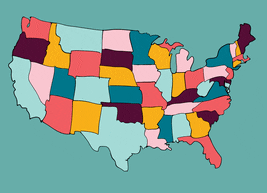

<link rel="stylesheet" href="//fonts.googleapis.com/css?family=Lato" />

::: {#header}

:::

```{r markdown-setup, include=FALSE}
knitr::opts_chunk$set(fig.path = "mapping/www/images/")
knitr::opts_chunk$set(message = FALSE)
knitr::opts_chunk$set(echo = TRUE)
knitr::opts_chunk$set(warning = FALSE)

options(scipen = 999)
```

```{r setup, include=FALSE}
library(tidyverse)
library(knitr)
library(kableExtra)
library(here)
library(sf)
```

# Introduction

------------------------------------------------------------------------

This guide will teach you the concepts and code you will need for
mapping and geospatial analysis in R. **This is a long guide, so if you
need something specific, we encourage you to scroll to the appropriate
section using the Table of Contents on the left.** If you just want copy and 
pasteable code to create different kinds of maps, head to the [`Map Gallery`](#map_gallery). 
Now let's start mapping!



## Geospatial Workflow

This picture below outlines what we think are the main steps in a
geospatial workflow. This guide will be split into sections describing
each of the steps.

`r knitr::include_graphics(here::here("mapping", "www", "images", "geospatial_workflow.png"), dpi = 350)`

## Should this be a map?

The [Urban Institute Data Visualization Style
Guide](http://urbaninstitute.github.io/graphics-styleguide/) offers some
blunt but useful suggestions for maps:

> Just because you've got geographic data, doesn't mean that you have to
> make a map. Many times, there are more efficient storyforms that will
> get your point across more clearly. If your data shows a very clear
> geographic trend or if the absolute location of a place or event
> matters, maps might be the best approach, but sometimes the reflexive
> impulse to map the data can make you forget that showing the data in
> another form might answer other---and sometimes more
> important---questions.

So we would encourage you to think critically before making a map.

## Why map with R?

R can have a steeper learning curve than point-and-click tools - like
QGIS or ArcGIS - for geospatial analysis and mapping. But creating maps
in R has many advantages including:

1)  **Reproducibility**: By creating maps with R code, you can easily
    share the outputs and the code that generated the output with
    collaborators, allowing them to replicate your work and catch errors
    easily.

2)  **Iteration**: With point and click software like ArcGIS, making 50
    maps would be 50 times the work/time. But using R, we can easily
    make make many iterations of the same map with a few changes to the
    code.

3)  **Easy Updates**: Writing code provides a roadmap for others (and
    future you!) to quickly update parts of the map as needed. Say for
    example a collaborator wanted to change the legend colors of 50
    state maps. With R, this is possible in just a few seconds!

4)  **An Expansive ecosystem**: There are several R packages that make
    it very easy to get spatial data, create static and interactive
    maps, and perform spatial analyses. This feature rich package
    ecosystem which all play nice together is frankly unmatched by other
    programming languages and even point and click tools like QGIS and
    ArcGIS. Some of these R packages include:

    -   `sf`: For managing and analyzing spatial dataframes
    -   `tigris`: For downloading in Census geographies
    -   `ggplot2`: For making publication ready static maps
    -   `urbnmapr`: For automatically adding Urban styling to static
        maps
    -   `mapview`: For making expxploratory interactive maps

5)  **Cost**: Most point-and-click tools for geospatial analysis are
    proprietary and expensive. R is free open-source software. The
    software and most of its packages can be used for free by anyone for
    almost any use case.

## Helpful Learning Resources

In addition to this guide, you may want to look at these other helpful
resources:

-   The Urban Institute [mapping training
    series](https://ui-research.github.io/urbn101-mapping/) (with video
    lectures and notes)
-   Chapters
    [5](https://walker-data.com/census-r/census-geographic-data-and-applications-in-r.html),
    [6](https://walker-data.com/census-r/mapping-census-data-with-r.html),
    and
    [7](https://walker-data.com/census-r/spatial-analysis-with-us-census-data.html)
    from Kyle Walker's Analyzing US Census Data
    [book](https://walker-data.com/census-r/index.html).
-   Andrew Heiss' fantastic mapping
    [guide](https://datavizm20.classes.andrewheiss.com/example/12-example/)
-   All of the vignettes for the [`sf`
    package](https://cran.r-project.org/web/packages/sf/sf.pdf)
-   [Geocomputation with
    R](https://geocompr.robinlovelace.net/index.html): A book by Robin
    Lovelace and others
-   UChicago's R Spatial Workshops:
    <https://spatialanalysis.github.io/tutorials/>

# Get Spatial Data {#get_spatial_data}

------------------------------------------------------------------------

## library(sf) {.tabset .tabset-pills}

### The short version

`library(sf)` stores geospatial data, which are
<font color="red">**points**</font> (a single longitude/latitude),
<font color="blue">**lines**</font> (a pair of connected points), or
<font color="black">**polygons**</font> (a collection of points which
make a polygon) in a `geometry` column within R dataframes

`r knitr::include_graphics(here::here("mapping", "www", "images", "amtrak_points_lines_polygons.jpg"), dpi = 600)`

This is what `sf` dataframe looks like in the console:

```{r print-sf-dataframe}
dc_parks <- st_read("mapping/data/dc_parks.geojson", 
										quiet = TRUE)

# Print just the NAME and geometry column
dc_parks %>%
  select(NAME) %>%
  head(2)
```


### The long version

The `sf` library is a key tool for reading in, managing, and working
with spatial data in R. `sf` stands for simple features (not San
Francisco you Bay Area folks) and denotes a way to describe the spatial
attributes of real life objects. The R object you will be working with
most frequently for mapping is an `sf` dataframe. An `sf` dataframe is
essentially a regular R dataframe, with a couple of extra features for
use in mapping. These extra features exclusive to `sf` dataframes
include:

-   sticky `geometry` columns
-   attached coordinate reference systems
-   some other spatial metadata

The most important of the above list is the sticky `geometry` column,
which is a magical column that contains all of the geographic
information for each row of data. Say for example you had a `sf`
dataframe of all DC census tracts. Then the `geometry` column would
contain all of the geographic points used to define DC census tract
polygons. The stickiness of this column means that no matter what data
munging/filtering you do, you will not be able to drop or delete the
`geometry` column. Below is a graphic to help you understand this:

`r knitr::include_graphics(here::here("mapping", "www", "images", "sf_sticky_geometry.png"), dpi = 600)`

credits: @allisonhorst

This is what an `sf` dataframe looks like in the console:

```{r print_sf}
# Read in spatial data about DC parks from DC Open Data Portal
dc_parks  <- st_read("https://opendata.arcgis.com/api/v3/datasets/287eaa2ecbff4d699762bbc6795ffdca_9/downloads/data?format=geojson&spatialRefId=4326",
										quiet = TRUE)

# dc_parks <- st_read("mapping/data/dc_parks.geojson")

# Select just a few columns for readability
dc_parks <- dc_parks %>%
  select(NAME, geometry)

# Print to the console
dc_parks
```

Note that there is some spatial metadata such as the `Geometry Type`,
`Bounding Box`, and `CRS` which shows up as a header before the actual
contents of the dataframe.

Since `sf` dataframes operate similarly to regular dataframes, we can
use all our familiar `tidyverse` functions for data wrangling, including
`select`, `filter`, `rename`, `mutate`, `group_by` and `summarize`. The
`sf` package also has many functions that provide easy ways to replicate
common tasks done in other GIS software like spatial joins, clipping,
and buffering. Almost all of the mapping and geospatial analysis methods
described in this guide rely on you having an `sf` dataframe. So let's
talk about how to get one!

## Importing spatial data {.tabset .tabset-pills}

Getting an `sf` dataframe is always the first step in the geospatial
workflow. Here's how to import spatial data for...

### States and counties

We highly recommend using the `library(urbnmapr)` package, which was
created by folks here at Urban to easily create state and county level
maps. The `get_urbn_map()` function in the package allows you to read in
spatial data on states and counties, with options to include
territories. Importantly, it will also display AL and HI as insets on
the map in accordance with the Urban Institute Data Visualization Style
Guide. For information on how to install `urbnmapr`, see the [GitHub
repository](https://github.com/UrbanInstitute/urbnmapr).

Below is an example of how you would use `urbnmapr` to get an `sf`
dataframe of all the states or counties in the US.

```{r urbnmapr-1, eval=FALSE}
library(urbnmapr)

# Get state data
states <- get_urbn_map("states", sf = TRUE)

# Can also get county data
counties <- get_urbn_map("counties", sf = TRUE)
```

### Other Census geographies

Use the `library(tigris)` package, which allows you to easily download
TIGER and other cartographic boundaries from the US Census Bureau. In
order to automatically load in the boundaries as `sf` objects, run
`r options(tigris_class = "sf")` once per R session.

`library(tigris)` has all the standard census geographies, including
census tracts, counties, CBSAs, ZCTAs, congressional districts, tribal
areas, and more. It also includes other elements such as water, roads,
and military bases.

By default, `libraray(tigris)` will download large very large and
detailed TIGER line boundary files. For thematic mapping, the smaller
cartographic boundary files are a better choice, as they are clipped to
the shoreline, generalized, and therefore usually smaller in size
without losing too much accuracy. To load cartographic boundaries, use
the `cb = TRUE` argument. If you are doing detailed geospatial analysis
and need the most detailed shapefiles, then you should use the detailed
TIGER line boundary files and set `cb = FALSE`.

Below is an example of how you would use `library(tigris)` to get a `sf`
dataframe of all Census tracts in DC for 2019.

```{r tigris-1, eval=FALSE}
library(tigris)

# Only need to set once per script
options(tigris_class = "sf")

dc_tracts <- tracts(
  state = "DC",
  cb = TRUE,
  year = 2019
)
```

Unlike `library(urbnmapr)`, different functions are used to get
geographic data for different geographic levels. For instance, the
`blocks()` function will load census block group data, and the
`tracts()` function will load tract data. Other functions include
`block_groups()`, `zctas()` , and `core_based_statistical_areas()`. For
the full list of supported geographies and functions, see the [package
vignette](https://cran.r-project.org/web/packages/tigris/tigris.pdf).

For folks interested in pulling in Census demographic information along
with Census geographies, we recommend checking out the sister package to
`library(tigris)`: `library(tidycensus)`. That package allows you to
download in Census variables and Census geographic data simultaneously.

### Countries

We recommend using the `library(rnaturalearth)` package, which is
similar to `library(tigris)` but allows you to download and use
boundaries beyond the US. Instead of setting class to `sf` one time per
session as we did with `library(tigris)`, you must set the
`returnclass = "sf"` argument each time you use a function from the
package. Below is an example of downloading in an `sf` dataframe of all
the countries in the world.

```{r natural-earth, eval = FALSE}

library(rnaturalearth)

world <- ne_countries(returnclass = "sf")

ggplot() +
  geom_sf(data = world, mapping = aes())
```

### Your own files

#### Shapefiles/GeoJSONS

Shapefiles and GeoJSONs are 2 common spatial file formats you will found
out in the wild. `library(sf)` has a function called `st_read` which
allows you to easily read in these files as `sf` dataframes. The only
required argument is `dsn` or data source name. This is the filepath of
the `.shp` file or the `.geojson` file on your local computer. For
geojsons, `dsn` can also be a URL.

Below is an example of reading in a shapefile of fire stations in DC
which is stored in `mapping/data/shapefiles/`. Note that shapefiles are
actually stored as 6+ different files inside a folder. You need to
provide the filepath to the file ending in `.shp`.

```{r list f-ei}
library(sf)

# Print out all files in the directory
list.files("mapping/data/shapefiles")

# Read in .shp file
dc_firestations <- st_read(
  dsn = "mapping/data/shapefiles/Fire_Stations.shp",
  quiet = TRUE
)
```

And now `dc_firestations` is an `sf` dataframe you can use for all your
mapping needs! `st_read` supports reading in a wide variety of other
spatial file formats, including geodatabases, KML files, and over 200
others. For an incomplete list, please see the this `sf`
[vignette](https://r-spatial.github.io/sf/articles/sf2.html).

#### CSVs or dataframes with lat/lons

If you have a CSV with geographic information stored in columns, you
will need to read in the CSV as a regular R dataframe and then convert
to an `sf` dataframe. `library(sf)` contains the `st_as_sf()` function
for converting regular R dataframes into an `sf` dataframe. The two
arguments you must specify for this function are:

-   `coords`: A length 2 vector with the names of the columns
    corresponding to longitude and latitude (in that order!). For
    example, `c("lon", "lat")`.
-   `crs`: The CRS (coordinate references system) for your
    longitude/latitude coordinates. Remember you need to specify both
    the\
    authority and the SRID code, for example ("EPSG:4326"). For more
    information on finding and setting CRS codes, please see the [`CRS`](#crs) section.

Below is an example of reading in data from a CSV and converting it to
an `sf` dataframe.

```{r make-sf}
library(sf)

# Read in dataset of state capitals which is stored as a csv
state_capitals <- read_csv("mapping/data/state-capitals.csv")

state_capitals <- state_capitals %>%
  # Specify names of the lon/lat columns in the CSV to use to make geometry col
  st_as_sf(
    coords = c("longitude", "latitude"),
    crs = 4326
  )
```

One common mistake is that before converting to an `sf` dataframe, you
must drop any rows that have `NA` values for latitude or longitude. If
your data contains `NA` values, then the `st_as_sf()` function will
throw an error.

## Appending spatial info to your data

Oftentimes, the data you are working with will just have state or county
identifiers - like FIPS codes or state abbreviations - but will not
contain any geographic information. In this case, you must do the extra
work of downloading in the geographic data as an `sf` dataframe and then
joining your non-spatial data to the spatial data. Generally this
involves 3 steps:

1)  Reading in your own data as a data frame
2)  Reading in the geographic data as an `sf` dataframe
3)  Using `left_join` to merge the geographic data with your own non
    spatial data and create a new expanded `sf` dataframe

Let's say we had a dataframe on CHIP enrollment by state with state
abbreviations.

```{r readin-chip-data}

# read the state CHIP data
chip_by_state <- read_csv("mapping/data/chip-enrollment.csv") %>%
  # clean column names so there are no random spaces/uppercase letters
  janitor::clean_names()

# print to the console
chip_by_state %>% head()
```

In order to convert this to an `sf` dataframe, we need to read in the
spatial boundaries for each state and append it to our dataframe. Here
is how we do that with `get_urbn_map()` and `left_join()` .

```{r append-spatial-info, cache = FALSE}
library(urbnmapr)

# read in state geographic data from urbnmapr
states <- get_urbn_map(map = "states", sf = TRUE)

# left join state geographies to chip data
chip_with_geographies <- states %>%
  left_join(
    chip_by_state,
    # Specify join column, which are slightly differently named in states and chip
    # respectively
    by = c("state_abbv" = "state_abbreviation")
  )

chip_with_geographies %>%
  select(state_fips, state_abbv, chip_enrollment)
```

```{r append-state-pops, include = FALSE, eval = TRUE, echo = FALSE}
# TODO: DELETE THIS

# Read in data on state populations from 2010
state_pops <-
  read_csv("https://raw.githubusercontent.com/jakevdp/data-USstates/master/state-population.csv",
    # Set this to disable printing column info to console
    col_types = cols()
  ) %>%
  filter(ages == "total", year == "2010") %>%
  select(state_abbv = `state/region`, population)

chip_with_geographies <- chip_with_geographies %>%
  # Specify left_join from tidylog to print summary messages
  tidylog::left_join(state_pops, by = "state_abbv") %>%
  # Calculate the chip enrollment percentage and append as a column
  mutate(chip_pct = chip_enrollment / population)
```

# Project

## Coordinate Reference Systems {.tabset .tabset-pills #crs}

### The short version

Just watch [this
video](https://www.youtube.com/watch?v=vVX-PrBRtTY%60) and know the
following:

-   All spatial data has a CRS, which specifies how to identify a
    location on earth.

-   It's important that all spatial datasets you are working with be in
    the same CRS. You can find the CRS with `st_crs()` and change the
    CRS with `st_transform()`.

-   The Urban Institute Style Guide requires the use of the Atlas Equal
    Earth Projection (`"ESRI:102003"`) for national maps. For state and local
    maps, use [this](https://github.com/veltman/d3-stateplane) handy
    guide to find an appropriate State Plane projection.

### The long version

Coordinate reference systems (CRS) specify the 3d shape of the earth and
optionally how we project that 3d shape onto a 2d surface. They are an
important part of working with spatial data as you need to ensure that
all the data you are working with are in the same CRS in order for
spatial operations and maps to be accurate.

CRS can be specified either by name (ie Maryland State Plane) or
**S**patial **R**eference System **ID**entifier (SRID). THe SRID is a
numeric identifier that uniquely identifies a coordinate reference
system. Generally when referring to an SRID, you need to refer to an
authority (ie the data source) and a unique ID. An example is
`EPSG:26985` which refers to the Maryland State plane projection from
the EPSG, or `ESRI:102003` which refers to the Atlas Equal Area
projection from ESRI. Most CRS codes will be from the EPSG, and some
from ESRI and others. A good resource for finding/validating CRS codes
is [epsg.io](epsg.io).

Sidenote - EPSG stands for the now defunct European Petroleum Survey
Group. And while oil companies have generally been terrible for the
earth, the one nice thing they did for the earth was to set up common
standards for coordinate reference systems.

You might be thinking well isn't the earth just a sphere? Why do we need
all this complicated stuff? And the answer is well the earth is [kind
of](https://oceanservice.noaa.gov/facts/earth-round.html) a sphere, but
it's really more of a misshapen ellipsoid which is pudgier at the
equator than at the poles. To visualize how coordinate reference systems
work, imagine that the earth is a (lumpy) orange. Now peel the skin off
an orange and try to flatten it. There are many ways to do it, but all
will create
[distortions](https://twitter.com/neilrkaye/status/1050740679008296967)
of some kind. The CRS will give us the formula we've used to specify the
shape of the orange (usually a sphere or ellipsoid of some kind) and
optionally, specify how we flattened the orange into 2d.

Broadly, there are two kinds of Coordinate Reference Systems:

1)  [**Geographic coordinate
    systems**](https://www.ibm.com/support/knowledgecenter/en/SSGU8G_12.1.0/com.ibm.spatial.doc/ids_spat_407.html)

    -   (sometimes called unprojected coordinate systems)
    -   Specifies a 3d shape for the earth
    -   Uses a spheroid/ellipsoid to approximate shape of the earth
    -   Usually use decimal degree units (ie latitude/longitude) to
        identify locations on earth
        `r knitr::include_graphics(here::here("mapping", "www", "images", "gcs_image.png"), dpi = 150)`

2)  [**Projected coordinate
    systems**](https://mgimond.github.io/Spatial/chp09-0.html#projected-coordinate-systems)

    -   Specifies a 3d shape for the earth + a 2d mapping

        -   Is a geographic coordinate system + a *projection*

            `r knitr::include_graphics(here::here("mapping", "www", "images", "projecting_xkcd.png"), dpi = 150)`

            credit:
            [xkcd](https://imgs.xkcd.com/comics/projecting.png)

        -   **projection**: mathematical formula used to convert a 3d
            coordinate system to a 2d flat coordinate system

        -   Many different kinds of projections, including Equal Area,
            Equidistant, Conformal, etc

        -   All projections distort the true shape of the earth in some
            way, either in terms of shape, area, or angle. Required
            [xkcd comic](https://xkcd.com/977/)

        -   Usually use linear units (ie feet, meters) and therefore
            useful for distance based spatial operations (ie creating
            buffers)

## Finding the CRS

If you are lucky, your data will have embedded CRS data that will be
automatically detected when the file is read in. This is usually the
case for GeoJSONS (`.geojson`) and shapefiles (`.shp`). When you use
`st_read()` on these files, you should see the CRS displayed in the
metadata:

```{r import-shpfile-crs example, echo = FALSE}
knitr::include_graphics(here("mapping", "www", "images", "sf_crs_pic.png"))
```

You can also the `st_crs()` function to find the CRS. The CRS code is located at
the end in `ID[authority, SRID]`.

```{r st_crs}
st_crs(dc_firestations)
```

Sometimes, the CRS will be blank or `NA` as the dataset did not
specify the CRS. In that case you **MUST find and set the CRS for your
data before proceeding** with analysis. Below are some good rules of
thumb for finding out what the CRS for your data is:

-   For geojsons, the CRS should always be `EPSG:4326` (or WGS 84). The
    official geojson specification states that this is the only valid
    CRS for geojsons, but in the wild, this may not be true 100% of the
    time.
-   For shapefiles, there should be a file that ends in `.proj` in the
    same directory as the `.shp` file. This file contains the projection
    information for that file and should be used automatically when
    reading in shapefiles.
-   For CSV's with latitude/longitude columns, the CRS is usually
    `EPSG:4326` (or WGS 84).
-   Look at the metadata and any accompanying documentation to see if
    the coordinate reference system for the data is specified

If none of the above rules of thumb apply to you, check out the
`crsuggest` R [package](https://github.com/walkerke/crsuggest).

Once you've identified the appropriate CRS, you can set the CRS for your
data with `st_crs()`:

```{r set_crs, eval = FALSE}

# If you are certain that your data contains coordinates in the ESRI Atlas Equal Earth projections
st_crs(some_sf_dataframe) <- st_crs("ESRI:102003")
```

## Transforming the CRS

Often you will need to change the CRS for your `sf` dataframe so that
all datasets you are using have the same CRS, or to use a projected CRS
for performing more accurate spatial operations. You can do this with
`st_transform`:

```{r transform-crs}
# Transforming CRS from WGS 84 to Urban required Equal Earth Projection
state_capitals <- state_capitals %>% st_transform("ESRI:102003")
```

`st_transform()` also allows you to just use the CRS of another `sf`
dataframe when transforming.

```{r transform-crs-with-another-sf-object}
# transform CRS of chip_with_geographies to be the same as CRS of dc_firestations
chip_with_geographies <- chip_with_geographies %>%
  st_transform(crs = st_crs(state_capitals))
```

If you are working with local data, you should use an appropriate state
plane projection instead of the Atlas Equal Earth projection which is
meant for national maps. `library(crsuggest)` can simplify the process
of picking an appropriate state plane CRS.

```{r crsuggest-ex, cache = TRUE}
library(crsuggest)

suggest_crs(dc_firestations) %>%
  # Use the value in the "crs_code" column to transform CRS's
  head(4)
```

# Map

In order to start mapping, you need an `sf` dataframe. If you don't have
one, see the [`Get Spatial Data`](#get_spatial_data) section above.

## The basics

### library(ggplot2)

Most mapping in R fits the same theoretical framework as plotting in R
using `library(ggplot2)`. To learn more about ggplot2, visit the Data
Viz
[page](https://urbaninstitute.github.io/r-at-urban/graphics-guide.html#Grammar_of_Graphics_and_Conventions)
or read the official ggplot [book](html).

The key function for mapping is **the special `geom_sf()` function** which works
with `sf` dataframes. This function magically detects whether you have
point or polygon spatial data and displays the results on a map.

### A simple map

To make a simple map, add `geom_sf()` to a `ggplot()` and set
`data = an_sf_dataframe`. Below is code for making a map of all 50
states using `library(urbnmapr)`:

```{r first-map, cache = TRUE}
library(urbnmapr)

states <- get_urbn_map("states", sf = TRUE)

ggplot() +
  geom_sf(
    data = states,
    mapping = aes()
  )
```

## Styling

### `library(urbnthemes)`

`library(urbnthemes)` automatically styles maps in accordance with the
[Urban Institute Data Visualization Style
Guide](http://urbaninstitute.github.io/graphics-styleguide/). By using
`library(urbnthemes)`, you can create publication ready maps you can
immediately drop in to Urban research briefs or blog posts.

To install `urbnthemes`, visit the package's [GitHub
repository](https://github.com/UrbanInstitute/urbnthemes) and follow the
instructions. There are 2 ways to use the `urbnthemes` functions:

```{r urbnthemes}

library(urbnthemes)

# You can either run this once per script to automatically style all maps with
# the Urban theme
set_urbn_defaults(style = "map")

# Or you can add `+ theme_urbn_map()` to the end of every map you make
ggplot() +
  geom_sf(states, mapping = aes()) +
  theme_urbn_map()
```

### Layering

You can layer multiple points/lines/polygons on top of each other using
the `+` operator from `library(ggplot2)`. The shapes will appear from
bottom to top (ie the last mapped object will show up on top). It is
important that all layers are in the same CRS (coordinate reference
system).

```{r layers, cache = TRUE}

state_capitals <- state_capitals %>%
  # This will change CRS to ESRI:102003 and shift the AK and HI state capitals
  # point locations to the appropriate locations on the inset maps.
  tigris::shift_geometry() %>%
  # For now filter out AL and HI as their state capitals will be slightly off.
  filter(!state %in% c("Alaska", "Hawaii"))

ggplot() +
  geom_sf(
    data = states,
    mapping = aes()
  ) +
  # Note we change the data argument
  geom_sf(
    data = state_capitals,
    mapping = aes(),
    # urbnthemes library has urbn color palettes built in.
    color = palette_urbn_main["yellow"],
    size = 2.0
  ) +
  theme_urbn_map()
```

### Fill and Outline Colors

The same commands used to change colors, opacity, lines, size, etc. in
charts can be used for maps too. To change the colors of the map , just
use the `fill =` and `color =` parameters in `geom_sf()`. `fill` will
change the fill color of polygons; `color` will change the color of
polygon outlines, lines, and points.

Generally, maps that show the magnitude of a variable use the blue
sequential ramp and maps that display positives and negatives use the
diverging color ramp.`library(urbnthemes)` contains inbuilt. helper
variables (like `palette_urbn_main`) for accessing color palettes from
the Urban Data Viz Style guide. If for example you want states to be
Urban's magenta color:

```{r urbnthemes- pink}

ggplot() +
  geom_sf(states,
    mapping = aes(),
    # Adjust polygon fill color
    fill = palette_urbn_main["magenta"],
    # Adjust polygon outline color
    color = "white"
  ) +
  theme_urbn_map()
```

### Adding text

You can also add text, like state abbreviations, directly to your map
using `geom_sf_text` and the helper function `get_urbn_labels()`.

```{r geom_sf_text}
library(urbnmapr)

ggplot() +
  geom_sf(states,
    mapping = aes(),
    color = "white"
  ) +
  theme_urbn_map() +
  # Generates dataframe of state abbv and appropriate location to plot them
  geom_sf_text(
    data = get_urbn_labels(
      map = "states",
      sf = TRUE
    ),
    aes(label = state_abbv),
    size = 3
  )
```

There's also `geom_sf_label()` if you want labels with a border.

# Map Gallery {#map_gallery}

Below are copy and pasteable examples of maps you can make, after you
have an `sf` dataframe.

## Choropleth Maps

Choropleth maps display geographic areas with shades, colors, or
patterns in proportion to a variable or variables. Choropleth maps can
represent massive geographies like the entire world and small
geographies like Census Tracts. To make a choropleth map, you need to
set `geom_sf(aes(fill = some_variable_name))`. Below are examples

### Continuous color scale

```{r choropoleth_continious}
# Map of CHIP enrollment percentage by state
chip_with_geographies_map <- chip_with_geographies %>%
  ggplot() +
  geom_sf(aes(
    # Color in states by the chip_pct variable
    fill = chip_pct
  ))


# Below add-ons to the map are optional, but make the map look prettier.
chip_with_geographies_map +
  # scale_fill_gradientn adds colors with more interpolation and reverses color scale
  scale_fill_gradientn(
    # Convert legend from decimal to percentages
    labels = scales::percent_format(),
    # Make legend title more readable
    name = "CHIP Enrollment %",
    # Manually add 0 to lower limit to include it in legend. NA=use maximum value in data
    limits = c(0, NA),
    # Set number of breaks on legend = 3
    n.breaks = 3
  )
```

### Discrete color scale

The quick and dirty way is with `scale_fill_steps()`, which creates
discretized bins for continuous variables:

```{r chorpleth_disccrete}
chip_with_geographies %>%
  ggplot() +
  geom_sf(aes(
    # Color in states by the chip_pct variable
    fill = chip_pct
  )) +
  scale_fill_steps(
    # Convert legend from decimal to percentages
    labels = scales::percent_format(),
    # Make legend title more readable
    name = "CHIP Enrollment %",
    # Show top and bottom limits on legend
    show.limits = TRUE,
    # Roughly set number of bins. Won't be exact as R uses algorithms under the
    # hood for pretty looking breaks.
    n.breaks = 4
  )
```

Often you will want to manually generate the bins yourself to give you
more fine grained control over the exact legend text. (ie `1% - 1.8%`,
`1.8 - 2.5%`, etc). Below is an example of discretizing the continuous
`chip_pct` variable yourself using `cut_interval()` and a helper
function to get nice looking interval labels:

```{r format_intervals}

# Helper function to clean up R generated intervals into nice looking interval labels
format_interval <- function(interval_text) {
  text <- interval_text %>%
    # Remove open and close brackets which is R generated math notation
    str_remove_all("\\(") %>%
    str_remove_all("\\)") %>%
    str_remove_all("\\[") %>%
    str_remove_all("\\]") %>%
    str_replace_all(",", " — ")

  # Convert decimal ranges to percent ranges
  text <- text %>%
    str_split(" — ") %>%
    map(~ as.numeric(.x) %>%
      scales::percent() %>%
      paste0(collapse = " — ")) %>%
    unlist() %>%
    # By default character vectors are plotted in alphabetical order. We want
    # factors in reverse alphabetical order to get correct colors in ggplot
    fct_rev()

  return(text)
}

chip_with_geographies <- chip_with_geographies %>%
  # cut_interval into n groups with equal range. Set boundary so 0 is included in the bins
  mutate(chip_pct_interval = cut_interval(chip_pct, n = 5)) %>%
  # Generate nice looking interval labels
  mutate(chip_pct_interval = format_interval(chip_pct_interval))
```

And now we can map the discretized `chip_pct_interval` variable using
`geom_sf()`:

```{r make_discrete_map}
chip_with_geographies %>%
  ggplot() +
  geom_sf(aes(
    # Color in states by the chip_pct variable
    fill = chip_pct_interval
  )) +
  # Default is to use main urban palette, which assumes unrelated groups. We
  # adjust colors manually to be on Urban cyan palette
  scale_fill_manual(
    values = palette_urbn_cyan[c(8, 7, 5, 3, 1)],
    name = "CHIP Enrollment %"
  )
```

In addition to `cut_interval` there are [similar
functions](https://ggplot2.tidyverse.org/reference/cut_interval.html)
for creating intervals/bins with slightly different rules. When creating
bins, be careful as changing the number of bins can drastically change
how the map looks.

## Bubble Maps

This is just a layered map with one polygon layer and one point layer,
where the points are sized in accordance with a variable in your data.

```{r bubble_maps, cache = TRUE}
set_urbn_defaults(style = "map")

# Get sf dataframe of DC tracts
library(tigris)
dc_tracts <- tracts(
  state = "DC",
  year = 2019,
  progress_bar = FALSE
)

# Add bubbles for firestations
ggplot() +
  geom_sf(data = dc_tracts, fill = palette_urbn_main["gray"]) +
  geom_sf(
    data = dc_firestations,
    # Size bubbles by number of trucks at each station
    aes(size = TRUCK),
    color = palette_urbn_main["yellow"],
    # Adjust transparency for readability
    alpha = 0.8
  )
```

## Dot-density Maps

These maps scatter dots within a geographic area. Typically each dot
represents a unit (like 100 people, or 1000 houses). To create this kind
of map, you need to start with an `sf` dataframe that is of `geometry`
type `POLYGON` or `MULTIPOLYGON` and then sample points within the
polygon.

The below code generates a dot-density map representing people of
different races within Washington DC tracts The code may look a little
complicated, but the key workhorse function is `st_sample()` which
samples points within each polygon to use in the dot density map:

```{r dot_density_maps, cache = TRUE}
library(tidycensus)

# Get counts by race of DC tracts
dc_pop <- get_acs(
  geography = "tract",
  state = "DC",
  year = 2019,
  variables = c(
    Hispanic = "DP05_0071",
    White = "DP05_0077",
    Black = "DP05_0078",
    Asian = "DP05_0080"
  ),
  geometry = TRUE,
  progress_bar = FALSE
)

# Get unique groups (ie races)
groups <- unique(dc_pop$variable)

# For each unique group (ie race), generate sampled points
dc_race_dots <- map_dfr(groups, ~ {
  dc_pop %>%
    # .x = the group used in the loop
    filter(variable == .x) %>%
    # Use the projected MD state plane for accuracy
    st_transform(crs = "EPSG:6487") %>%
    # Have every dot represent 100 people
    mutate(est100 = as.integer(estimate / 100)) %>%
    st_sample(size = .$est100, exact = TRUE) %>%
    st_sf() %>%
    # Add group (ie race) as a column so we can use it when plotting
    mutate(group = .x)
})


ggplot() +
  # Plot tracts, then dots on top of tracts
  geom_sf(
    data = dc_pop,
    # Make interior of tracts transparent and boundaries black
    fill = "transparent",
    color = "black"
  ) +
  geom_sf(
    data = dc_race_dots,
    # Color in dots by racial group
    aes(color = group),
    # Adjust transparency and size to be more readable
    alpha = 0.5,
    size = 1.1,
    stroke = FALSE
  )
```

## Geofacets

Geofaceting arranges sub-geography-specific plots into a grid that
resembles a larger geography (usually the US). This can be a useful
alternative to choropleth maps, which tend to overemphasize
low-population density areas with large areas. To make geofacetted
charts, use the `facet_geo()` function from the `geofacet` library,
which can be thought of as equivalent to ggplot2's `facet_wrap()`. For
this example, we'll use the built-in `state_ranks` data.

```{r geofacet-data}
library(geofacet)

head(state_ranks %>% as_tibble())
```

```{r geofacet-ex, cache = TRUE}
set_urbn_defaults(style = "print")

state_ranks %>%
  filter(variable %in% c("education", "employment")) %>%
  ggplot(aes(x = rank, y = variable)) +
  geom_col() +
  facet_geo(
    facets = "state",
    # Use custom urban geofacet grid which is built into urbnthemes
    # For now we need to rename a few columns as urbnthemes has to be
    # updated
    grid = urbnthemes::urbn_geofacet %>%
      rename(
        code = state_code,
        name = state_name
      )
  )
```

Interactive geofacets of the United States have been used in Urban
Features like [A Matter of
Time](https://apps.urban.org/features/long-prison-terms/trends.html)
which included geofaceted line charts showing trends in incarceration by
state. Static geofacets of the United States were included in [Barriers
to Accessing Homeownership Down Payment, Credit, and
Affordability](https://www.urban.org/sites/default/files/publication/94801/barriers-to-homeownership-down-payments-credit-access-and-affordability_3.pdf)
by the Housing Finance Policy Center.

## Cartograms

Cartograms are a modified form of a choropleth map with intentionally
distorted sizes that map to a variable in your data. Below we create a
cartogram with `library(cartogram)` where the state sizes are
proportional to the population.

```{r cartogram-example, cache = TRUE}
library(cartogram)

set_urbn_defaults(style = "map")

chip_with_geographies_weighted <- chip_with_geographies %>%
  # Note column name needs to be in quotes for this package
  cartogram_cont(weight = "population")

ggplot() +
  geom_sf(
    data = chip_with_geographies_weighted,
    # Color in states by chip percentages
    aes(fill = chip_pct)
  )
```

## Interactive Maps

Interactive maps can be a great exploratory tool to explore and
understand your data. And luckily there are a lot of new R packages that
make it really easy to create them. Interactive maps are powerful but
**we do not recommend them for official use in Urban publications** as
getting them in Urban styles and appropriate basemaps can be tricky
(reach out to
[anarayanan\@urban.org](mailto:anarayanan@urban.org){.email} if you
really want to include them).

### `library(mapview)`

`library(mapview)` is probably the most user friendly of the interactive
mapping R libraries. All you have to do to create an interactive map is:

```{r show-mapview}
library(mapview)


chip_with_geographies_for_interactive_mapping <- chip_with_geographies %>%
  # Filter out AL and HI bc they would appear in Mexico. If you want AL, HI and
  # in the correct place in interactive maps, make sure to use tigris::states()
  filter(!state_abbv %in% c("AK", "HI"))

mapview(chip_with_geographies_for_interactive_mapping)
```

When you click on an object, you get a popup table of all it's attributes. And 
when you hover over an object, you get a popup with an object id.

Each of the above behaviors can be changed if desired. As you'll see in
the below section, the syntax for `library(mapview)` is significantly
different from `library(ggplot2)` so be careful!

#### Coloring in points/polygons

In order to create a choropleth map where we color in the
points/polygons by a variable, we need to feed in a column name *in
quotes* to the`zcol` argument inside the `mapview()` function:

```{r mapview_zcol}
# Create interactive state map colored in by chip enrollment
mapview(chip_with_geographies_for_interactive_mapping, zcol = "chip_enrollment")
```

If you want more granular control over the color palette for the legend
can also feed in a vector of color hex codes to `col.regions` along with
a column name to `zcol`. This will create a continuous color range along
the provided colors. Be careful though as the color interpolation is not
perfect.

```{r mapview-colors-granular}
# library(RColorBrewer)
mapview(chip_with_geographies_for_interactive_mapping,
  col.regions = c(
    palette_urbn_green[6],
    "white",
    palette_urbn_cyan[6]
  ),
  zcol = "chip_enrollment"
)
```

If you want to color in all points/polygons as the same color, just feed
in a single color hex code to the `col.regions` argument:

```{r mapview-colors}
mapview(chip_with_geographies_for_interactive_mapping,
  col.regions = palette_urbn_green[5]
)
```

#### Adding layers

You can add multiple `sf` objects on the same map by using the `+`
operator. This is very useful when comparing 2 or more spatial datasets.

```{r mapview-layers}
mapview(chip_with_geographies_for_interactive_mapping, col.regions = palette_urbn_green[5]) +
  mapview(state_capitals, col.regions = palette_urbn_cyan[5])
```

You can even create slider maps by using the `|` operator!

```{r mapview-sliders}
mapview(chip_with_geographies_for_interactive_mapping, col.regions = palette_urbn_green[5]) |
  mapview(state_capitals, col.regions = palette_urbn_cyan[5])
```

### More details

To learn more about more advanced options with `mapview` maps, check out
the
[documentation](https://r-spatial.github.io/mapview/articles/articles/mapview_02-advanced.html)
page and the [reference
manual](https://cran.r-project.org/web/packages/mapview/mapview.pdf).

There are also other interactive map making packages in R like `leaflet`
(which `mapview` is a more user friendly wrapper of), `tmap`, and
`mapdeck`. To learn about these other packages, [this book
chapter](https://geocompr.robinlovelace.net/adv-map.html#interactive-maps)
is a good starting point.

# Spatial Operations


## Cropping

Cropping (or clipping) is geographically filtering an `sf` dataframe to just 
the area we are interested in. Say we wanted to look at the roads around Fire 
Station 24 in DC. 

```{r roads_cropping_before, cache = TRUE}
library(tigris)
library(units)

dc_firestations <- dc_firestations %>%
  st_transform("EPSG:6487")


# Draw 500 meter circle around one fire station
fire_station_24_buffered <- dc_firestations %>%
  filter(NAME == "Engine 24 Station") %>%
  st_buffer(set_units(500, "meter"))

# Get listing of all roads in DC
dc_roads <- roads(
  state = "DC",
  county = "District of Columbia",
  class = "sf",
  progress_bar = FALSE
) %>%
  st_transform("EPSG:6487")

# View roads on top of fire_station
ggplot() +
  # Order matters! We need to plot fire_stations first, and then roads on top
  # to see overlapping firestations
  geom_sf(
    data = fire_station_24_buffered,
    fill = palette_urbn_cyan[1],
    color = palette_urbn_cyan[7]
  ) +
  geom_sf(
    data = dc_roads,
    color = palette_urbn_gray[7]
  ) +
  theme_urbn_map()
```

We can clip the larger roads dataframe to just roads that overlap with the circle 
around the fire station with `st_intersection()`.

```{r roads_cropping_after}

# Use st_intersection() to crop the roads data to just roads within the
# fire_station radius
dc_roads_around_fire_station_24_buffered <- fire_station_24_buffered %>%
  st_intersection(dc_roads)

ggplot() +
  geom_sf(
    data = fire_station_24_buffered,
    fill = palette_urbn_cyan[1],
    color = palette_urbn_cyan[7]
  ) +
  geom_sf(
    data = dc_roads_around_fire_station_24_buffered,
    color = palette_urbn_gray[7]
  ) +
  theme_urbn_map()
```


**More Coming Soon!**

## Calculating Distance

## Spatial Joins

### Point to Polygon

### Polygon to Polygon
## Aggregating

## Drive/Transit times

## Geocoding

Geocoding is the process of turning text (usually addresses) into
geographic coordinates (usually latitudes/longitudes) for use in
mapping. For Urban researchers, we highly recommend using the [Urban
geocoder](https://tech-tools.urban.org/geocoding/) as it is fast,
accurate, designed to work with sensitive/confidential data and most
importantly free to use for Urban researchers! To learn about how we set
up and chose the geocoder for the Urban Institute, you can read our
[Data\@Urban
blog](https://medium.com/@urban_institute/choosing-a-geocoder-for-the-urban-institute-86192f656c5f).

### Cleaning Addresses

The single most important factor in getting accurate geocoded data is
having cleaned, well structured address data. This can prove difficult as
address data out in the wild is often messy and unstandardized. While
the rules for cleaning addresses are very data specific, below are some
examples of clean addresses you should aim for in your data cleaning
process:

```{r cleaned-addr, cache=TRUE,eval=TRUE,results=TRUE, echo=FALSE}
library(gt)
cleaned_address_table <- tribble(
  ~"f_address", ~"Type of address",
  "123 Troy Drive, Pillowtown, CO, 92432", "residnetial address",
  "789 Abed Avenue, Apt 666, Blankesburg, CO, 92489", "residential apartment address",
  "Shirley Boulevard and Britta Drive, Blanketsburg, CO, 92489", "street intersection",
  "Pillowtown, CO", "city",
  "92489, CO", "Zip Code",
)

gt(cleaned_address_table) %>%
  # tab_header(title = md("Clean Address Examples")) %>%
  opt_row_striping(row_striping = TRUE) %>%
  tab_style(
    style = list(
      cell_text(weight = "bold")
    ),
    locations = cells_column_labels(
      columns = vars(f_address, `Type of address`)
    )
  ) %>%
  opt_align_table_header(align = c("left")) %>%
  tab_options(
    container.width = "100%",
    container.height = "400px",
    # column_labels.background.color  = palette_urbn_cyan[1],
    table.border.top.width = 0,
    table.border.bottom.width = 0,
    column_labels.border.bottom.width = 0,
  )
```

All that being said, our geocoder is pretty tolerant of different
address formats, typos/spelling errors and missing states, zip codes,
etc. So don't spend too much time cleaning every address in the data.
Also note that while our geocoder is able to geocode cities and zip
codes, it will return the lat/lon of the center of the city/zip code,
which may not be what you want.

### Instructions

To use the [Urban geocoder](https://tech-tools.urban.org/geocoding/),
you will need to:

1)  Generate a CSV with a column named `f_address` which contains the
    addresses in single line format (ie
    `123 Abed Avenue, Blanketsburg, CO, 94328`). This means that if you
    have the addresses split across multiple columns (ie `Address`,
    `City`, `State`, `Zip` columns), you will need to concatenate them
    into one column. Also see our Address cleaning section above.

2)  Go to the Urban geocoder and answer the initial questions. This will
    tell you whether your data is non-confidential or confidential data,
    and allow you to upload your CSV for geocoding.

3)  Wait for an email telling you your results are ready. If your data
    is non-confidential, this email will contain a link to your geocoded
    results. This link expires in 24 hours, so make sure to download
    your data before then. If you data is confidential, the email will
    contain a link to the location on the Y Drive where your
    confidential geocoded data is stored. You can specify this output
    folder when submitting the CSV in step 1.

### Geocoder outputs

<p>

The geocoded file will be your original data, plus a few more columns
(including latitude and longitude). each of the new columns that have
been appended to your original data. [It's very important that you take
a look at the Addr_type
column]{style="background-color: #FFFF00;  font-weight: bold"} in the
CSV before doing further analysis to check the accuracy of the geocoding
process.

</p>

+------------+------------------------------------------------------+
| Column     | Description                                          |
+:===========+:=====================================================+
| Match_addr | The actual address that the inputted address was     |
|            | matched to. This is the address that the geocoder    |
|            | used to get Latitudes / Longitudes. If there are     |
|            | potentially many typos or non standard address       |
|            | formats in your data file, you will want to take a   |
|            | close look at this column to confirm that the        |
|            | matched address correctly handled typos and badly    |
|            | formatted addresses.                                 |
+------------+------------------------------------------------------+
| Longitude  | The WGS 84 datum Longitude (EPSG code 4326)          |
|            |                                                      |
+------------+------------------------------------------------------+
| Latitude   | The WGS 84 datum Latitude (EPSG code 4326)           |
+------------+------------------------------------------------------+
| Addr_type  | The match level for a geocode request. This should   |
|            | be used as an indicator of the precision of geocode  |
|            | results. Generally, Subaddress, PointAddress,        |
|            | StreetAddress, and StreetInt represent accurate      |
|            | matches. The list below contains all possible values |
|            | for this field. **Green values represent High        |
|            | accuracy matches, yellow represents Medium accuracy  |
|            | matches and red represents Low accuracy/inaccurate   |
|            | matches**. If you have many yellow and red values in |
|            | your data, you should manually check the results     |
|            | before proceeding with analysis. All possible        |
|            | values:\                                             |
|            | \                                                    |
|            | **Subaddress:** A subset of a PointAddress that      |
|            | represents a house or building subaddress location,  |
|            | such as an apartment unit, floor, or individual      |
|            | building within a complex. The UnitName, UnitType,   |
|            | LevelName, LevelType, BldgName, and BldgType field   |
|            | values help to distinguish subaddresses which may be |
|            | associated with the same PointAddress. Reference     |
|            | data consists of point features with associated      |
|            | house number, street name, and subaddress elements,  |
|            | along with administrative divisions and optional     |
|            | postal code; for example, 3836 Emerald Ave, Suite C, |
|            | La Verne, CA, 91750.\                                |
|            | \                                                    |
|            | **PointAddress:** A street address based on points   |
|            | that represent house and building locations.         |
|            | Typically, this is the most spatially accurate match |
|            | level. Reference data contains address points with   |
|            | associated house numbers and street names, along     |
|            | with administrative divisions and optional postal    |
|            | code. The X / Y (`Longitude`/`Latitude`) and         |
|            | `geometry` output values for a PointAddress match    |
|            | represent the street entry location for the address; |
|            | this is the location used for routing operations.    |
|            | The `DisplayX` and `DisplayY` values represent the   |
|            | rooftop, or actual, location of the address.         |
|            | Example: 380 New York St, Redlands, CA, 92373.\      |
|            | \                                                    |
|            | **StreetAddress** --- A street address that differs  |
|            | from PointAddress because the house number is        |
|            | interpolated from a range of numbers. Reference data |
|            | contains street center lines with house number       |
|            | ranges, along with administrative divisions and      |
|            | optional postal code information, for example, 647   |
|            | Haight St, San Francisco, CA, 94117.\                |
|            | \                                                    |
|            | **StreetInt:** A street address consisting of a      |
|            | street intersection along with city and optional     |
|            | state and postal code information. This is derived   |
|            | from StreetAddress reference data, for example,      |
|            | Redlands Blvd & New York St, Redlands, CA, 92373.\   |
|            | \                                                    |
|            | **StreetName:** Similar to a street address but      |
|            | without the house number. Reference data contains    |
|            | street centerlines with associated street names (no  |
|            | numbered address ranges), along with administrative  |
|            | divisions and optional postal code, for example, W   |
|            | Olive Ave, Redlands, CA, 92373.\                     |
|            | \                                                    |
|            | **StreetAddressExt:** An interpolated street address |
|            | match that is returned when parameter                |
|            | matchOutOfRange=true and the input house number      |
|            | exceeds the house number range for the matched       |
|            | street segment.\                                     |
|            | \                                                    |
|            | **DistanceMarker:** A street address that represents |
|            | the linear distance along a street, typically in     |
|            | kilometers or miles, from a designated origin        |
|            | location. Example: Carr 682 KM 4, Barceloneta,       |
|            | 00617.\                                              |
|            | \                                                    |
|            | **PostalExt:** A postal code with an additional      |
|            | extension, such as the United States Postal Service  |
|            | ZIP+4. Reference data is postal code points with     |
|            | extensions, for example, 90210-3841.\                |
|            | \                                                    |
|            | **POI:** ---Points of interest. Reference data       |
|            | consists of administrative division place-names,     |
|            | businesses, landmarks, and geographic features, for  |
|            | example, Golden Gate Bridge.\                        |
|            | \                                                    |
|            | **Locality:** A place-name representing a populated  |
|            | place. The Type output field provides more detailed  |
|            | information about the type of populated place.       |
|            | Possible Type values for Locality matches include    |
|            | Block, Sector, Neighborhood, District, City,         |
|            | MetroArea, County, State or Province, Territory,     |
|            | Country, and Zone. Example: Bogotá, COL,\            |
|            | \                                                    |
|            | **PostalLoc:** A combination of postal code and city |
|            | name. Reference data is typically a union of postal  |
|            | boundaries and administrative (locality) boundaries, |
|            | for example, 7132 Frauenkirchen.\                    |
|            | \                                                    |
|            | **Postal:** Postal code. Reference data is postal    |
|            | code points, for example, 90210 USA.                 |
+------------+------------------------------------------------------+
| Score      | A number from 1--100 indicating the degree to which  |
|            | the input tokens in a geocoding request match the    |
|            | address components in a candidate record. A score of |
|            | 100 represents a perfect match, while lower scores   |
|            | represent decreasing match accuracy.                 |
+------------+------------------------------------------------------+
| Status     | Indicates whether a batch geocode request results in |
|            | a match, tie, or unmatched. Possible values include\ |
|            | \                                                    |
|            | M - Match. The returned address matches the input    |
|            | address and is the highest scoring candidate.\       |
|            | \                                                    |
|            | T - Tied. The returned address matches the input     |
|            | address but has the same score as one or more        |
|            | additional candidates.\                              |
|            | \                                                    |
|            | U - Unmatched. No addresses match the inputted        |
|            | address.                                             |
+------------+------------------------------------------------------+
| geometry   | The WKT (Well-known text) representation of the      |
|            | latitudes and longitudes. This column may be useful  |
|            | if you're reading the CSV into R, Python, or ArcGIS  |
+------------+------------------------------------------------------+
| Region     | The state that `Match_addr` is located in            |
+------------+------------------------------------------------------+
| RegionAbbr | Abbreviated State Name. For example, CA for          |
|            | California                                           |
+------------+------------------------------------------------------+
| Subregion  | The county that the input address is located in      |
+------------+------------------------------------------------------+
| MetroArea  | The name of the Metropolitan area that `Match_addr`  |
|            | is located in. This field may be blank if the input  |
|            | address is not located within a metro area.          |
+------------+------------------------------------------------------+
| City       | The city that `Match_addr` is located in             |
+------------+------------------------------------------------------+
| Nbrhd      | The Neighborhood that `Match_addr` is located in.    |
|            | Note these are ESRI defined neighborhoods which may  |
|            | or may not align with other sources neighborhood     |
|            | definitions                                          |
+------------+------------------------------------------------------+

\

# Geospatial Modeling

Coming soon!

# Bibliography and references

------------------------------------------------------------------------

```{r session-info}

sessionInfo()
```


